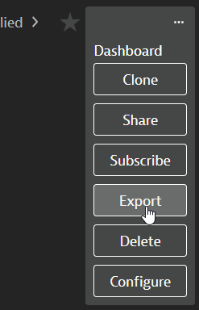
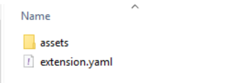
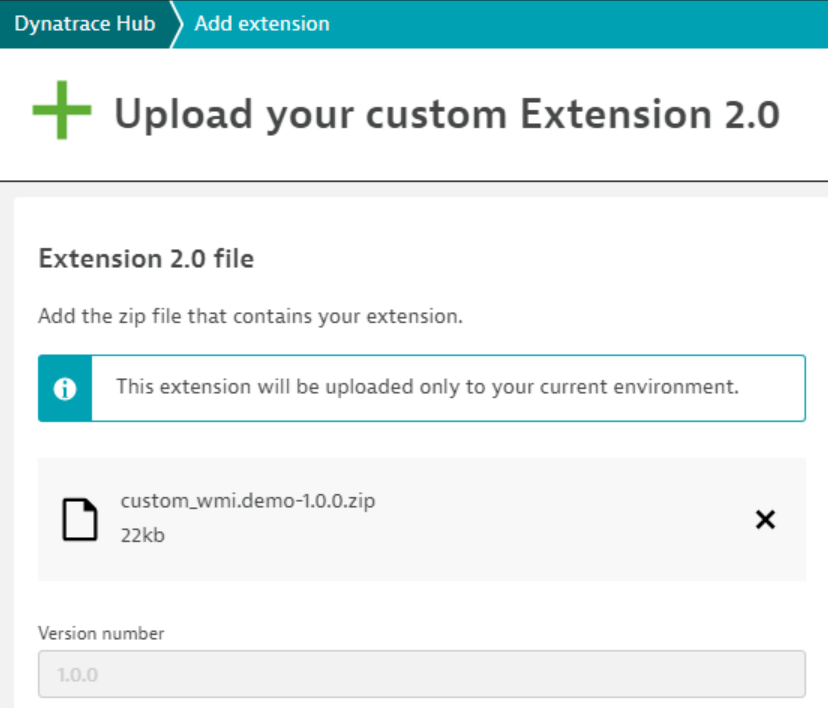
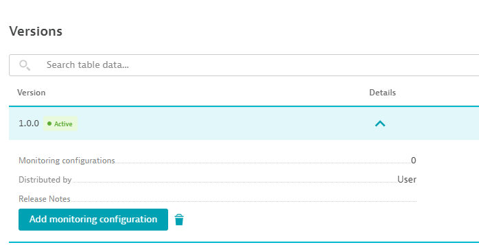
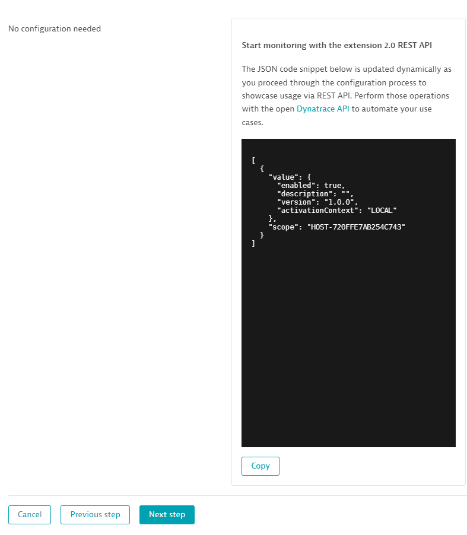
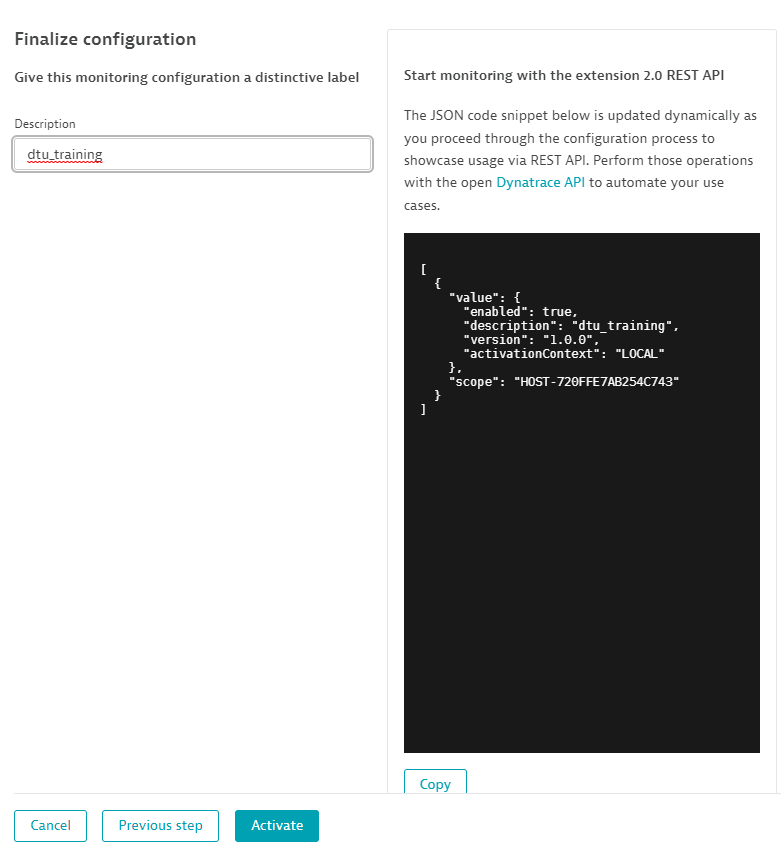
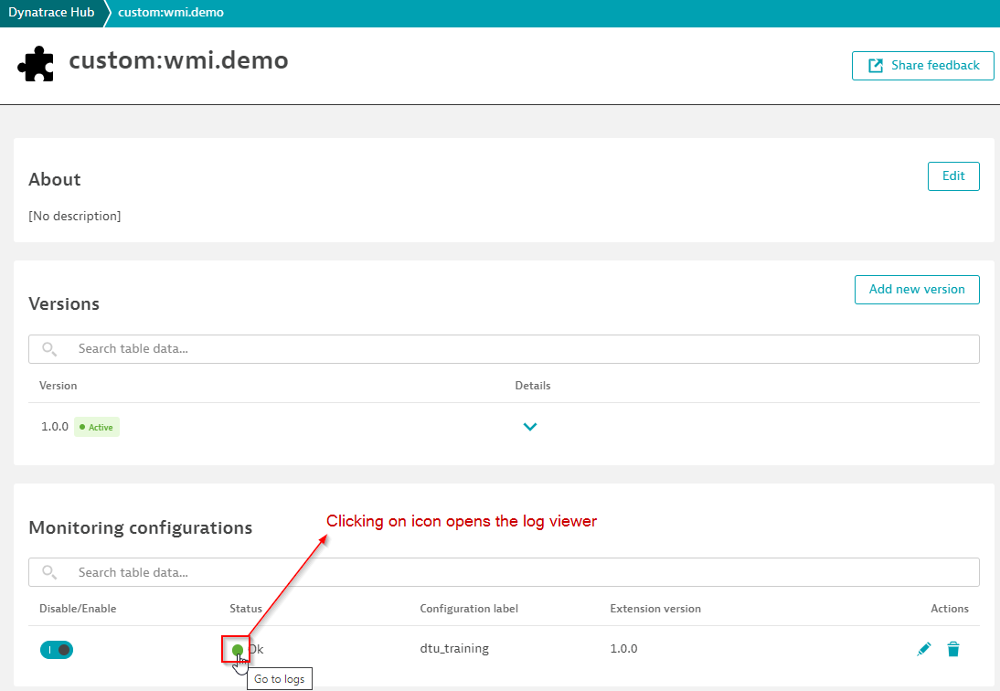
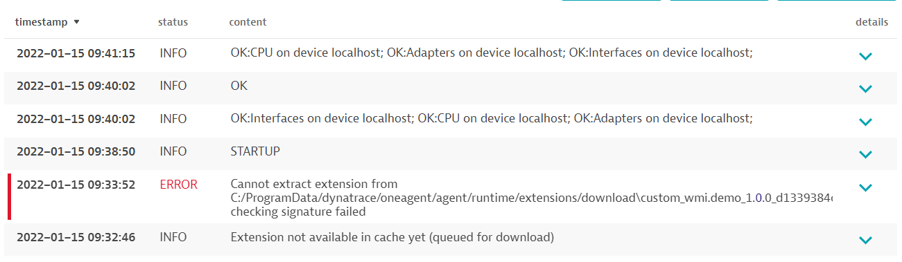
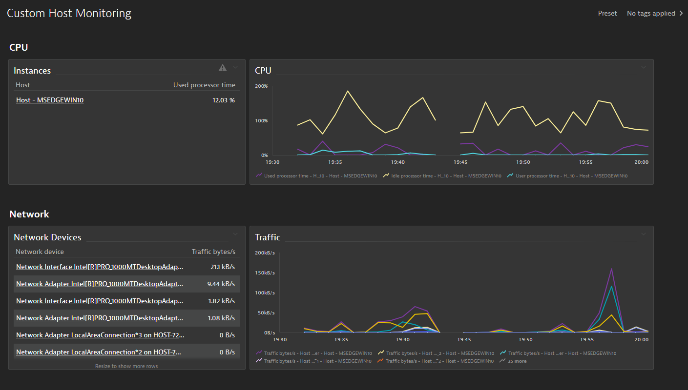
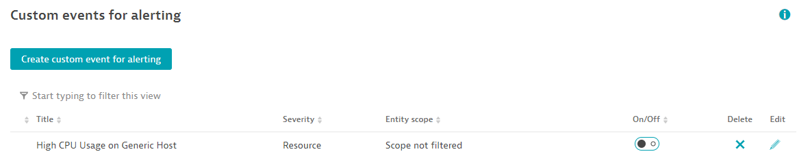

## Packaging

With extensions 2.0 you can now package the expertise required to monitor a new technology in the form of dashboards and custom alerts. These are made available within the Dynatrace tenant as soon as the extension is deployed.

Dashboards and alerts must be packaged as part of your `extension.zip` archive and are referenced in YAML within the `dashboards` and `alerts` sections. Items in these lists map to paths relative to the extension archive.

You can create your dashboard on Dynatrace and exporting it to JSON format by clicking on the ellipses and selecting "Export", then place that JSON file within your zip file and reference it in your yaml file.



You can also bundle alerts in your extension package by simply creating your alert, then exporting it using the Dynatrace API. For example:

`Settings -> Anomaly detection -> Custom events for alerting`

After you create your alerts, use the the Dynatrace API to export them:

`/api/config/v1/anomalyDetection/metricEvents/{id}`

To get the ID, you can retrieve a list of them by calling:

`/api/config/v1/anomalyDetection/metricEvents`

then grabbing the ID from the output.

Save the JSON output in your alerts file and reference it in your `extension.yaml`

Example:
```yaml
dashboards:
  - path: dashboards/dashboard.json
alerts:
  - path: alerts/alert.json
```

### Tasks
1. Download the [dashboard.json](../../../assets/images/dashboard.json) and [alert_cpu.json](../../../assets/images/alert_cpu.json) files provided with this exercise.
2. Place the downloaded files into an `assets` folder and place that folder next to the `extension.yaml`



3. Add the `dashboards` and `alerts` sections to `extension.yaml`
4. Package and upload a new version of your extension
```
dt ext build --certificate ..\..\certificates\developer.pem --private-key ..\..\certificates\developer.key --no-dev-passphrase
```

### Uploading and configuring your new extension








If you run into issues where data is not displaying or you receive errors, you may check the log viewer for the extension




### Verifying your dashboards

Click on Dashboards on the Dynatrace navigation on the left and select `Custom Host Monitoring`



### Verifying the alert rule was imported

Go to Settings -> Anomaly detection -> Custom event for alerting 

