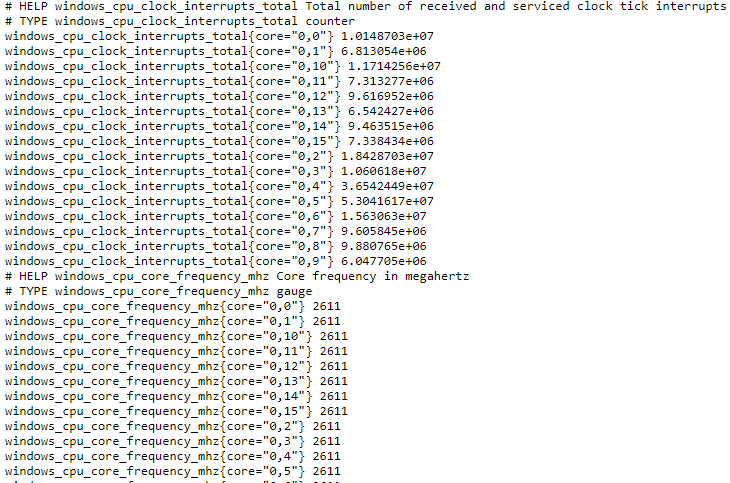
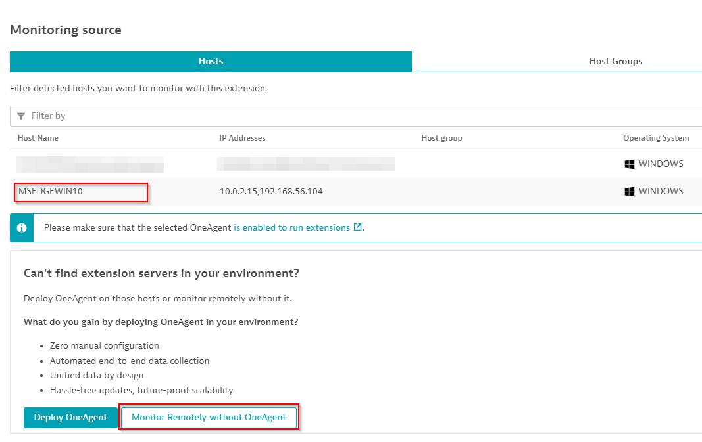
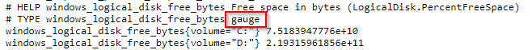

## Data source and scope

In this example we are collecting data from a Windows exporter which is currently running on your Windows environment.



Different datasources have different rules and features. For example, there are some functions that are available in WMI but not on Prometheus.

Currently we have data sources for **SNMP, WMI, Prometheus and Google Cloud Platform**

### Scope

There are two available scopes to run this extension, Local or Remote. Each monitoring configuration can have its own scope and they both use the same built extension.



Selecting a host will run our extension as LOCAL. Selecting **Monitor Remotely without OneAgent** will run our configuration as REMOTE from an ActiveGate group.

In this example, we will be using a **LOCAL** scope

Let's go through the datasource and discuss new concepts:

```yaml
prometheus:
  - group: system
    interval: 1m
    dimensions:
      - key: category
        value: System
    subgroups:
      - subgroup: Logical disks
        dimensions:
          - key: volume
            value: label:volume
        metrics:
          - key: custom.prometheus.demo.host.logical.disk.free.bytes
            value: metric:windows_logical_disk_free_bytes
            type: gauge
          - key: custom.prometheus.demo.host.logical.disk.size.bytes
            value: metric:windows_logical_disk_size_bytes
            type: gauge
```

Let's break it down...

* In this set of System metrics, we are creating a subgroup to collect metrics about **Logical disks**

* The next dimension will grab the **volume** label from the metric line `windows_logical_disk_free_bytes` and assign it to a key called **volume**
    * For example, our Windows exporter line says:

    `windows_logical_disk_free_bytes{volume="C:"} 4.4214255616e+10`
    
    It will grab the volume label "C:" and assign it a new volume dimension

```yaml
        dimensions:
          - key: volume
            value: label:volume
```

* Next we map our metric key to the metric name from our windows exporter

* Every metric in our exporter has a **TYPE**, make sure to use the appropriate type (count or gauge). If you do not use the appropriate type, **your metric could result in not displaying or 0 value**



```yaml
        metrics:
          - key: custom.prometheus.demo.host.logical.disk.free.bytes
            value: metric:windows_logical_disk_free_bytes
            type: gauge
          - key: custom.prometheus.demo.host.logical.disk.size.bytes
            value: metric:windows_logical_disk_size_bytes
            type: gauge
```
