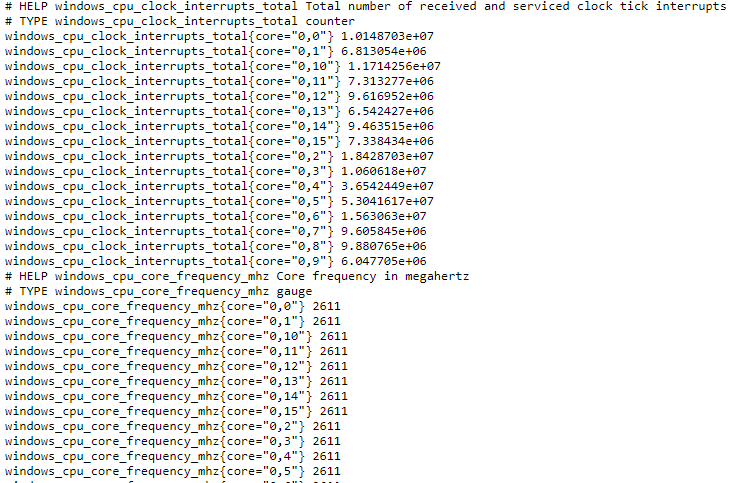

## Preparing our Prometheus extension

You should have a Windows-exporter running on your lab environment.
  * Open a browser and go to [http://localhost:9182/metrics](http://localhost:9182/metrics)



We will be using this as the data source for our extension. The goal is to scrape a few metrics to get an example going.

So first things first!
  * We have to create a **prometheus** folder for our new extension, to separate it from the others.
  * We have to create an **extension** folder inside our **prometheus** folder.
  * We need to create an **extension.yaml** file inside that **extension** folder.

Using your terminal window, navigate to your `extensions` directory:

```
cd C:\Users\dtu_training\Desktop\training\extensions
```

Create a new folder called `prometheus`
```
mkdir prometheus
```

Go into our new `prometheus` folder
```
cd prometheus
```

Create a new folder called `extension`. Remember that this folder is part of the structure required when building our extension package.
```
mkdir extension
```

Now navigate to our `extension` folder and create our `extension.yaml` by clicking on the New File icon or right-clicking on the `extension` folder and selecting "New File"


Save it as `extension.yaml`

Now let's add our 4 mandatory fields:

```yaml
name: custom:prometheus.demo
version: 1.0.0
minDynatraceVersion: "1.227"
author:
  name: "Dynatrace User"
```

Next, we will add the datasource