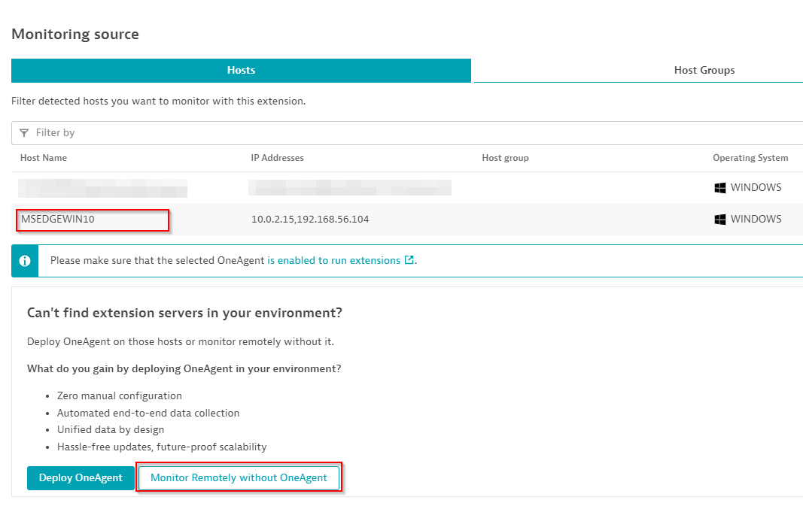

## Data source and scope

Our data source this time is completely different and will have the header `prometheus`.

There are similarities in each data source but they are different. Some functions and rules apply to one but may not apply to the other. For example, in our previous WMI exercise we were able to use `this:device.host` as a value to a dimension and this value would be resolved to the host running the extension. This is not available on the Prometheus data source.

Currently we have data sources for **SNMP, WMI and Prometheus**

### Scope

There are two available scopes to run this extension, Local or Remote. Yup, you guessed it. This is a concept that existed on Extensions 1.0 and you had to get a specific binary for one or the other. This time you get to activate your extension from your Dynatrace console local to the OneAgent, or Remote from an ActiveGate group, or both. Each monitoring configuration can have its own scope and they both use the same built extension.



Selecting a host will run our extension as LOCAL. Selecting **Monitor Remotely without OneAgent** will run our configuration as REMOTE from an ActiveGate group.

For our exercise, we will be using a **LOCAL** scope

```yaml
prometheus:
  - group: system
    interval: 1m
    dimensions:
      - key: category
        value: System
    subgroups:
      - subgroup: Logical disks
        dimensions:
          - key: volume
            value: label:volume
        metrics:
          - key: custom.prometheus.demo.host.logical.disk.free.bytes
            value: metric:windows_logical_disk_free_bytes
            type: gauge
```

Let's break it down...

* In this case, we are adding a group of metrics regarding the system that will poll once a minute.

* We are hard coding a dimension for these metrics by adding a `category` and giving it a value of `System`

* In this set of System metrics, we are creating a subgroup to collect metrics about **Logical disks**

* The next dimension will grab the **volume** label from the metric line `windows_logical_disk_free_bytes` and assign it to a key called **volume**
    * For example:

    `windows_logical_disk_free_bytes{volume="C:"} 4.4214255616e+10`
    
    It will grab the volume label "C:" and assign it a new volume dimension

* Next we map our metric key to the metric name from our windows exporter

* Every metric in our exporter has a **TYPE**, make sure to use the appropriate type (count or gauge). If you do not use the appropriate type, **your metric could result in not displaying or 0 value**


## Tasks
1. Add the following metrics, map keys to your windows exporter metrics
```
  custom.prometheus.demo.host.logical.disk.size.bytes -> windows_logical_disk_size_bytes
  custom.prometheus.demo.host.logical.disk.latency.read -> windows_logical_disk_read_latency_seconds_total
  custom.prometheus.demo.host.logical.disk.latency.write -> windows_logical_disk_read_write_latency_seconds_total
```
2. Add a **CPU** subgroup and map 
```
custom.prometheus.demo.host.cpu.processor -> windows_cpu_processor_performance
```
3. Make sure the `type` field matches the type of metric

Your end result should look like [this](../../../assets/images/06_prometheus_datasource.yaml)
