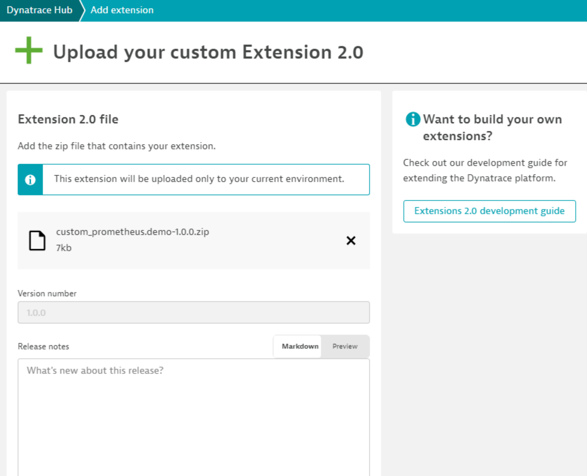
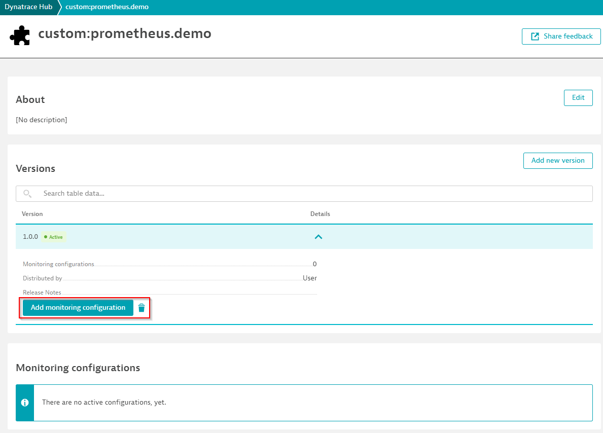
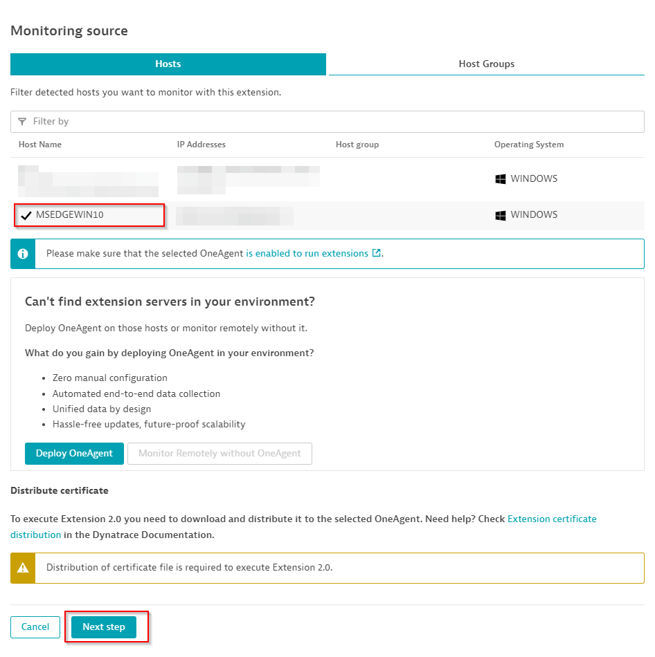
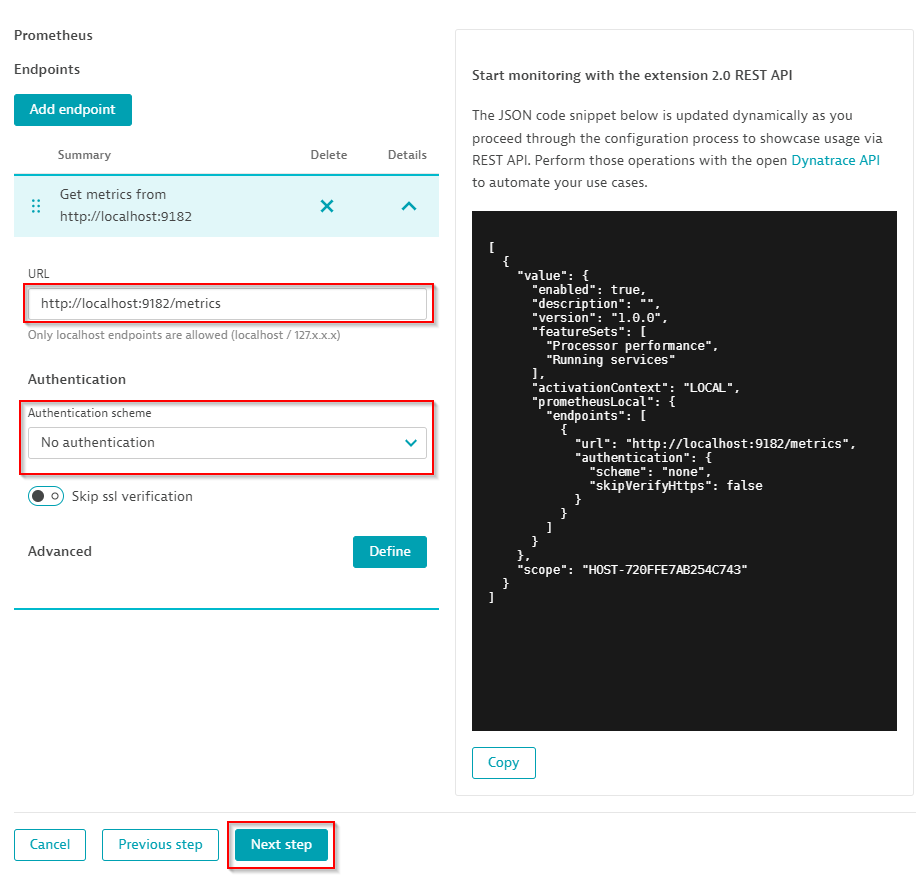
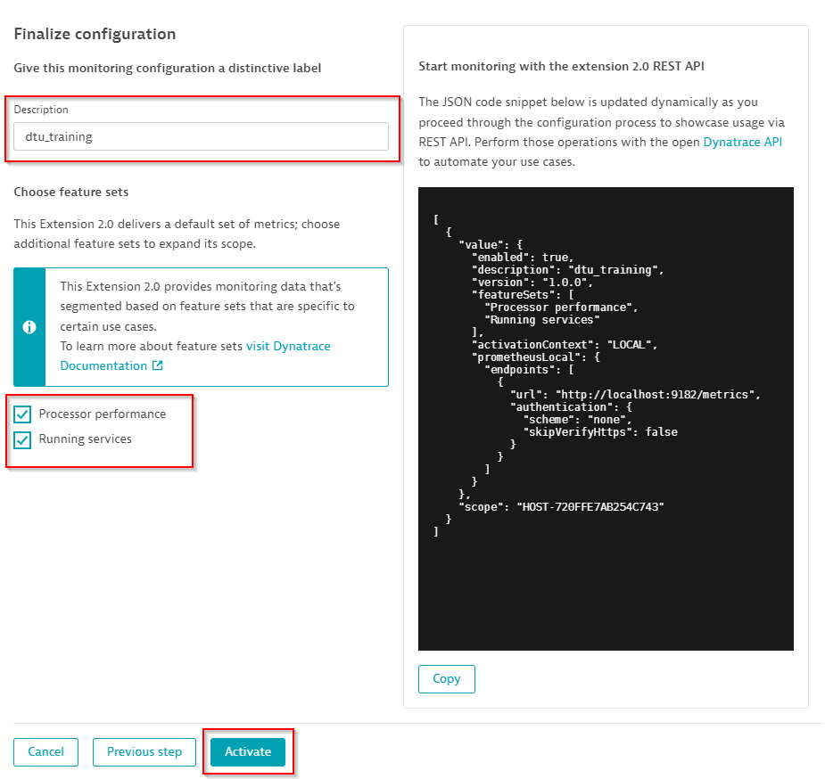
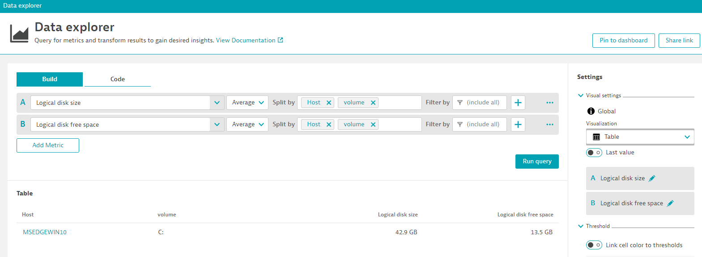

## Building your extension

Navigate to your prometheus demo folder

```
cd perform-2022-hotday/extensions-as-code/prometheus-demo-extension
```

Build your extension running

```
dt ext build --certificate ..\..\..\certificates\developer.pem --private-key ..\..\..\certificates\developer.key --no-dev-passphrase
```

This will sign and package your extension into a zip file called custom_prometheus.demo-1.0.0.zip

Upload the extension to your tenant environment



Add a monitoring configuration



Select your host. This will automatically make it a `LOCAL` extension and click `Next`.



Add a new Prometheus endpoint and point it to `http://localhost:9182/metrics`. This prompt came from the **prometheus** data source we entered in the yaml file.



**Note: If you see a slash at the end '/', remove it**

Leaving a slash at the end will make the Prometheus data source try to collect data from a Prometheus API and not scraping a metrics endpoint

Next, select which Feature sets you want to enable, then Activate



We can see and verify data by going to **Data Explorer** or **Metrics** on Dynatrace



You are done!