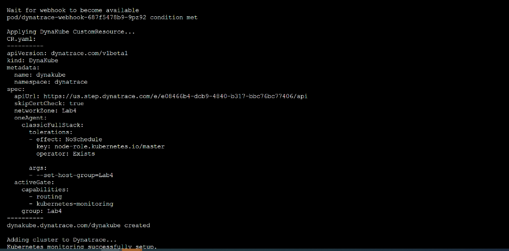

## Run install.sh

Let's start the deployment by navigating to the Dynatrace menu and go to **Deploy Dynatrace**.
1. Find and select **Start installation** and click on **Kubernetes**.
2. On the **Monitor Kubernetes / OpenShift** page, follow the on-screen deployment instructions:
    - **Name**: This name is used by various Dynatrace settings including: Kubernetes cluster name, Network Zone, ActiveGate Group, and Host Group.
    - **Platform**: Kubernetes
    - **Paas token & API token**: To create these tokens automatically, select **Create tokens**.
    - Enable **Skip SSL Certificate Check**.
    - **Copy the command as shown on the UI and run it with sudo access**. 

**Note**: The **install.sh** script deploys the Dynatrace Operator and resources as well as automatically integrates the Kubernetes cluster with Dynatrace.

Output should look similar to the below screenshots:

