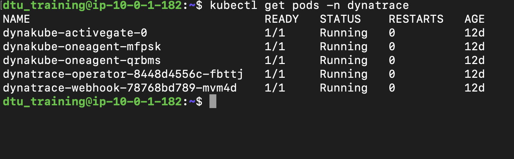
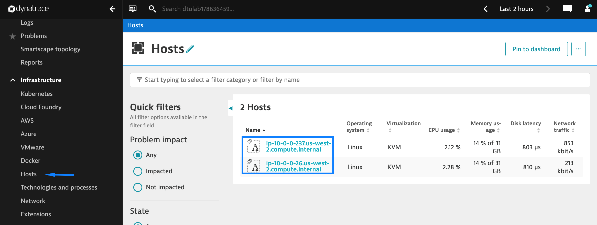
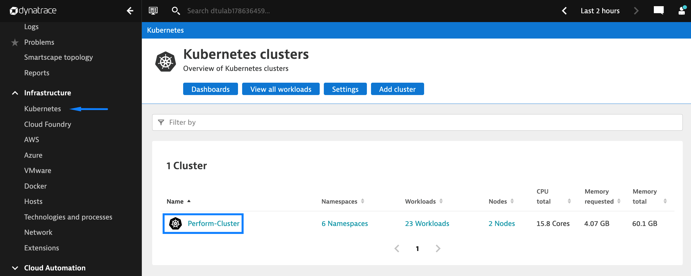

## Validate deployment

To validate the deployment of our Dynatrace Operator and resources we can:
1. Check the pods' status with:
   
    ```
    kubectl get pods -n dynatrace
    ```

    

2. Navigate to the **Hosts** page in Dynatrace where we should see two hosts:
   
   

3. Navigate to the **Kubernetes** page in Dynatrace where we should see one cluster:
   
   

   

**Note**: The **Kubernetes metrics** may take a few minutes to populate, as long as you see a cluster in step 3 you can move on to the next step.
