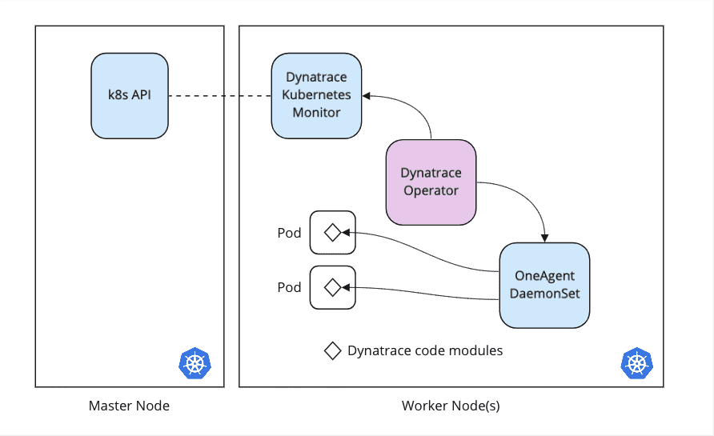

## Deploy Dynatrace Operator

In this section, we will deploy the Dynatrace Operator which handles the lifecycle of the Dynatrace resources.

Breakdown of resources:

- **OneAgent**: deployed as a DaemonSet, collects host metrics from Kubernetes nodes. Also detects new containers and injects OneAgent code modules into application pods.
- **Dynatrace Kubernetes Monitor (ActiveGate)**: collects cluster and workload metrics, events, and status from the Kubernetes API.

