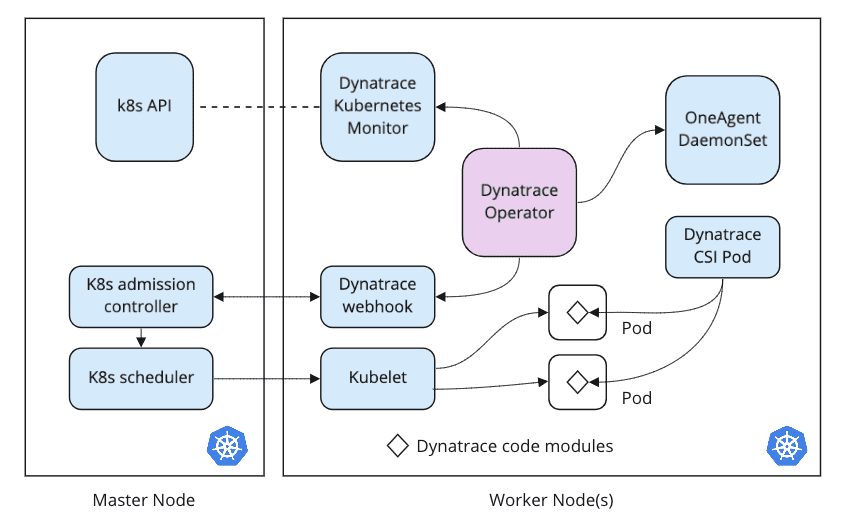

## Deploy Dynatrace Operator

In this section, we will deploy the Dynatrace Operator which handles the lifecycle of the Dynatrace resources.

Breakdown of resources:

- **OneAgent**: deployed as a DaemonSet, collects host metrics from Kubernetes nodes.
- **Dynatrace webhook server**: modifies pod definitions to include code modules for application observability.
- **Dynatrace CSI driver**: deployed as a DaemonSet provides OneAgent binaries to pods.
- **Dynatrace Kubernetes Monitoring (ActiveGate)**: collects cluster and workload metrics, events, and status from the Kubernetes API.

