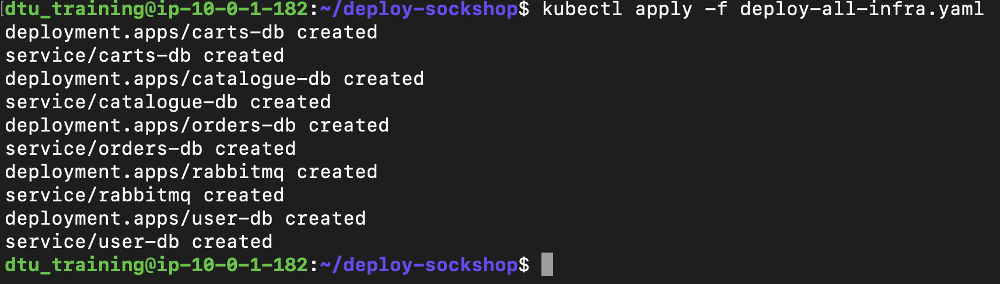
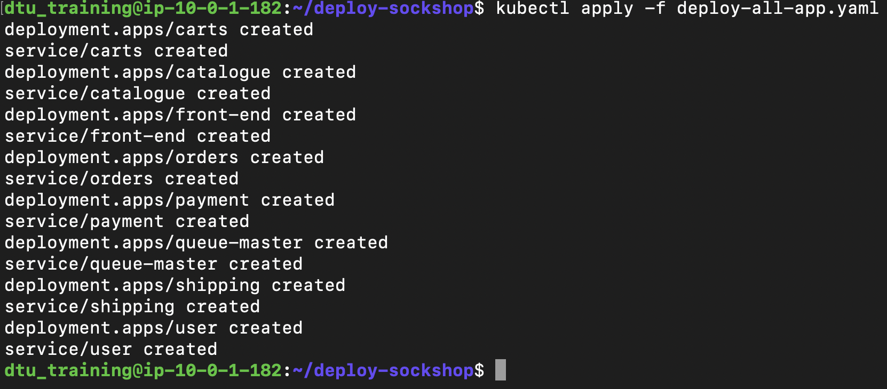

## Deploy-all YAML

Let's start our application deployment:

1. Navigate to the deploy-sockshop directory and creating our sockshop namespace:

    ```
    cd deploy-sockshop
    ```

    ```
    kubectl create ns sockshop
    ```

2. Next we'll deploy the sockshop infrastructure, which includes databases, queues, and their services:

    ```
    kubectl apply -f deploy-all-infra.yaml
    ```

    

3. Finally, we'll deploy the sockshop application and its services:
   
   ```
    kubectl apply -f deploy-all-app.yaml
    ```

    

    - **Note**: To check the status of the deployments you can use:

        ```
        kubectl get pods,svc -n sockshop
        ```

