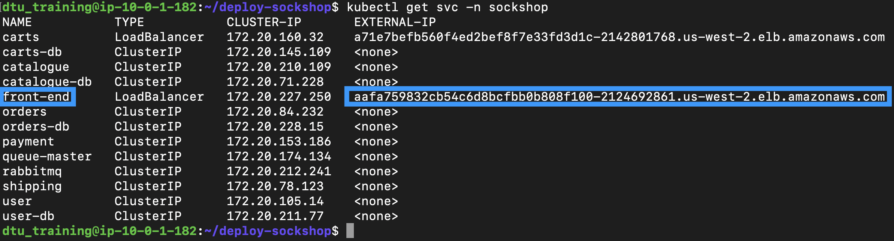
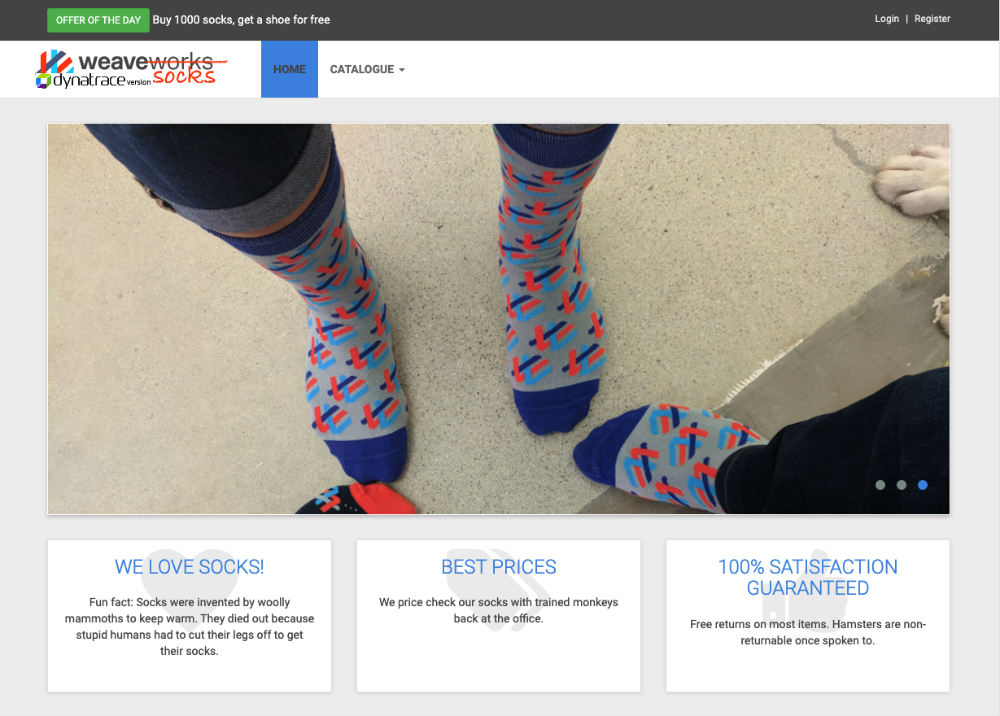

## Access the application

**Note**: We use a LoadBalancer service to expose our front-end microservice to the public.

Let's access our application:

1. Retrieve our front-end endpoint from its service:

    ```
    kubectl get svc -n sockshop
    ```

    

2. Paste the endpoint into your browser and click around the application to generate traffic.

    

