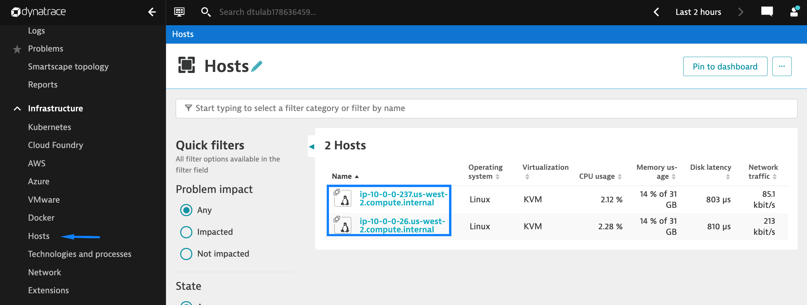

## Full Stack Monitoring

In this section we'll walkthrough the entire application stack in Dynatrace, starting with the host level and moving up to the application layer.

### Hosts
   - Navigate to the **Hosts** page and select a host:

   

   

### Processes (Pods) & Process Groups
   - Select a **Process (Pod)** from the **Processes and Containers** section on the host page:

   

   - Open the **Properties and tags** and select the **Process Group**:

   

### Services
   - Navigate to the **Services** page and select the **front-end** Service:

   

   

### Applications
   - Navigate to the **Frontend** page and select **My web application**:

   

   
