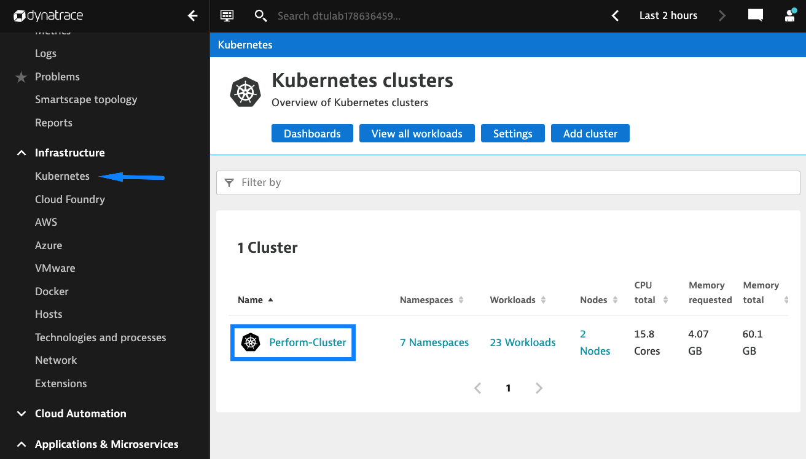
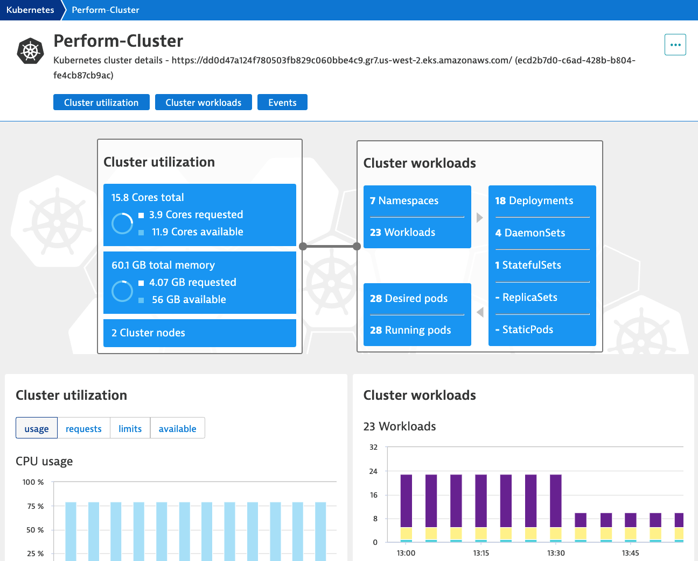
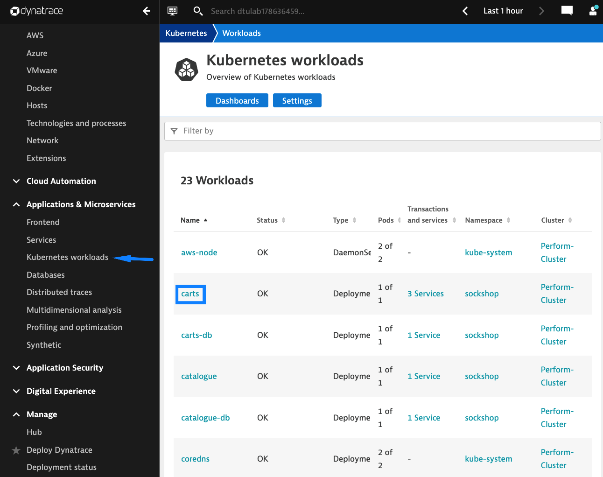
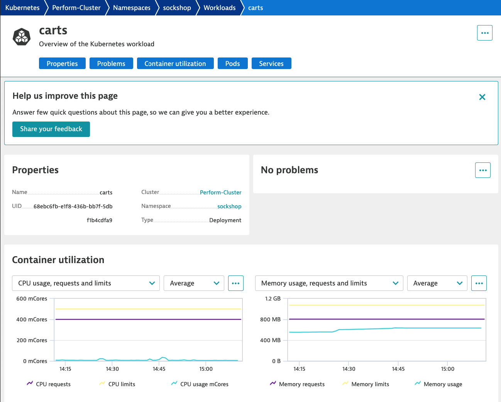
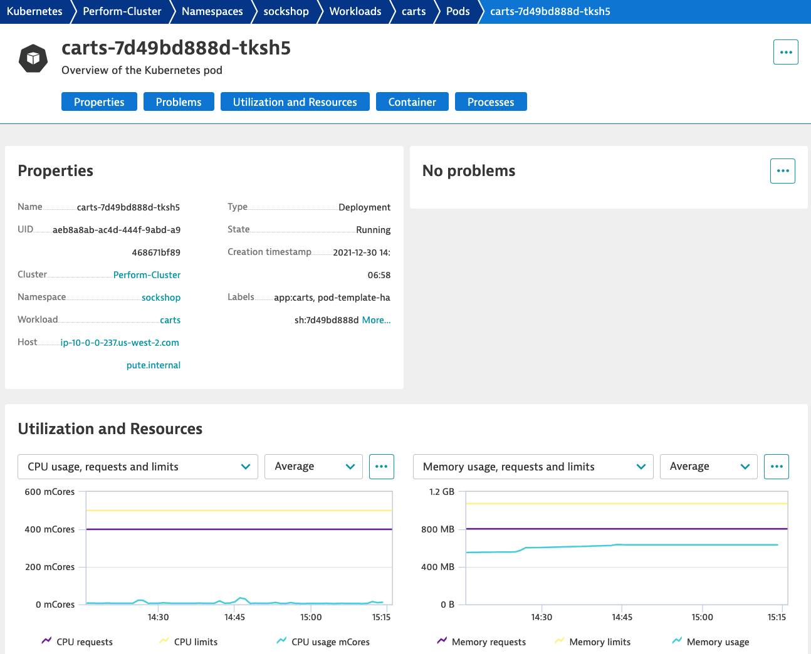

## Kubernetes Integration

In this section, we'll explore the additional cluster, workload, and container metrics pulled into Dynatrace via the Kubernetes API.

### Cluster
   - Navigate to the **Kubernetes** page and select the cluster:

   

   

### Workloads
   - Navigate to the **Kubernetes workloads** page and select the **carts** deployment:

   

   

### Pods
   - Select the **carts-\*** pod:

   

