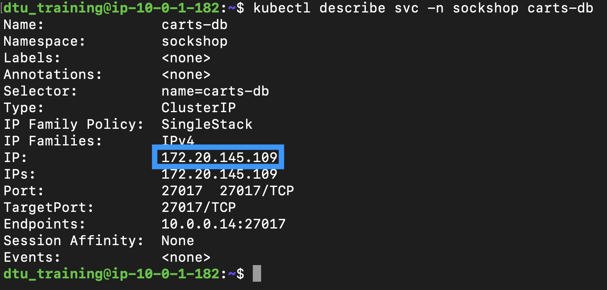

## Installing Prometheus and Enabling Exporters

### Install Prometheus and Deploy node-exporter
- Execute the below commands in order to install Prometheus and deploy our node-exporter:

      ```
      sudo snap install helm --classic

      helm repo add prometheus-community https://prometheus-community.github.io/helm-charts

      helm repo update

      helm install prometheus-node-exporter prometheus-community/prometheus-node-exporter
      ```

### Annotate mongo-db exporter
- Prometheus will have the mongodb-exporter already added on your Helm prometheus-community. 
- You will need the ClusterIP for the carts-db (mongodb) service to configure Prometheus so that it collects metrics from mongodb-exporter, run the following command:

      ```
      kubectl describe svc -n sockshop carts-db
      ```

      

      - **Note**: Keep the ClusterIP handy as its needed while setting up the mongodb-exporter.

- This will deploy the mongodb-exporter pod in your Kubernetes cluster:

      ```
      helm install prometheus-mongo-carts-db prometheus-community/prometheus-mongodb-exporter --set mongodb.uri=mongodb://clusterip:27017,serviceMonitor.enabled=false --set-string podAnnotations."prometheus\.io/scrape"=true  --set-string podAnnotations."prometheus\.io/port"=9108
      ```

      - **Note**: Replace the **clusterip** string with the ClusterIP we retrieved earlier.


- You can view all Prometheus pods running in your cluster by executing:
      
      ```
      kubectl get pods
      ```