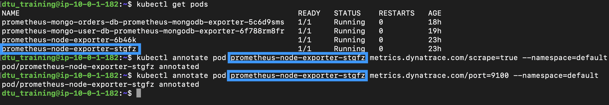

## Prometheus Metrics in Dynatrace

In this step, we will annotate the exporters so that the OneAgents running on the cluster know to pull the Prometheus metrics and push them to the Dynatrace tenant.

### Enable collection of Prometheus metrics in Dynatrace
1. Navigate to **Kubernetes** page and select your cluster
2. Click on the "**...**" in the top-right corner and select **Settings**


      

3. Enable the **Monitor annotated Prometheus exporters** toggle and select **Save changes**

      

### Annotate the mongodb-exporter
- First we need to get the pod name:
      
      ```
      kubectl get pods
      ```

      

- Next we will replace **mongodb-exporter** with the pod name in the commands below and run them to annotate the pod:

      ```
      kubectl annotate pod mongodb-exporter metrics.dynatrace.com/scrape=true --namespace=default
      kubectl annotate pod mongodb-exporter metrics.dynatrace.com/port=9216 --namespace=default
      ```

### Annotate the node-exporter - Optional
We will follow a similar pattern for the node-exporter
- First we need to get the pod name:
      
      ```
      kubectl get pods
      ```

      

- Next we will replace **node-exporter** with the pod name in the commands below and run them to annotate the pod:

      ```
      kubectl annotate pod node-exporter metrics.dynatrace.com/scrape=true --namespace=default
      kubectl annotate pod node-exporter metrics.dynatrace.com/port=9100 --namespace=default
      ```

### View metrics in Dynatrace
- Navigate to the **Metrics** page in Dynatrace.
- Search for text "**mongodb**"
  
      
