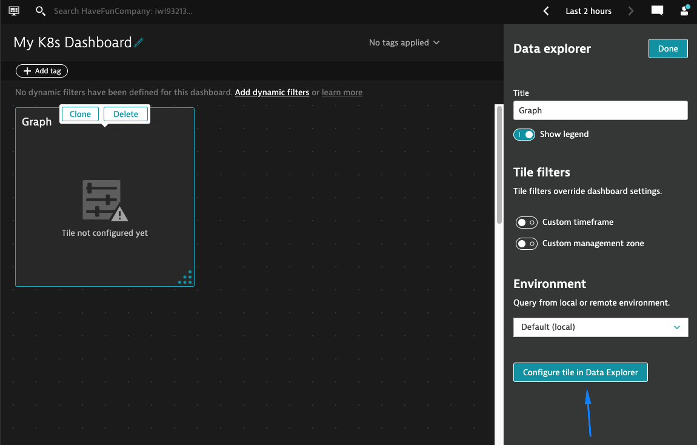

## Create a dashboard

In this step, we will create our own Kubernetes dashboard using metrics we've seen in the previous steps.

1. Navigate to the **Dashboards** page and select **Create dashboard**
      - Enter a dashboard name (ex. _My K8s Dashboard_) and click **Create**

      

2. Drag & drop a **Graph** tile onto the dashboard
      - Select **Configure tile in Data Explorer**

      

3. Search for **_namespace workloads_**
      - Select the **Workloads** (_builtin:cloud.kubernetes.namespace.workloads_) metric

      

      - Change aggregation to **Sum** and split by **Deployment type**
      - Select **Run query** then **Save changes to dashboard**

      

4. **Result**

      

5. Go through these steps again
      - This time utilize **different metrics** and **visualizations**.
          - Example metrics:
              - _mongodb\_network\_metrics\_num\_requests\_total.count_
              - _Pods builtin:cloud.kubernetes.workload.pods_
              - _Container cpu usage builtin:containers.cpu\_usage2_
              - _CPU requests builtin:cloud.kubernetes.node.cpuRequested_

