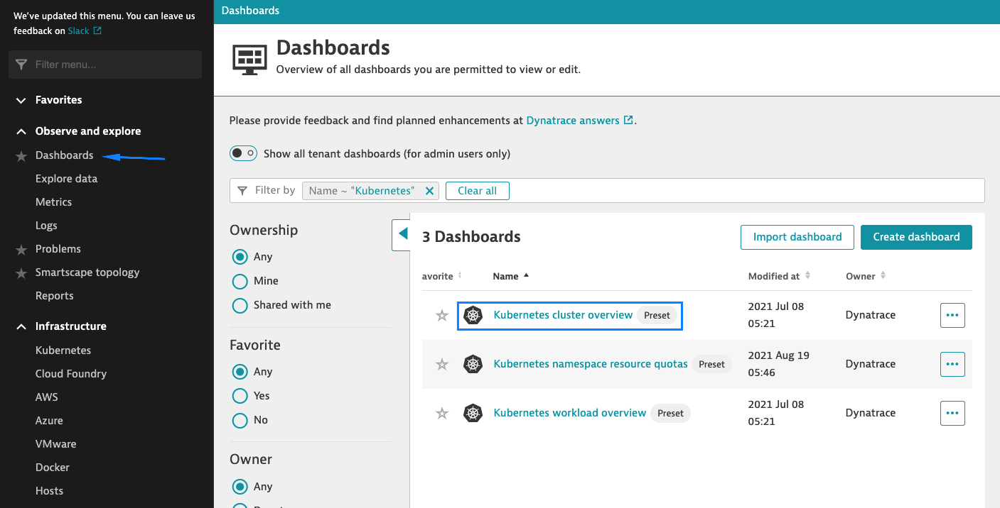

## View preset dashboard

In this step, we will view the preset Kubernetes dashboard(s) provided by Dynatrace.

1. Navigate to the **Dashboards** page and select the **Kubernetes cluster overview** dashboard

      

