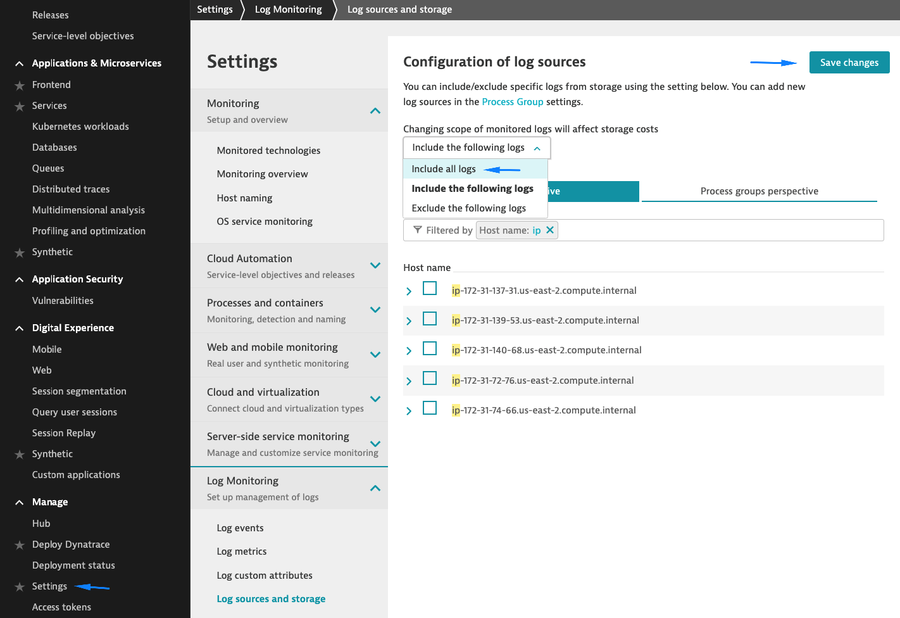

## Enable log ingestion

In this step, we will enable log ingestion.

1. Navigate to **Settings** > **Log Monitoring** > **Log sources and storage**
    - Change the scope to **Include all logs**
    - Click on **Save changes**

    

2. Navigate to the **Carts** page (_basket.html_) of the sockshop application and reload the page a few times.
    - **Note**: If you need to get your frontend endpoint again you can run:

        ```
        kubectl get svc -n sockshop
        ```
        


