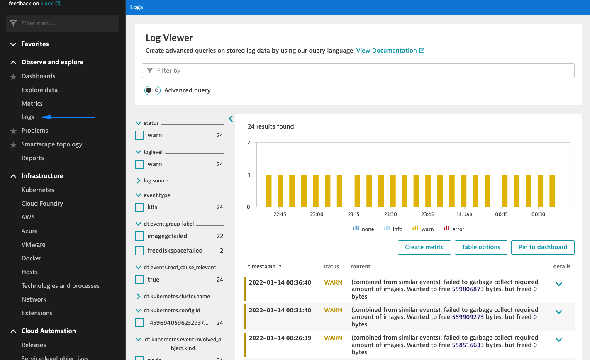
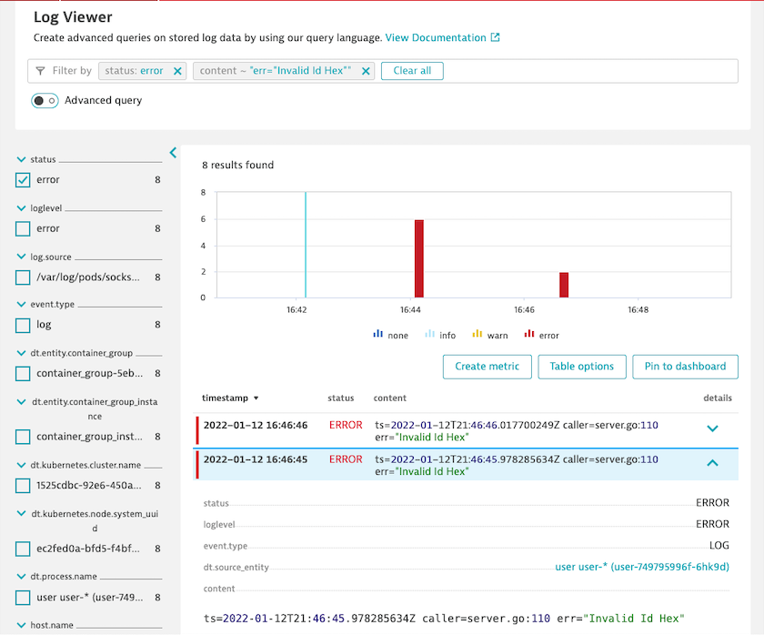
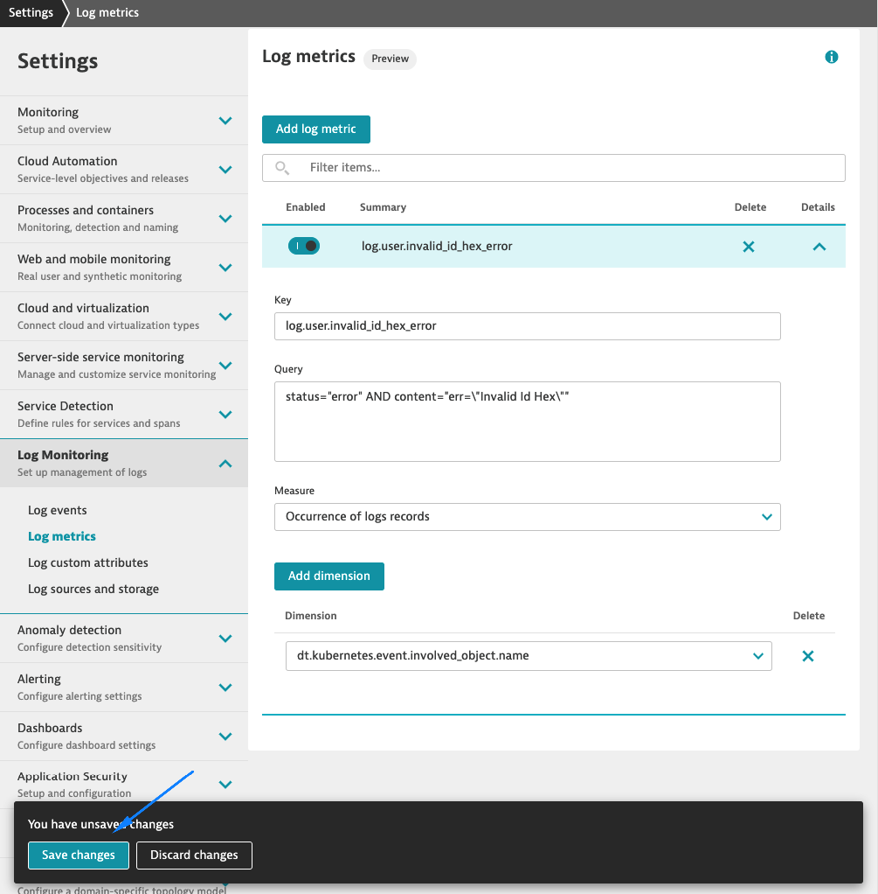

## Create metric

In this step, we will create a metric based on log content.

1. Navigate to the **Logs** page

    

2. Filter for **status: error** and **content: err="Invalid Id Hex"**

    

3. Click on the **Create metrics** button
4. Add *key* **log.user.invalid\_id\_hex\_error**
5. Add dimension **_dt.kubernetes.event.involved\_object.name_**
6. Click on **Save changes**

    

