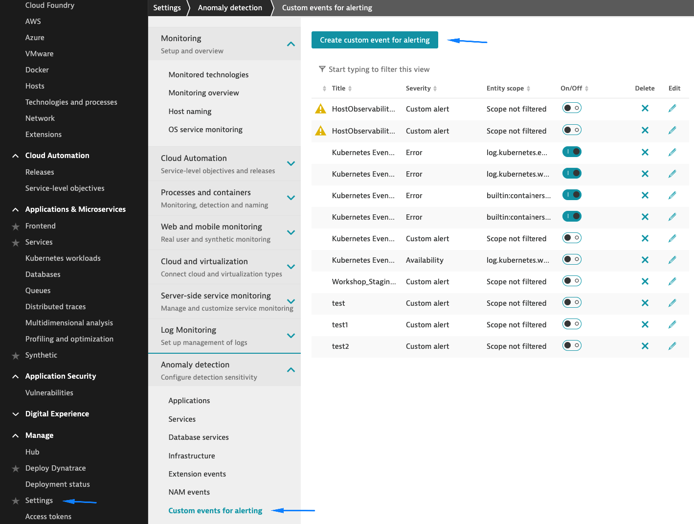
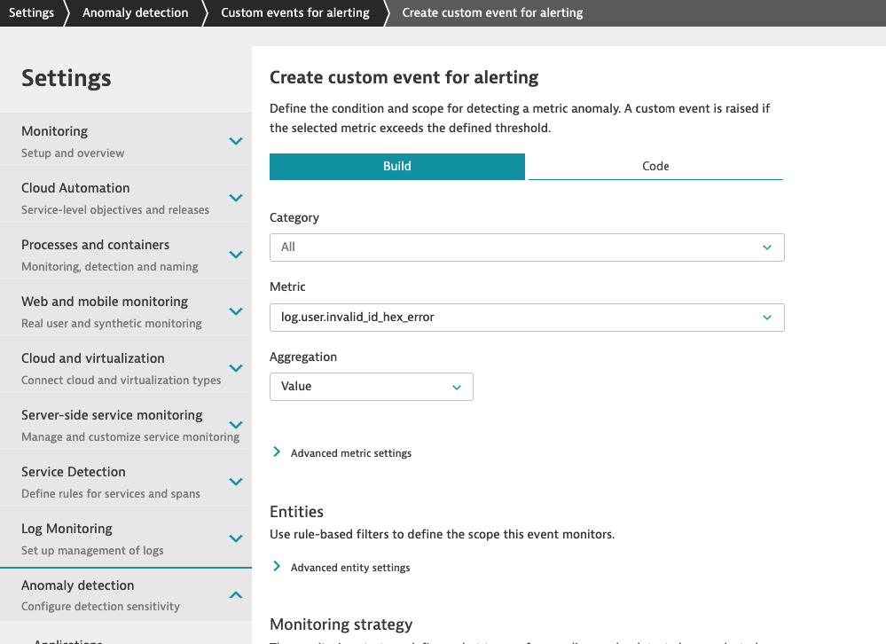
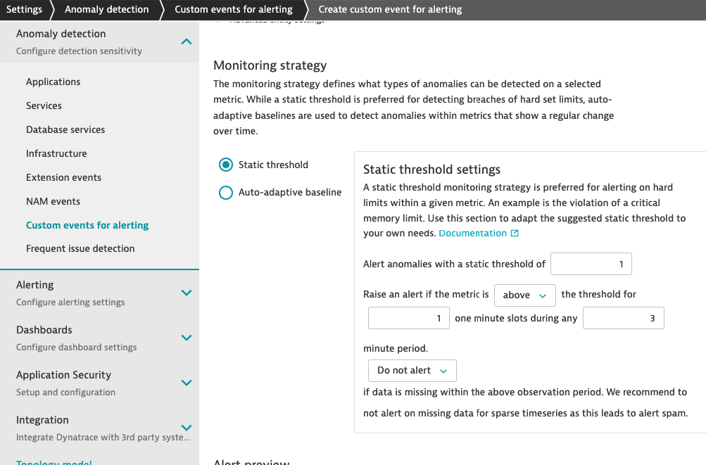
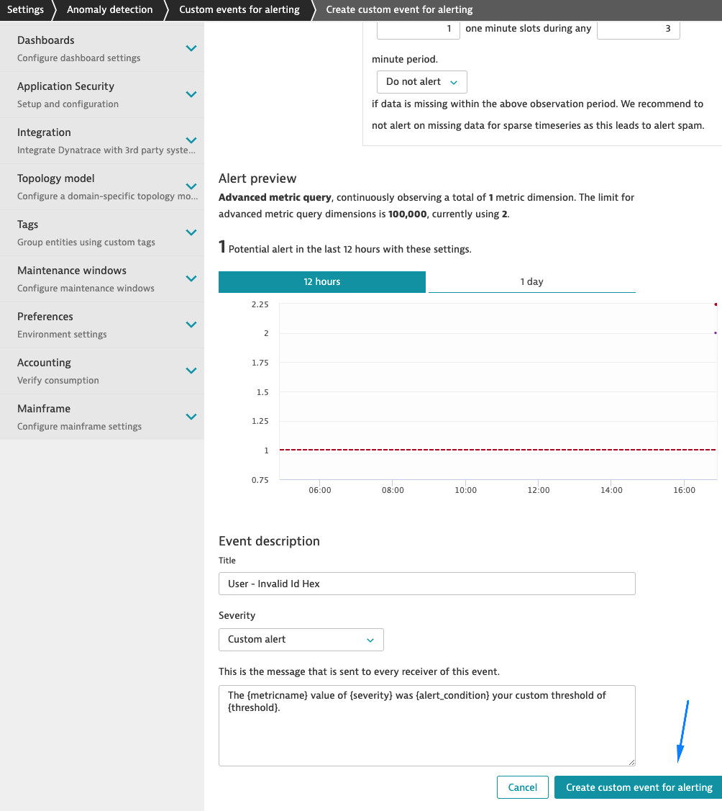

## Create custom event for alerting

In this step, we will create a custom event for alerting based on the metric from the previous step.

1. Navigate to **Settings** > **Anomaly detection** > **Custom events for alerting**
    - Click on **Create custom event for alerting**

    

2. Filter for *Metric* **log.user.invalid\_id\_hex\_error**

    

3. Set the static threshold as:
    - Alert with a static threshold of **1**
    - Raise an alert if the metric is **above** the threshold for
    - **1** one minute slots during any **3** minute period

    

4. Add a title in the *Event description* such as **User - Invalid Id Hex**
    - Click on **Create custom event for alerting**

    

