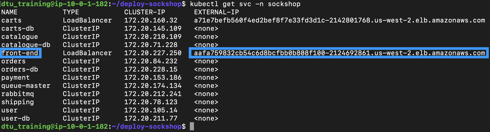

## Create and analyze problem

In this step, we will cause a problem to be created based on our custom event for alerting in the previous step.

1. Navigate to the **Carts** page (_basket.html_) of the sockshop application and reload the page multiple times.
    - **Note**: If you need to get your frontend endpoint again you can run:

        ```
        kubectl get svc -n sockshop
        ```
        


2. Once a problem is created, navigate to the **Problems** page
    - Select the **Custom alert** where the title is (or is similar to) **User - Invalid Id Hex**

    

3. Select **Analyze logs**
    - This brings us to the **Logs** page with the context of the problem already selected (*status: error | content: "err="Invalid Id Hex"*)
  
    

4. After a few minutes, the **Problem** should resolve itself:

    

- **Note**: The metric we created can also be used in a *Data Explorer chart* and be put on a *dashboard*.

    
