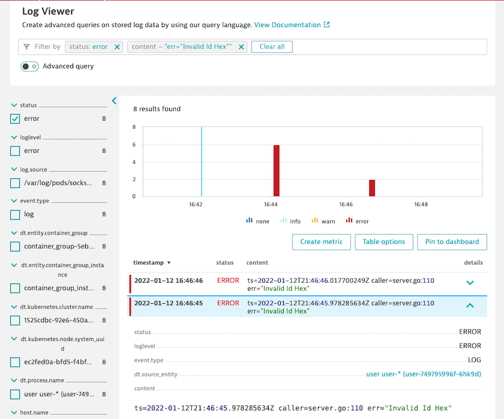

## Log Monitoring v2

In this section we will:

- Enable log ingestion
- Create a metric based on specific log content 
- Create a custom event for alerting based on that metric
- Trigger a problem based on that custom event for alerting

