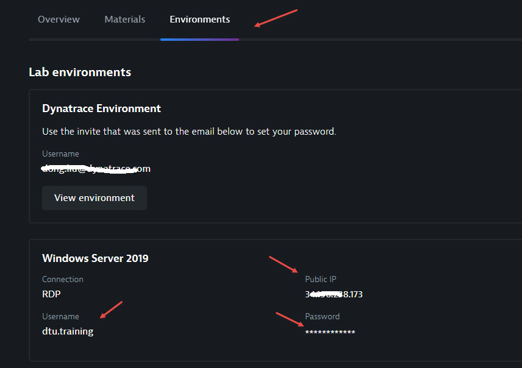
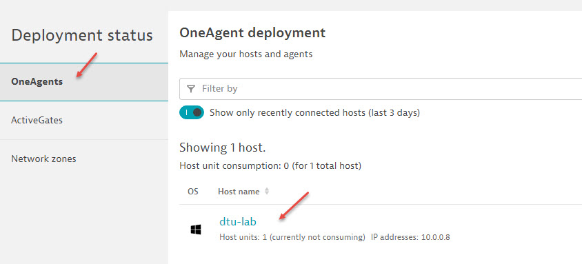

# Installing the OneAgent

## Step 1: Connect windows VM via RDP

Each participant has a windows VM. You will use your laptop to connect the VM via RDP (Remote Desktop). The login information (IP, username, password) can be found at DTU "Environment" tab.

## Step 2. Download and Install OneAgent

1. Sign into your provided SaaS tenant. Navigate to `Manage` , select `Deploy Dynatrace` and select `start installation`. 

2. Select `Windows` button and click on `Download OneAgent installer` (leave everything else as default)
    
3. Run the installer with all default settings

4. Once the installation is complete, check your Dynatrace tenant for succesful agent installation. On the left hand navigation panel select `Deployment Status` under the `manage` section.

 