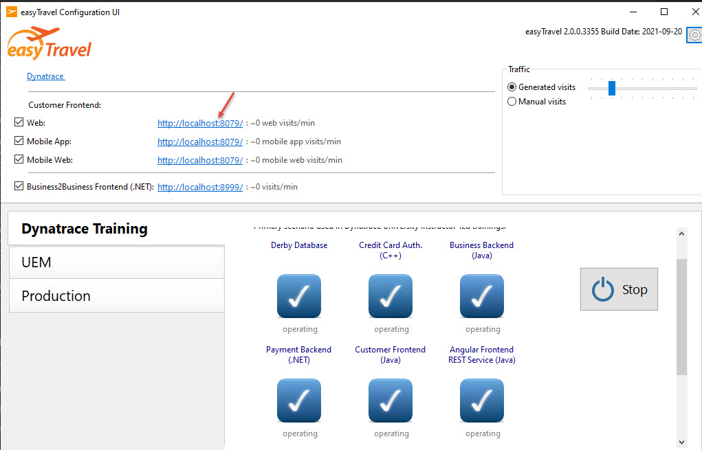

# Launch easyTravel application

## Step 1: Start easyTravel launcher

easyTravel is a demo app with several technologies build-in. The app automatically generate traffics simulating user activities (search, login or order). Application components write logs periodically. We will use the logs for this lab. 

To launch easyTravel app, double click the "easyTravel configuration UI" icon on the desktop, it will automatically launch the app. if not, click on "Standard" link from the launcher. 

if the app is launched successfully, it should looks like this:

