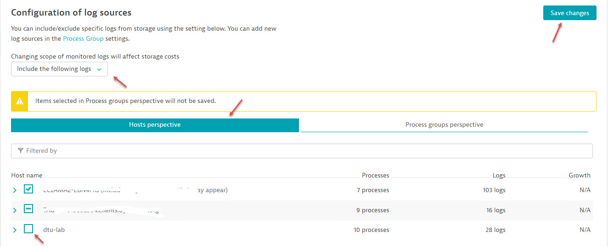
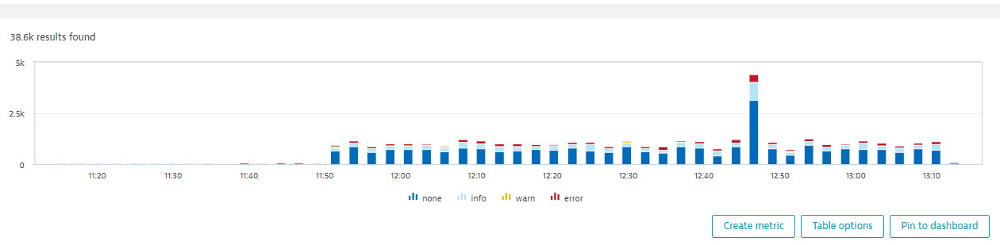

# Hand-on lab #3: Add easyTravel application log

## Step 1: Configure log source

By default, application logs are not added to log storage until you configure the log source setting. 

To add easyTravel logs, go to "Manage" menu, select "Settings"
Expend the "Log Monitoring" folder, select "Log sources and storage"
Select "Include the following logs" from the dropdown menu on the top
Check the checkbox matchs your host name (e.g. dtu-lab)
Click on "Save changes" on the top right corner

## Step 2: Verity logs are added

Go to left navigation menus, click on "Logs" under "Observe and explore" folder.
You should see the logs show up in log viewer

