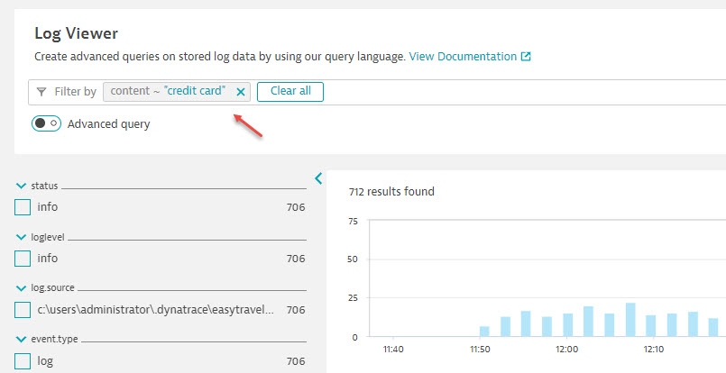
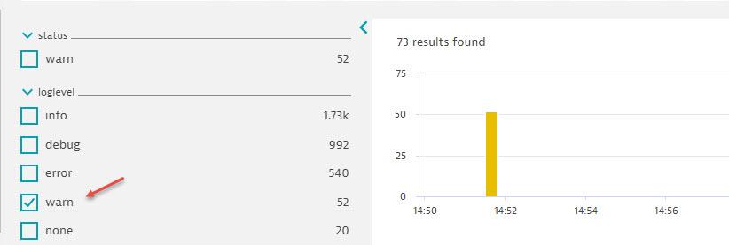
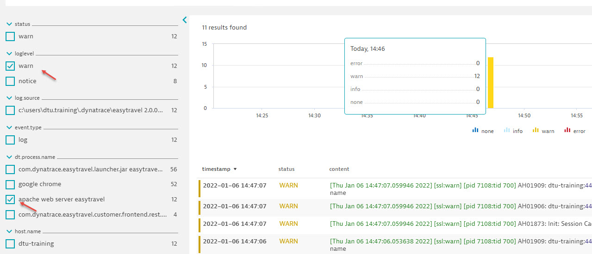
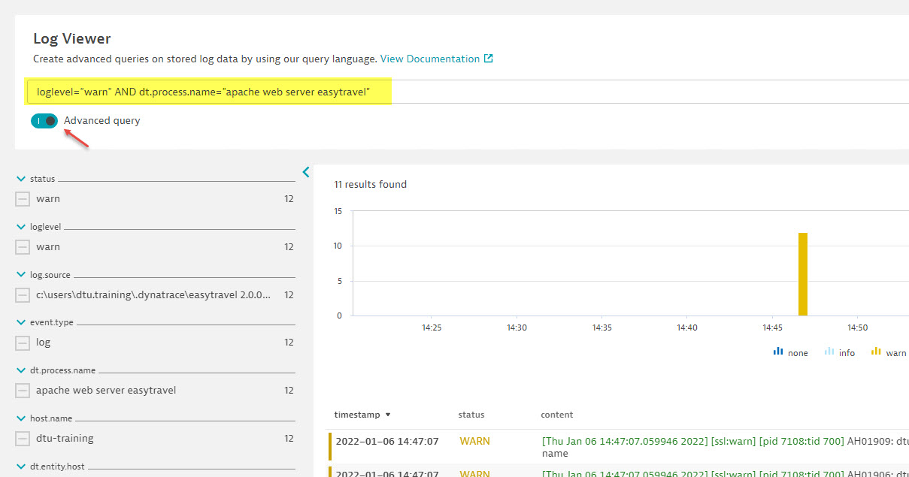
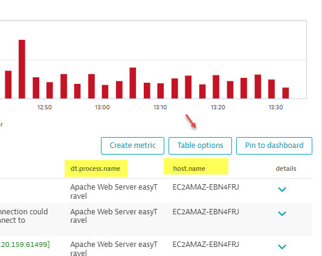

## Hand-on lab #4: Log viewer

### Step 1: Search by keyword

Keyword search is one of most used features for log analytic. In this lab, we will how much log records match keyword of "credit card" 

Click on "filter" field, select "content", type "credit card" and hit enter. How many log records return? expand one record, view the details. 

### Step 2: Filter by facet

1. Remove the content filter from the last step. 
2. Select "warn" under "loglevel" facet list. how many records return?

### Step 3: Filter by multiple facets

Facets are generated automatically by Dynatrace for build-in list properties such as "level", "status", "process.name". 

1. with the "warn" facet select from the step 2, select another facet in "dt.process.name" (e.g "apache web server easytravel")

### Step 4: Advanced query

With the facets selection in step 3, toggle the button of "Advanced query" at the top, it will build the query based on your current selection, what does it look like?

(optional) Feel free to modify your query with some new keyword (e.g. keyword="Unknown user name or bad password"), find out which log file match this query, can you find the user names? can you find out where the log attempt was from? (e.g. public IP address) 

### Step 5: Table option

Click on "Table options" button at the top of result section, select "host.name" or "dt.process.name", see the new table column show up. The view will stay. 

