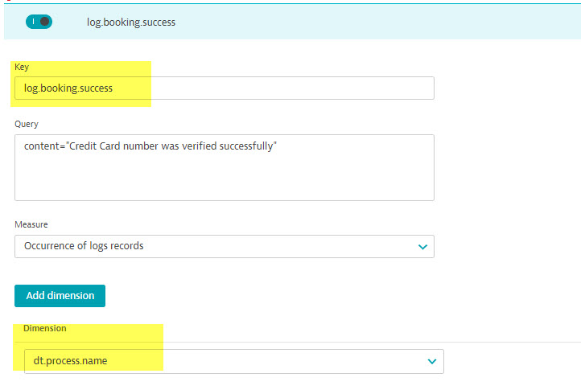
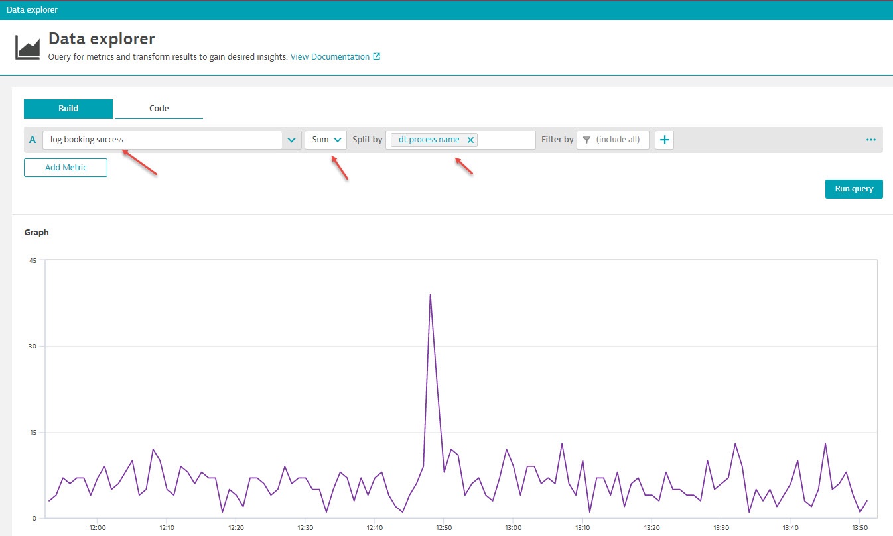

# Hand-on lab #5: Create log metrics

## Step 1: Search by keyword

In this lab, we will create custom metric based on log query result. 

1. reset the log viewer, choose time selection as last one hour
2. search by content with "Credit Card number was verified successfully", make sure more than one match return

## Step 2: Create metric

1. Click on "Create metric" button at the top of search results
2. Enter "log.booking.success" in the key field, keep other fields default value. 
3. Add a dimention, choose "dt.process.name" from the dropdown
4. Click on "Save changes"
5. Wait for 2-3 minutes or manually create a booking from http://localhost:8079/

## Step 3: Create a graph with the newly created metric

1. From the left main menu, select "Explore data" under "Observe and explore" section
2. Select "log.booking.success" in the metric selection
3. Change "average" to "sum" in aggregation selection
4. Select "st.process.name" dimention from "Split by" option
5. Click on "Run query"
6. Verify the data

