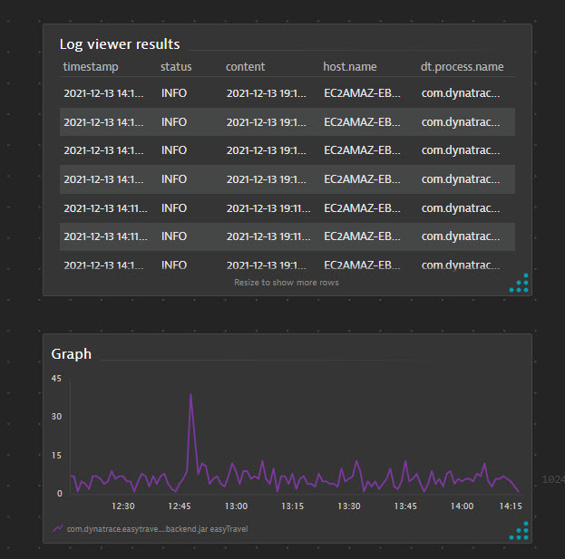

# Hand-on lab #6: Dashboard with log metric and tile

## Step 1: log tile

 
1. In log viewer, search "hot deals"
2. Click on "Pin to dashboard" 
3. Leave everything as default, click on "Pin" button (it will automatically create a dashboard by default)
4. Click on "Open dashbaord", view the log result tile
5. Click "Done" to exist Edit mode

## Step 2: add log-based metric graph to dashboard

1. In the same dashboard, Click on "Edit" to switch to edit mode
2. On the Tiles selection on the right,  double click on "Graph"
3. Click on "Configure tile in Data Explorer" button on the right
4. Build a new chart based on the log metrics "log.booking.success" (Run query)
5. Click on "Pin to dashboard" on the top, select the same dashboard you created from the last step
6. Open dashboard to see the new tile

it looks like this:

[Next Lab](../07_create_log_event/README.md)

