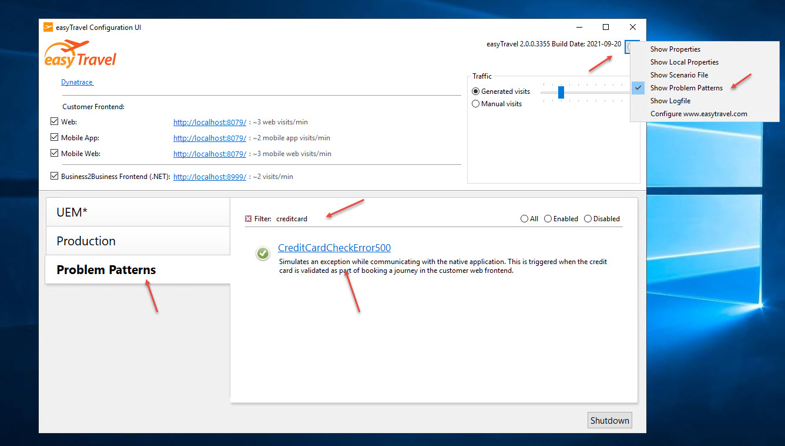
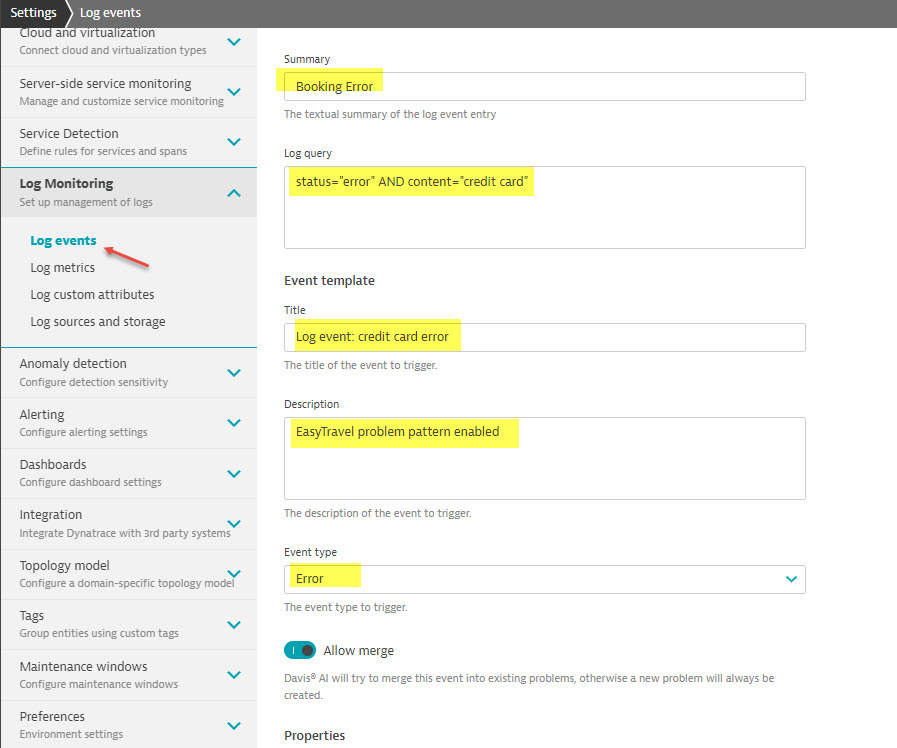

## Hand-on lab #7: Create a log event

### Step 1: Turn on problem pattern

easyTravel demo app has build-in problem patterns. In this lab, we will turn on "CreditCardCheckError500" pattern.
 
1. In the easyTravel configuration UI, click on the configuration icon (top right corner)
2. Enable "show problem patterns" option , a new tab ("Problem Patterns") will be added to the left main menu
3. In the problem pattern filter, search "creditcard"
4. Enable "CreditCardCheckError500" option
5. Wait for 2-3 minutes (or manually create a booking)

### Step 2: Create a log event based on problem pattern

1. In log viewer, select "error" facet
2. Search "credit card" keyword and verify the matching record
3. Toggle the "Advanced query" button on the top, copy the query (e.g. status="error" AND content="credit card") to a notepad
4. Go to settings (managed->settings), under "Log Monitoring", select "Log events"
5. Enter "Booking Error" in the summary field, copy your query from step 2.3
6. Enter a tile "Log event: credit card error", in the description field, enter "easyTravel problem pattern enabled"
7. Select "Error" as event type
8. Save

it looks like this:

