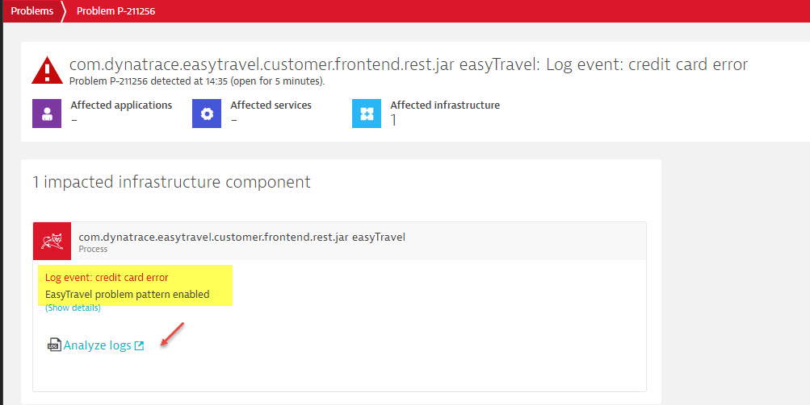
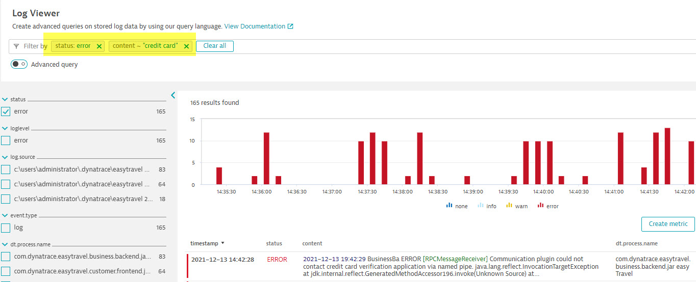

# Hand-on lab #8: Problem analysis with log events

## Step 1: Analyze log event problem

1. The last lab step will triger a detected problem with a name "Log event: credit card error"
2. Go to "Problem" menu under "Observe and explore" section
3. Select the problem from log event (Log event: credit card error)
4. Verify the content (description)
5. Click on "Analyze logs" link
6. Verify the query and filtered result, open one record for more details

