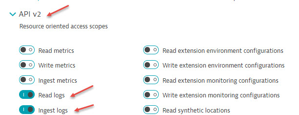
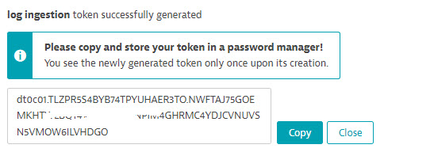
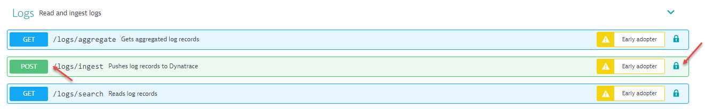
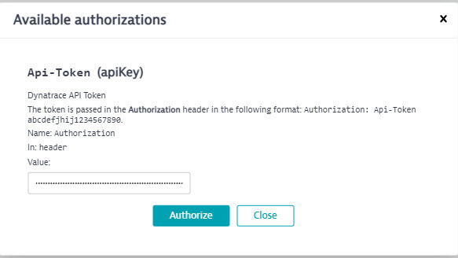
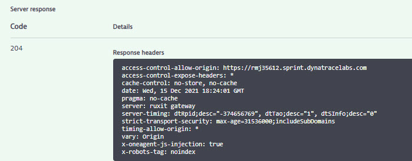
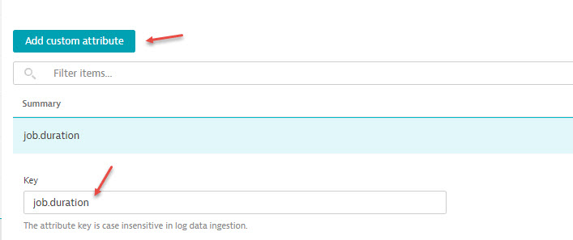
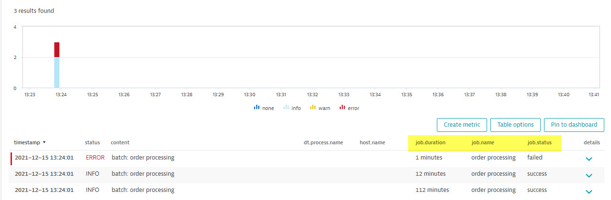

## Hand-on lab #9: Log ingest API (advanced, optional)

Dynatrace log monitoring 2.0 allows external log events through log ingest API. To use API, we need to create a token with proper permission. In this lab, we will simulate ingest batch job logs into Dynatrace. 

### Step 1: Create an API token

1. Go to global settings (manage -> settings)
2. Open "Integration" section, select "Dynatrace API"
3. Click on "Generate token" button
4. Enter a token name (e.g. Log ingestion)
5. Select "Read logs" and "Ingest logs" option (API v2), click "Generate"
6. Copy the token to a notepad (this is the only time you can copy the token, make sure save it)






### Step 2: Ingest log with Dynatrace API Explorer

1. Open "Dynatrace API Explorer" (link is at "Settings->Integration->Dynatrace API" page)
2. Click on "Logs" link
3. Click on "POST" button
4. Authenticate your API session (click on the lock icon on the right, enter your token and click "Authorize" button, then "Close")
5. Click on "Try it out" button on the right
6. Copy the following Json text and replace with the sample in the Request body section
```
[
  {
    "content": "batch: order processing",
    "loglevel": "INFO",
    "status": "INFO",
    "log.source": "/var/log/batch/orderprocessing.log",
    "job.name": "order processing",
    "job.status": "success",
    "job.duration": "112 minutes",
    "order.processed": "1888"
  },
  {
    "content": "batch: order processing",
    "loglevel": "INFO",
    "status": "INFO",    
    "log.source": "/var/log/batch/orderprocessing.log",
    "job.name": "order processing",
    "job.status": "success",
    "job.duration": "12 minutes",
    "order.processed": "1100"
  },
  {
    "content": "batch: order processing",
    "loglevel": "ERROR",
    "status": "ERROR",    
    "log.source": "/var/log/batch/orderprocessing.log",
    "job.name": "order processing",
    "job.status": "failed",
    "job.duration": "1 minutes",
    "order.processed": "0"
  }
]
``` 
7. Click on "Execute"
8. Verify the response return 204 OK
9. verify log events show up in log viewer






### Step 3: Create a custom attribute

1. Go to "Settings -> Log Monitoring -> Log custom attribute"
2. Click on "Add custom attribute"
3. Enter key "job.duration"
4. Repeat step 3 with "job.name", "job.status", "order.processed"
5. Save changes



### Step 4: Use custom attribute

1. Go to Log viewer
2. Click on "Table options"
3. Select "job.duration", "job.name", "job.status"
4. Review result table
5. Ping to dashboard

