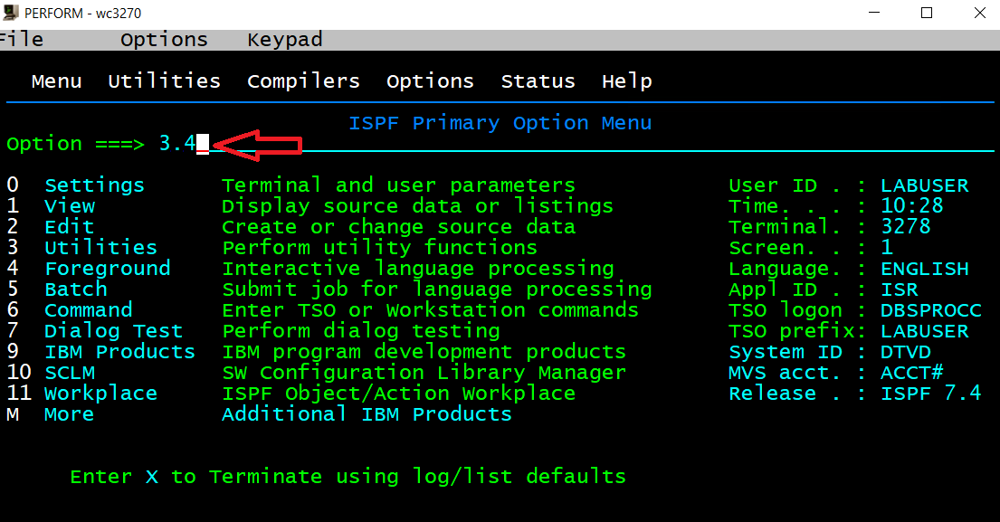
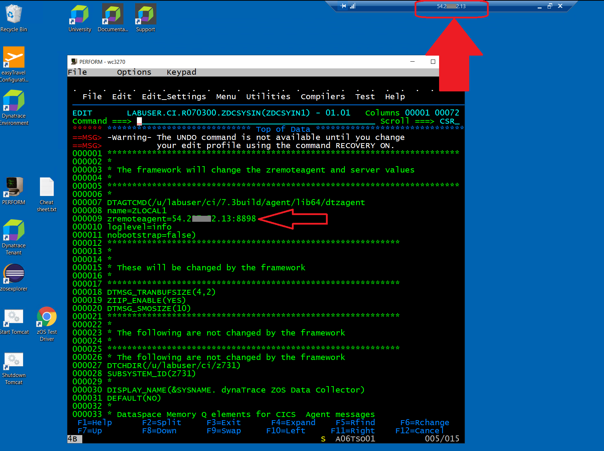
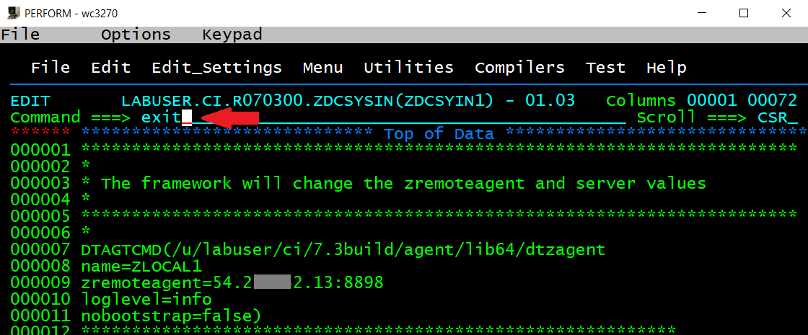

## Deployment and Customization

In this module you will learn how to deploy a Mainframe ActiveGate and zRemote and make the definitions on the Mainframe to connect an LPAR to this zRemote.

### Step 1: Open Dynatrace Tenant
- Open the Dynatrace tenant provided to you
- Login with the credentials provided to you

  

### Step 2: Install the Mainframe ActiveGate
- Select `Deploy Dynatrace` and click on `Install Active Gate`

  

- Select `Windows`
- Check `Route z/OS traffic to Dynatrace` (Step 1)
- Click on `Download Installer` (Step 2) OR Click on `Copy` and paste the download command into a DOS prompt, press `Enter`

  
  
- Wait for the download to finish (can take a while depending on the bandwidth)
- Navigate to the folder containing the downloaded file in the DOS prompt (either your User directory or the Downloads folder)
- `Copy` installation command from the Dynatrace Tenant (Step 3) 
- Make sure that the name of the `exe`-File is correct, before you hit `Enter` 
- Install with the default settings
- Click on `Show Deployment Status` after the Installation has been successful

  

### Step 3: Prepare and start the zDC
- Double click on the X3270 Session called `Perform` on the Desktop
- Logon to ISPF with `logon <userid>` using the Userid and Password provided to you 

  

- Type `ispf`

  

- Navigate to `3.4`

  

- Type `<userid>.**.ZDC*` as dataset mask and press `Enter` (`<userid>` is your personal User ID!)

  
  
- Type `e` left to the dataset

  
 
- Type `e` left to the member `ZDCSYIN1` to `edit` the member

  
  
- Edit the SYSIN for the zDC parameters - `<userid>.CI.R070300.ZDCSYSIN(ZDCSYIN1)`
- Provide the IP-Address of your Mainframe ActiveGate and Port 8898 in the DTAGTCMD string
- Note: the IP-Address is the one of your VM (shown in the titlebar of your RDP-Session)

  

- Keep all other parameters as they are 
- Type `exit` in the Command line or just press the `F3` function key (this will save the file and exit from the edit session)

  

- Press `F3` and `F3` to get to the Main screen

- Type `<userid>.**.JCL` as dataset mask and press `Enter` (`<userid>` is your personal User ID!)

  
 
- Type `b` left to the dataset `<userid>.CI.R070300.JCL` to `browse` the dataset

  

- Press `F8` to page down
  
- Submit the zDC JCL in `<userid>.CI.R070300.JCL(ZDCJCL1)`

  

- Press `F3`

- Type `=s.st` in the Command Line

  

- Check in sdsf if the job `AFVDZnnn` is running by typing `pre AFVDZ*` in the Command line (this will display all processes starting with `AFVDZ`)

  

- Browse your zDC's job spool with command `s` (select) to check, if it has connected to the zRemote (your zDC is the one containing your three didgit ID, e.g. 731)

  

- If you find these messages in the spool, all should be good (just use command `f ZDC955L` to find the relevant messages and page up/down with `F7` and `F8`):

```
ZDC955L Dynatrace connection being processed ZDC-Job/ID:AFVDZ731/Z731           
ZDC958L Dynatrace INIT completed, ZDC AgentId received ZDC-Job/ID:AFVDZ731/Z731 
ZDC993I Opn1RFD:0008  /u/labuser/ci/7.3build/log/dt_ZLOCAL1_Z731_67175364.0.log 
```

### Step 4: Prepare CICS Region
- Submit the CICS JCL in dataset `<userid>.CI.R070300.JCL (Cnnn5301)` (`<userid>` is your personal User ID and `nnn` is your three digit ID!)
- Check in SDSF, if the job `HVDACnnn` is running
- You can use command `=s.st` from anywhere in ISPF
- You may use commands `owner <userid>` and `pre *` to display all jobs running under your userid

  

- Double click on the X3270 Session called `Perform` on the Desktop again to open a second session
- Logon to CICS with `l HVDACnnn` (`nnn` is again your three digit ID)

  

- Click on Keypad and `Clr Scrn`

- Check the status of your CICS Agent using transaction `DTAX` in your CICS 

  

- CICS agent should be `Enabled`, `Agent ID` should contain a value and `zDC Name` should contain `Znnn` (`nnn` is your three digit ID)

- Type command `conf` after `Option ===>`  

   
 
- This will show you the configured CICS agent settings

   

### Step 5: Prepare CICS Program `EDUCHAN`
- Open a new X3270 session by double clicking the `Perform` icon and logon to CICS with `l HVDACnnn` (`nnn` is your theree digit ID)
- Click on Keypad and `Clr`
- Type `cemt s prog(EDUCHAN)` (this will display the current length and use count, after starting the CICS region it should all be zero)

  

- Make a `newcopy` of the EDUCHAN program version by adding `ne` after `cemt s prog(EDUCHAN)` (the length should change because the program has been loaded)

  

- Your `EDUCHAN` program version is active now

### You've arrived
- You have successfully deployed and configured Dynatrace for z/OS! 
