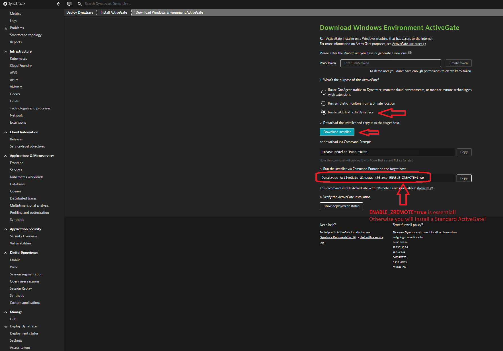
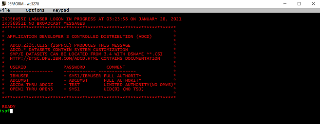
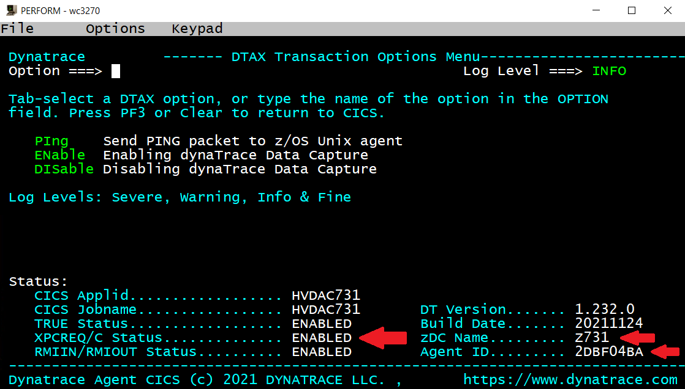

## Deployment and Customization

In this module you will learn how to deploy a Mainframe ActiveGate and zRemote and make the definitions on the Mainframe to connect an LPAR to this zRemote.

### Step 1: Open Dynatrace Tenant
- Open the Dynatrace tenant provided to you
- Login with the credentials provided to you

  

### Step 2: Install the Mainframe ActiveGate
- Select `Deploy Dynatrace` and click on `Install Active Gate`

  

- Select `Windows`

  

- Check `Route z/OS traffic to Dynatrace` (Step 1)
- Click on `Download Installer` (Step 2) OR Click on `Copy` and paste the download command into a DOS prompt, press `Enter`
- Wait for the download to finish (can take a while)
- Navigate to the folder containing the downloaded file in the DOS prompt (either your User directory or the Downloads folder)
- `Copy` installation command from the Dynatrace Tenant (Step 3) and install with the default settings
- Click on `Show Deployment Status` after the Installation has been successful

  

### Step 3: Prepare and start the zDC
- Double click on the X3270 Session called `Perform` on the Desktop
- Logon to ISPF with `logon <userid>` using the Userid provided to you 

  

- Type `ispf` and navigate to `3.4`

  

- Edit the SYSIN for the zDC parameters - `<userid>.CI.R070300.ZDCSYSIN(ZDCSYIN1)`
- Provide the IP-Address of your Mainframe ActiveGate and Port 8898 in the DTAGTCMD string
- Note: the IP-Address is the one of your VM (the one shown in the titlebar of your RDP-Session)

  

- Keep all other parameters as they are  
- Submit the zDC JCL in `<userid>.CI.R070300.JCL(ZDCJCL1)`
- Check in sdsf if the job `AFVDZnnn` is running
- Browse the job spool to check if the zDC has connected properly to the zRemote

```
ZDC955L Dynatrace connection being processed ZDC-Job/ID:AFVDZ731/Z731                  
ZDC958L Dynatrace INIT completed, ZDC AgentId received ZDC-Job/ID:AFVDZ731/Z731        
ZDC993I Opn1RFD:0008  /u/labuser/labusr2/ci/7.3build/log/dt_ZLOCAL1_Z731_50397350.0.log
```

### Step 4: Prepare CICS transaction
- Submit the CICS JCL in dataset `<userid>.CI.R070300.JCL (Cnnn5301)`
- Check in SDSF, if the job `HVDACnnn` is running
- You can use command `=s.st` from anywhere in ISPF
- You may use commands `owner <userid>` and `pre *` to display all jobs running under your userid

  

- Double click on the X3270 Session called `Perform` on the Desktop again to open a second session
- Logon to CICS with `l HVDACnnn` 

  

- Click on Keypad and `Clr Scrn`
- Make a newcopy using `cemt s prog(ADKCOBOL) ne`
 
  

- Optionally check the status of your CICS Agent using transaction `DTAX` in your CICS 

  

- CICS agent should be `Enabled` and `Agent ID` should contain a value

### Step 5: Define the CICS transaction in Dynatrace
- Open your Dynatrace Tenant
- Navigate to `Settings -> Server Side Service Monitoring -> Deep Monitoring -> CICS, IMS and MQ Monitoring` 
- In section `Transaction Monitoring` click on `Add CICS transaction Start Id filter` and add transaction `DADC`
- Do not forget to `Save changes`
- Check the status of your CICS Agent using transaction `DTAX` in your CICS 
- Type command `conf` after `Option ===>`  

   
 
### Step 6: Trigger the Mainframe transaction 
- Submit `<userid>.JCL (AFDTRAN)` 
- This will execute transaction `DADC` 20 times
- You will see these PurePaths as Requests under the CICS service (`Transactions and Services -> HVDACnnn -> View PurePaths')
- Go to `sdsf` and type `log` to browse the System Log
- At the bottom you will see messages like these (check those prefixed with your own CICS region `HVDACnnn`):
```
+HVDAC731 Africa                 
+HVDAC731 COBOL ADKCOB  complete.
+HVDAC731 Australia              
+HVDAC731 COBOL ADKCOB  complete.
+HVDAC731 Australia              
+HVDAC731 COBOL ADKCOB  complete.
+HVDAC731 Africa                 
+HVDAC731 COBOL ADKCOB  complete.
+HVDAC731 Australia              
+HVDAC731 COBOL ADKCOB  complete.
+HVDAC731 Africa                 
+HVDAC731 COBOL ADKCOB  complete.
+HVDAC731 America                
+HVDAC731 COBOL ADKCOB  complete.
+HVDAC731 Invalid                
+HVDAC731 COBOL ADKCOB  complete. 
```

### You've arrived
- You have successfully deployed Dynatrace and have defined and captured the CICS transaction, which will be used in the SDK Hands-On! 
