## Hands-on: z/OS Connect

In this module you will learn how to to define a z/OS Connect Service using IBM z/OS Explorer.

The goal is to create a z/OS Connect Service and monitor it with the Dynatrace OneAgent for z/OS Java.

### Step 1: Establish Connection to z/OS Connect Server
- Open z/OS Explorer by double clicking the `zosxplorer` icon on the Desktop

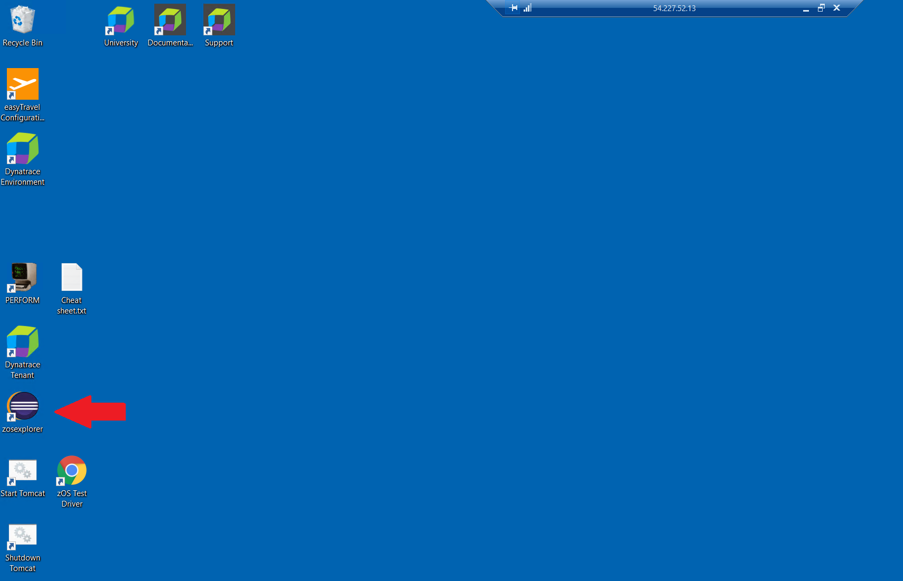

- Click on `Add` next to the `Credentials` pane

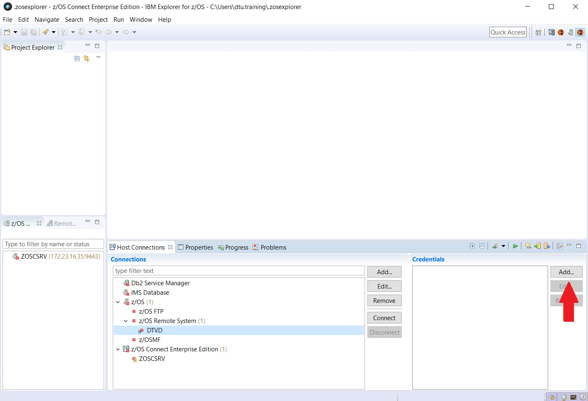

- Provide your Credentials and click `OK`

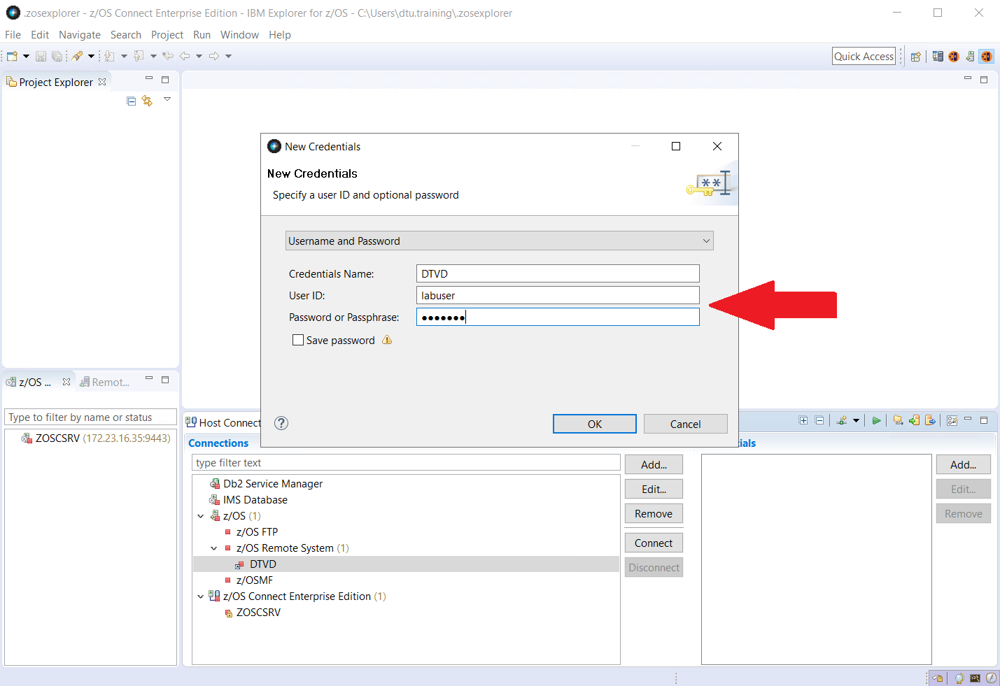

- Select `DTVD` and click on `Edit`

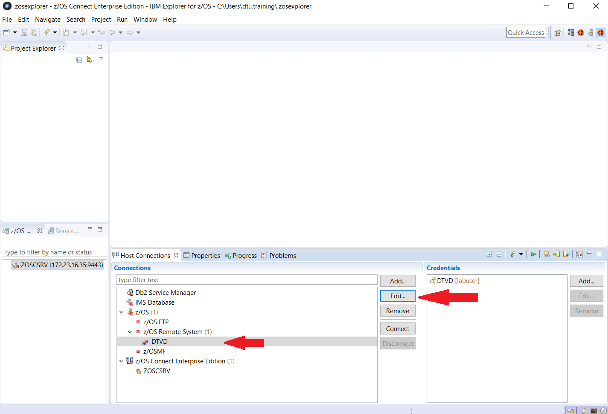

- Provide your own User ID in the `Default User ID` field and click`OK`

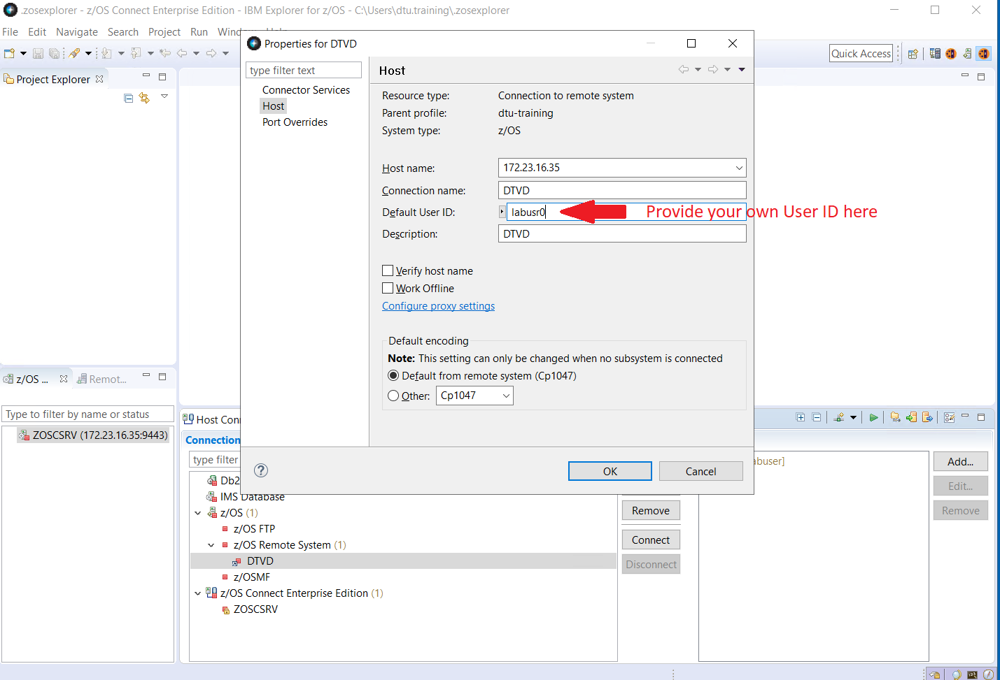

- Select `ZOSCSRV` entry in the `z/OS Connect EE Servers` pane and choose `Connect`

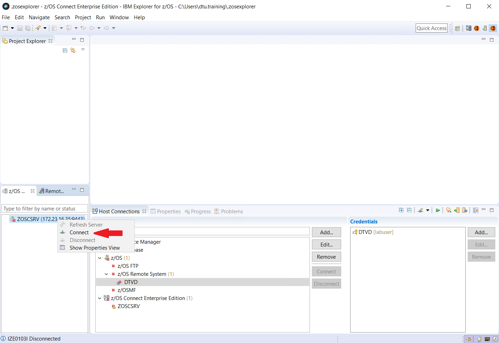

- Select `Use Existing Credentials` and select the `DTVD` credentials you have previously created

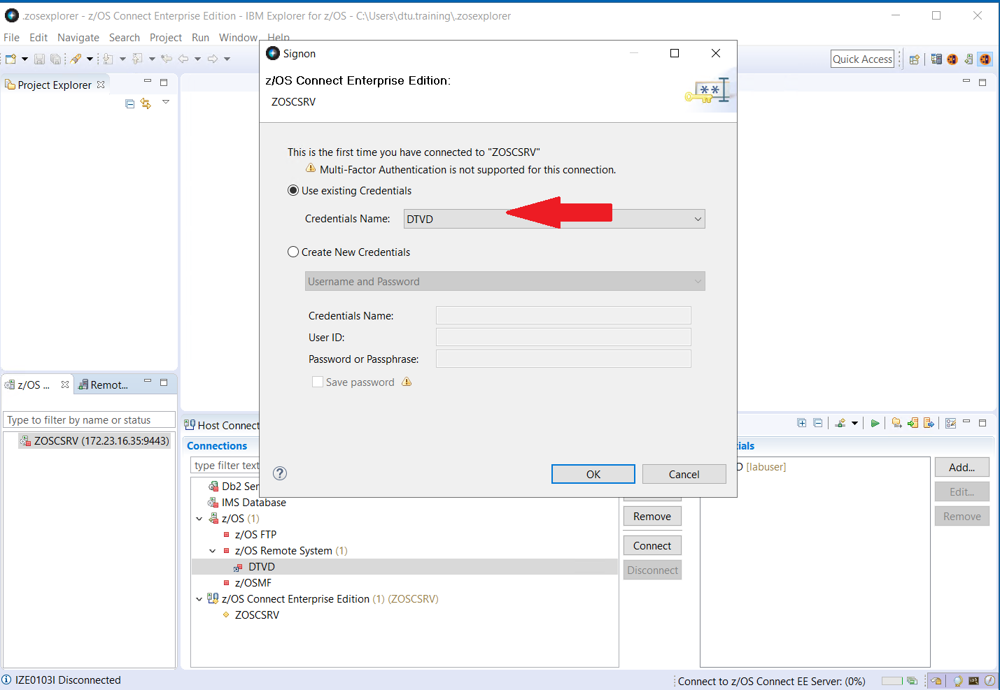
   
- Provide your Credentials and click `OK`

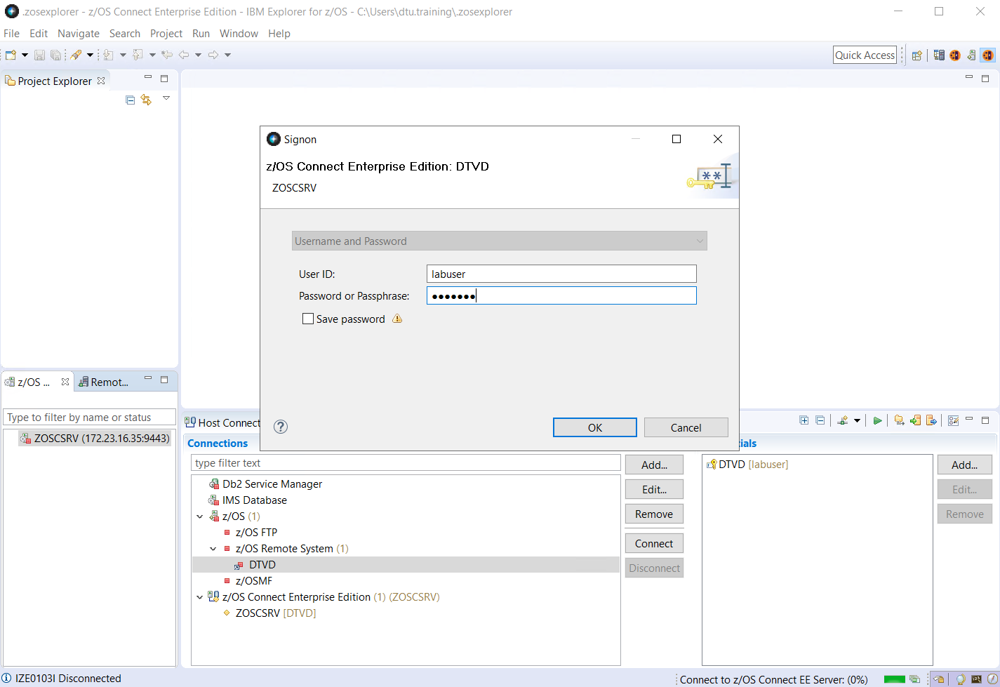
   
   
### Step 2: Create Service in IBM z/OS Explorer

Overview
This document provides step-by-step instructions on how to – 
•	create a service in IBM Explorer for z/OS 
•	deploy the service in z/OS Connect instance in mainframe
•	update server configuration in z/OS Connect
The IBM sample program, EDUCHAN, is used in the backend CICS region to serve the request received by this service

Pre-Requisite
•	IBM Explorer for z/OS installed with z/OS Connect Enterprise Edition plugin
•	A successful connection is established from IBM Explorer for z/OS to z/OS Connect in DTVD.DTWLAB.DYNATRACE.ORG
•	EDUCHAN resource is defined and installed in the backend CICS region

To create a Service in IBM Explorer for z/OS, first switch the perspective to z/OS Connect Enterprise Edition
1.	From the main menu, select `Window > Perspective > Open Perspective > Other`. The Open Perspective wizard opens.
2.	Select `z/OS Connect Enterprise Edition`

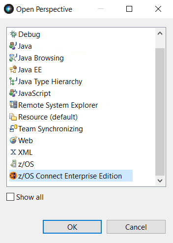

Create a z/OS Connect EE service project in the z/OS Connect Enterprise Edition perspective and define the request and response service interfaces.
1.	Select `File > New > Project`. The New Project wizard opens

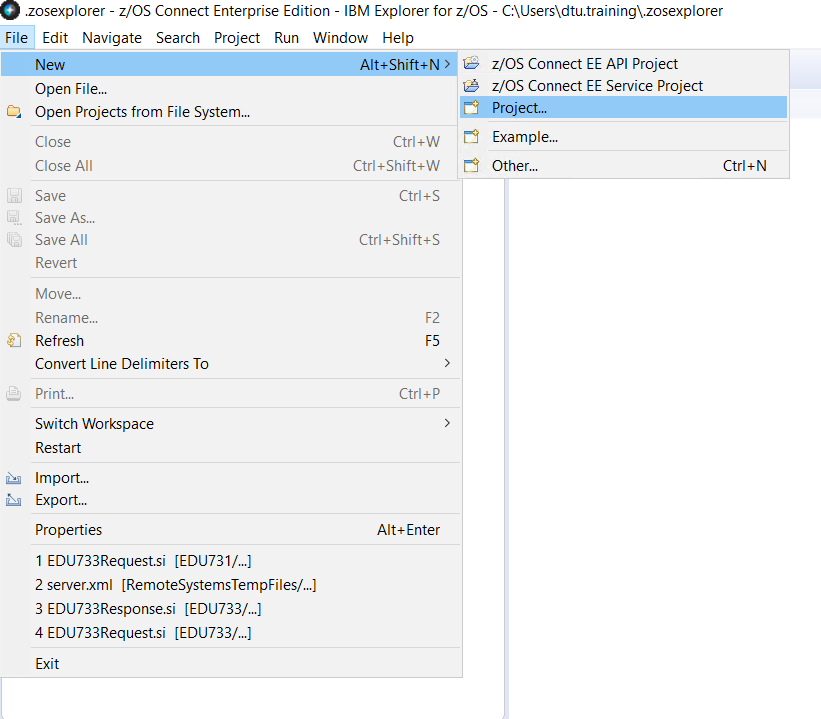

2.	Select `z/OS Connect Enterprise Edition > z/OS Connect EE Service Project` and click `Next`

3.	Enter project name `EDUnnn` (`nnn` is your three digit ID)

4.	In the Project type drop-down, select `CICS Channel Service` 

5.	Optionally type in a description and click `Finish` (a service template is created with errors by default)

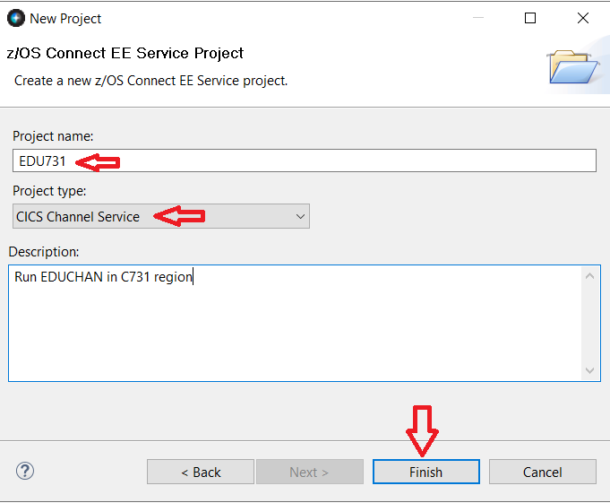

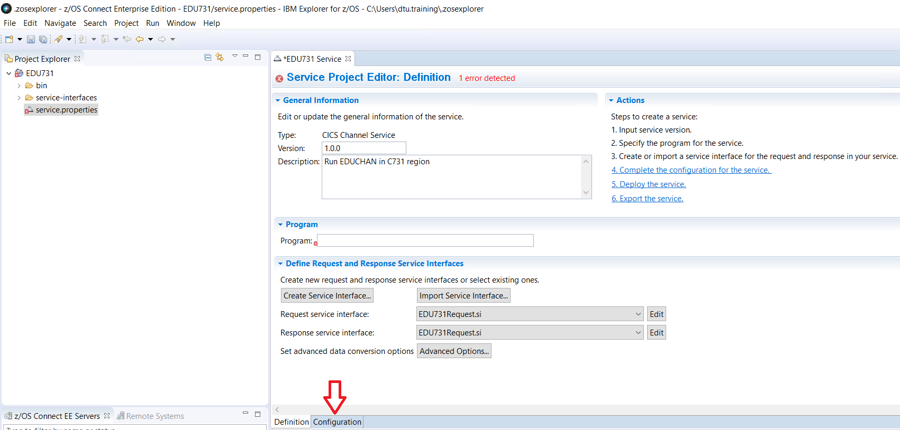

6.	Select `Configuration` tab and enter `Conn7nn` (`Conn7nn` is the unique connection ID of your CICS region, `7nn` is your three digit ID) 
Note: This connection ID should match with your `<zosconnect_cicsIpicConnection>` entry in `server.xml` configuration in z/OS Connect set up. 

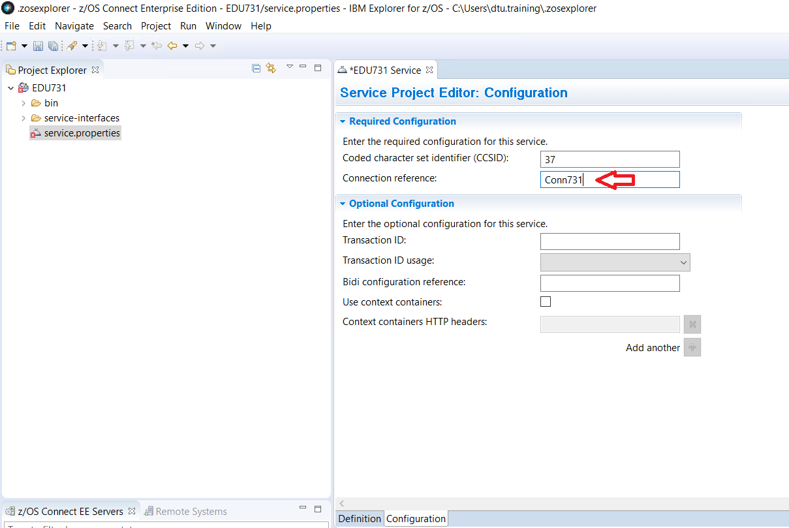

7.	Switch to the `Definition` tab to create Service interface definitions

8.	Enter `EDUCHAN` in the Program text box (`EDUCHAN` is an IBM sample COBOL CICS Application defined and installed in your CICS region)

9.	Click on button `Create Service Interface`

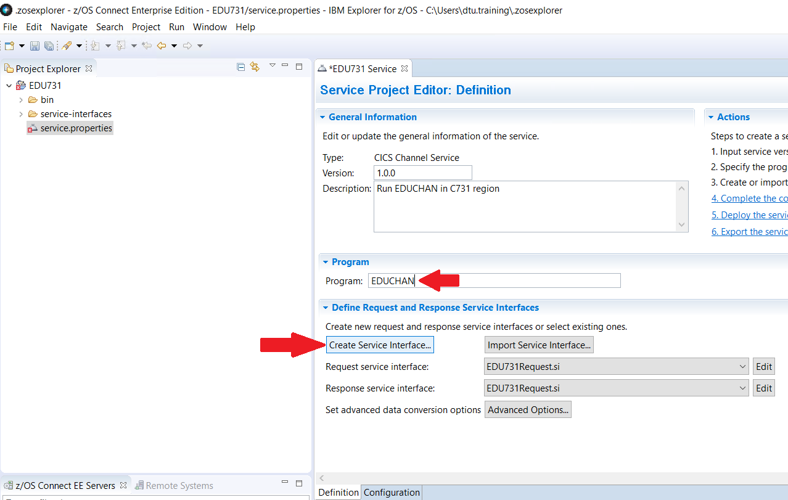

10.	Type in Service name `EDUnnnRequest` for Request service definition and click `OK`

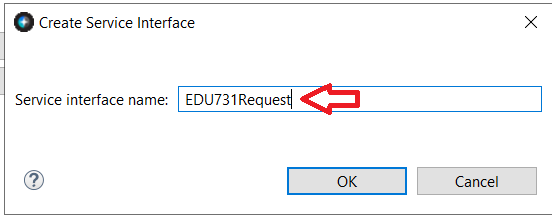

11.	Rename the Channel and Container fields by double-clicking on each entry
Channel -> `EDUCHANNEL`
Container1 -> `INPUTDATA`
For Container1, select `CHAR in the datatype field`

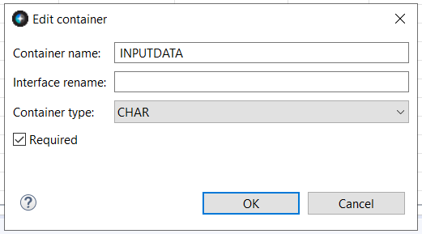

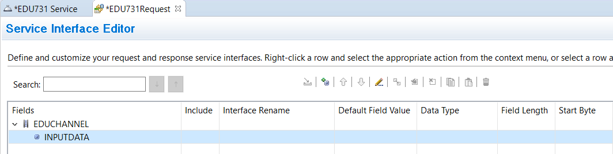

12.	Save Service Interface `EDUnnnRequest`

13.	Switch to tab `EDUnnnService` tab and create another service interface for the Response (follow Step 2 above)

14.	Create a response service with name `EDUnnnResponse`

15.	In the Service interface editor, create three containers with the following names and types for response service. Use the add icon at the top to add more containers
Containers
a.	Container Name: CICSRC; Container Type:  BIT
b.	Container Name: OUTPUTDATA; Container Type: CHAR
c.	Container Name: CICSTIME; Container Type: CHAR

16.	Save the `EDUnnnResponse` window

17.	Switch to `EDUnnn` Service window

18.	Select your new Request and Response service in the dropdown

19.	Save `EDU737` Service

### Step 3: Deploy Service in z/OS Connect

To deploy the service, ensure you have a z/OS Connect Host connection established to DTVD using your credentials

To deploy the service,
1.	Right click on your `EDUnnn` project in the Project Explorer pane
2.	Select `z/OS Connect EE > Deploy Service to z/OS Connect EE Server`
3.	Click `OK` on the Deploy Service pop-up

This will deploy an `EDU737.sar` file in this path: /var/zosconnect/v3r0/servers/defaultServer/resources/zosconnect/services in DTVD

### You've arrived
- You have successfully defined and deployed a z/OS Connect Service for program `EDUCHAN`! 

