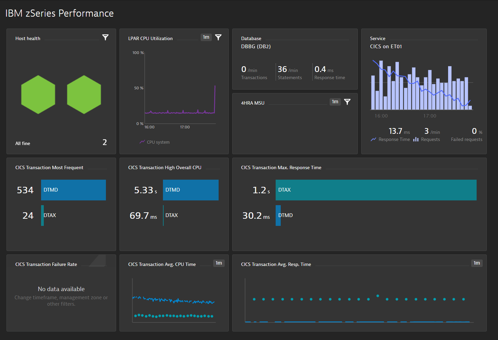
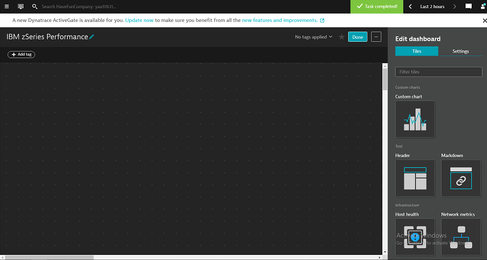
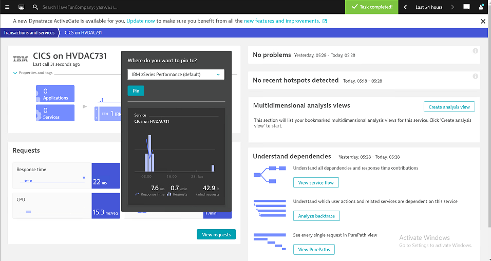
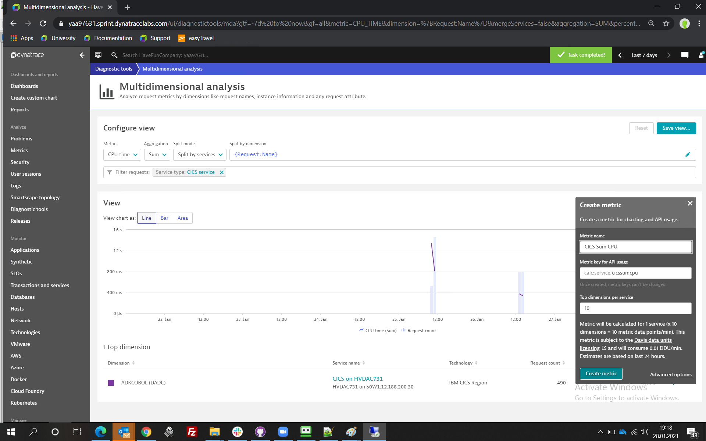

## Metrics, Charts and Dashboards

In this module you will learn how to to define Custom metrics, Charts and Dashboards.

The goal is to create this sample Dashboard:

   

### Step 1: Create Dashboard
- Open the Dynatrace tenant provided to you
- Go to `Dashboards` and click on `Create Dashboard`
- Provide Dashboard name `IBM zSeries Performance` and type `Create
- This will bring you to an empty Dashboard

   

### Step 2: Create "Host Health" Chart
- Drag & drop `Host health` tile into your Dashboard 
- Keep all defaults
- Click `Done`

### Step 3: Create "CICS Service" Chart
- Go to your CICS service (`Transactions and Services -> HVDACnnn`)
- Click on the three `...` right to the name of the CICS Service
- Select `Pin to Dashboard`, select the `IBM zSeries Performance` Dashboard and `Pin`

  

- Keep the defaults and click `Done` for the Services Chart

### Step 4: Create "LPAR CPU Utilization" Chart
- Drag & Drop `Custom Chart` to your Dashboard 
- You might need to click `Edit` if you are not yet Edit mode
- Click `Configure Chart`
- Under `add Metric` select Category `Hosts`
- Under Metric select `z/OS General CPU Usage`
- Keep defaults and select `Pin as new tile`
- Select your Dashboard and `Pin`, then `Open Dashboard`

### Step 5: Create "LPAR 4HRA MSU" Chart
- Drag & Drop `Custom Chart` to your Dashboard 
- You might need to click `Edit` if you are not yet Edit mode
- Click `Configure Chart`
- Under `add Metric` select Category `Hosts`
- Under Metric select `z/OS z/OS Rolling 4 hour MSU average`
- Keep defaults and select `Pin as new tile`
- Select your Dashboard and `Pin`, then `Open Dashboard`

### Step 6: Create Analysis Views for different Metrics
- ===> Go to `Diagnostic tools` and and click on `Create analysis view`
- Select CPU Time, Sum, Split Services, Filter by CICS Service
- Click `Save metric`
- Create metric as "CICS Sum CPU"

  

- ===> Go to `Diagnostic tools` and and click on `Create analysis view`
- Select CPU Time, Average, Split Services, Filter by CICS Service
- Click `Save metric`
- Create metric as "CICS Avg CPU"

- ===> Go to `Diagnostic tools` and and click on `Create analysis view`
- Select Response Time, Maximum, Split Services, Filter by CICS Service
- Click `Save metric`
- Create metric as "CICS Max Response Time"

- ===> Go to `Diagnostic tools` and and click on `Create analysis view`
- Select Response Time, Average, Split Services, Filter by CICS Service
- Click `Save metric`
- Create metric as "CICS Avg Response Time"

- ===> Go to `Diagnostic tools` and and click on `Create analysis view`
- Select Failure Rate, Average, Split Services, Filter by CICS Service
- Click `Save metric`
- Create metric as "CICS Failure Rate"

- ===> Go to `Diagnostic tools` and and click on `Create analysis view`
- Select Request Count, Count, Split Services, Filter by CICS Service
- Click `Save metric`
- Save it as 'CICS Request Count'

### Step 7: Open your Dashboard and add Charts
- Drag and drop a Custom Chart for each Metric created above
- Select `Configure Custom Chart`
- Select your metric from the dropdown (should contain CICS)
- Click `Update Dashboard Tile`
- Rearrange Tiles as needed

### You've arrived
- You have successfully created a new Dashboard with your key Mainframe components! 

