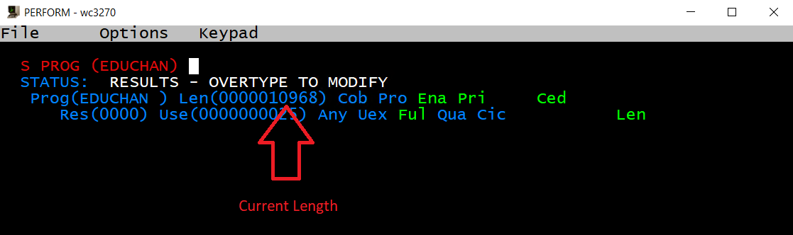
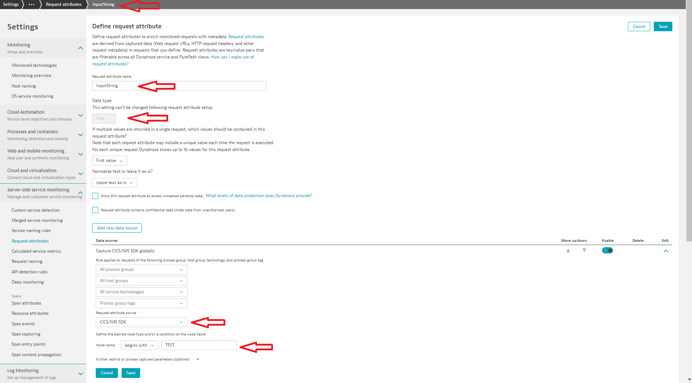

## Capture Application Data with the CICS SDK

In this module you will learn how to capture application data using the SDK and making it available in Dynatrace.

### Step 1: Prepare your COBOL application program
- Edit member `<userid>.JCL(EDUCHAN)`
- Uncomment the following lines in the source code
 
begin and end marked with
```COBOL
*==============================================================*
```

```COBOL
*==============================================================*
*=== Capture Application Data, i.e. Input String using the SDK  
                                                                
     Call "DTDCTF" Using INPUTSTRING,                           
                         ARGLEN,                                
                         ARGCCSID Returning RC.                 
     If RC Not Equal ZERO                                       
         MOVE "DTDCTF" to MSG_API                               
         MOVE RC to MSG_RC                                      
         EXEC CICS WRITE OPERATOR TEXT(ERROR_MSG) END-EXEC.     
```
 
```COBOL
*=== Insert Node in the current PurePath, which will hold the data
Call "DTENTF" Using NODENAME, NAMELEN, TOKEN Returning RC.
If RC Not Equal ZERO                                      
    MOVE "DTENTF" to MSG_API                              
    MOVE RC to MSG_RC                                     
    EXEC CICS WRITE OPERATOR TEXT(ERROR_MSG) END-EXEC.   
```
 
```COBOL
*=== If the data is invalid, create an Exception in the PurePath
If ARGUMENT Equal "***"                         
   Move 'DTEXEX' TO PGMNAME                           
   Call 'DTEXEX' Using TOKEN Returning RC             
Else                                                  
   Move 'DTEX' TO PGMNAME                             
   Call 'DTEX' Using TOKEN Returning RC.              
                                                      
If RC Not Equal ZERO                                  
    MOVE PGMNAME to MSG_API                           
    MOVE RC to MSG_RC                                 
    EXEC CICS WRITE OPERATOR TEXT(ERROR_MSG) END-EXEC.
```

- Compile EDUCHAN by submitting Compile JCL in `<userid>.JCL(EDUCHANJ)`
- Check in `sdsf` if the Compile & Link ended with RC=0 in all steps 
- Go to your CICS session or open a new session and logon to CICS with `l HVDACnnn` 
- Click on Keypad and `Clr`
- Type `cemt s prog(EDUCHAN)` (this will display the current length and use count)

  

- Make a `newcopy` of the new program version by adding `ne` after `cemt s prog(EDUCHAN)` (the length should change because of the added SDK code)

  

- Your new EDUCHAN program version is active now
 
### Step 2: Define Request Attribute for your Mainframe Data

- Go to your Dynatrace Tenant
- Select `Settings->Server Side Service Monitoring->Request Attributes`
- Click on `Define new Request Attribute`
- Provide any name for the Request Attribute, e.g. `InputString` (this is how it will be referenceable anywhere in Dynatrace)
- Use Data Type `Text` 
- Define the Data Source, in this case Request Attribute Source `CICS/IMS SDK` 
- Use `Node Name equals TESTNODE`  or `Node Name begins with TEST`

  

- Click on `Save` 
- Note: if you would like to use a Node name different than `TESTNODE`, just change the variable `NODENAME` in `<userid>.JCL(EDUCHAN)`, re-compile and newcopy. 
Make sure, that the Request Attribute is defined appropriately with the correct Node Name.
  
  

### Step 3: Trigger some test transactions
- Use the `z/OS Test Driver` Shortcut on your Desktop (make sure, that Tomcat is started)
- Provide different input strings and also at least an input string of `***` (three asterisks)

### Step 4: Verify Request Attributes in Dynatrace
- Go to your Dynatrace Tenant
- You will see the recent EDUCHAN PurePaths again as Requests under the CICS service (`Transactions and Services -> HVDACnnn -> View PurePaths`)
- Please check only the PurePaths for the latest transactions (because only these contain our SDK code and the Request Attribute)
- You will now see the input strings as Request Attribute `InputString`
- In addition we are getting an exception in Dynatrace, if InputString is `***`
- Make sure, that you have used at least one value of `***` for the input string


### Step 5: Define, that a transaction with an exception is treated and marked as "Failure" in Dynatrace  
- Go to your Dynatrace Tenant
- Go to your CICS service (`Transactions and Services -> HVDACnnn`)
- Click on the three `...` right to the name of the CICS Service
- Select `Edit`

  

- Add a new exception called `TESTNODE_Exception` under `Error Detection -> Custom handled exceptions` 

  

- Note: `TESTNODE` is the `NODENAME` in our SDK-Code, so the Exception name starts with that Node Name, suffixed with `_Exception`    

### Step 6: Trigger some more test transactions
- Use the `z/OS Test Driver` Shortcut on your Desktop (make sure, that Tomcat is started)
- Provide different input strings and also at least an input string of `***` (three asterisks)
- Go to your Dynatrace Tenant
- PurePaths with Exceptions should now be marked as failed (with a red bar left to the PP name)

  

### You've arrived
- You have successfuly instrumented your application to capture Mainframe application data as Request Attribute and are also able to create exceptions! 


