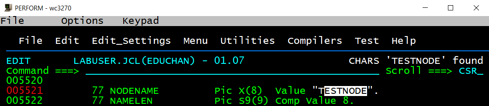

## Capture Application Data with the CICS SDK

In this module you will learn how to capture application data using the SDK and making it available in Dynatrace.

### Step 1: Prepare your COBOL application program
- Edit member `<userid>.JCL(ADKCOBOL)`
- Uncomment the following lines in the source code
 
begin and end marked with
```COBOL
*==============================================================*
```

```COBOL
*=== Capture Application Data, i.e. Sales-Region as Argument
Call "DTDCTF" Using ARGUMENT, ARGLEN, ARGCCSID Returning RC.
If RC Not Equal ZERO                                        
    MOVE "DTDCTF" to MSG_API                                
    MOVE RC to MSG_RC                                       
    EXEC CICS WRITE OPERATOR TEXT(ERROR_MSG) END-EXEC.      
```
 
```COBOL
*=== Insert Node in the current PurePath, which will hold the data
Call "DTENTF" Using NODENAME, NAMELEN, TOKEN Returning RC.
If RC Not Equal ZERO                                      
    MOVE "DTENTF" to MSG_API                              
    MOVE RC to MSG_RC                                     
    EXEC CICS WRITE OPERATOR TEXT(ERROR_MSG) END-EXEC.   
```
 
```COBOL
*=== If the data is invalid, create an Exception in the PurePath
If ARGUMENT Equal "Invalid  "                         
   Move 'DTEXEX' TO PGMNAME                           
   Call 'DTEXEX' Using TOKEN Returning RC             
Else                                                  
   Move 'DTEX' TO PGMNAME                             
   Call 'DTEX' Using TOKEN Returning RC.              
                                                      
If RC Not Equal ZERO                                  
    MOVE PGMNAME to MSG_API                           
    MOVE RC to MSG_RC                                 
    EXEC CICS WRITE OPERATOR TEXT(ERROR_MSG) END-EXEC.
```

- Compile ADKCOBOL by submitting Compile JCL in `<userid>.JCL(ADKCOBJ)`
- Check if the Compile & Link ended with RC=0 in all steps 
- Go to your CICS session or open a new session and logon to CICS with `l HVDACnnn` 
- Click on Keypad and `Clr`
- Make a newcopy using `cemt s prog(ADKCOBOL) ne`
- Your new ADKCOBOL program version is active now
 
### Step 2: Define Request Attribute for your Mainframe Data

- Go to your Dynatrace Tenant
- Select `Settings->Server Side Service Monitoring->Request Attributes`
- Click on `Define new Request Attribute`
- Provide any name for the Request Attribute, e.g. `RegionName` (this is how it will be referenceable anywhere in Dynatrace)
- Use Data Type `Text` 

  

- Define the Data Source, in this case Request Attribute Source `CICS SDK` 
- Use `Node Name equals TESTNODE`  or `Node Name begins with TEST`

  

- Click on `Save` 
- Note: if you would like to use a Node name different than `TESTNODE`, just change the variable `NODENAME` in `<userid>.JCL(ADKCOBOL)`, re-compile and newcopy. 
Make sure, that the Request Attribute is defined appropriately with the correct Node Name.
  
  

### Step 3: Trigger some test transactions
- Go to ISPF
- Submit 20 DADC test transactions using JCL in `<userid>.JCL(ADKTRAN)`
- Note the execution time of the transactions 
- Check any messages in the system log by going to `sdsf` and typing `log`
- At the bottom you will see messages like these (check those prefixed with your own CICS region `HVDACnnn`):

```
+HVDAC731 Africa                 
+HVDAC731 COBOL ADKCOB  complete.
+HVDAC731 Australia              
+HVDAC731 COBOL ADKCOB  complete.
+HVDAC731 Australia              
+HVDAC731 COBOL ADKCOB  complete.
+HVDAC731 Africa                 
+HVDAC731 COBOL ADKCOB  complete.
+HVDAC731 Australia              
+HVDAC731 COBOL ADKCOB  complete.
+HVDAC731 Africa                 
+HVDAC731 COBOL ADKCOB  complete.
+HVDAC731 America                
+HVDAC731 COBOL ADKCOB  complete.
+HVDAC731 Invalid                
+HVDAC731 COBOL ADKCOB  complete. 
```

### Step 4: Verify Request Attributes in Dynatrace
- Go to your Dynatrace Tenant
- You will see the recent DADC PurePaths again as Requests under the CICS service (`Transactions and Services -> HVDACnnn -> View PurePaths`)
- Please check only the PurePaths for the latest 20 DADC transactions (because only these contain our SDK code and the Request Attribute)
- Differently to the Deployment Hands-On, we will see the different values (Europe, Asia, America, Africa, Australia, Invalid) as Request Attribute `RegionName`
- In addition we are now getting an exception in Dynatrace, if Sales Region is "Invalid"
- Make sure, that at least one value of "Invalid" is shown (if not, just submit additional DADC test transactions until "Invalid" occurs)


### Step 5: Define, that a transaction with an exception is treated and marked as "Failure" in Dynatrace  
- Go to your Dynatrace Tenant
- Go to your CICS service (`Transactions and Services -> HVDACnnn`)
- Click on the three `...` right to the name of the CICS Service
- Select `Edit`

  

- Add a new exception called `TESTNODE_Exception` under `Error Detection -> Custom handled exceptions` 

  

- Note: `TESTNODE` is the `NODENAME` in our SDK-Code, so the Exception name starts with that Node Name, suffixed with `_Exception`    

### Step 6: Trigger some more test transactions
- Go to ISPF
- Submit 20 DADC test transactions using JCL in `<userid>.JCL(ADKTRAN)`
- Go to your Dynatrace Tenant
- PurePaths with Exceptions should now be marked as failed

  

### You've arrived
- You have successfuly instrumented your application to capture Mainframe application data as Request Attribute and are also able to create exceptions! 


