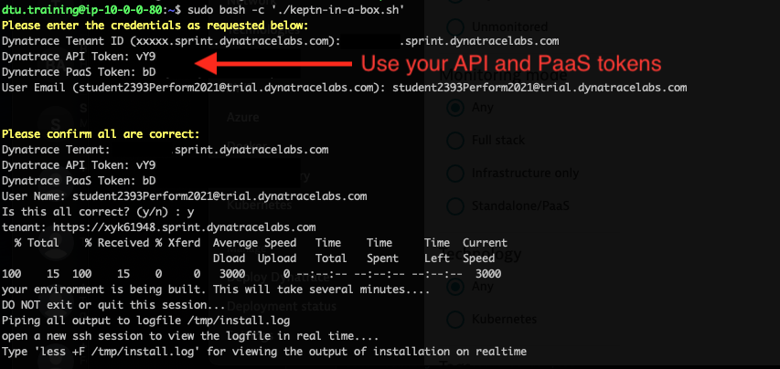

## Pre-Flight Checklist

Keptn-in-a-Box is a 🚀 rocket launcher for enabling tutorials or workshops in an easy, fast and ressource efficient way.
Keptn-In-A-Box is a Bash script that will convert a plain Ubuntu machine in a Single Node Kubernetes Cluster with Keptn installed and configured 

In a matter of minutes you'll have a fully configured Single Node Kubernetes Cluster for learning Keptn tutorials, trying out new functionalities, building your own pipeline or even delivering Performance-as-a-Self-Service.

Keptn-in-a-Box runs on microk8s, which is a simple production-grade upstream certified Kubernetes made for developers and DevOps.

Projects used for this Session
- [Keptn](https://keptn.sh/)
- [Jenkins Service for Keptn](https://github.com/keptn-sandbox/jenkins-service/)
- [Order Overview](https://github.com/dthotday-performance/overview)
- [Jmeter Plugin](https://github.com/dynatrace-oss/jmeter-dynatrace-plugin)
- [KIAB](https://github.com/keptn-sandbox/keptn-in-a-box)
- [Jmeter Service](https://github.com/keptn/keptn/tree/master/jmeter-service#workloads)

Let's begin by creating the necessary credentials.

### Create Credentials

  - [ ] TENANTID=mytenant.sprint.dynatracelabs.com
  - [ ] PAASTOKEN=myDynatracePaaSToken
  - [ ] APITOKEN=myDynatraceApiToken

Open a text editor, we will use this as a cheat sheet, for our Credential information.

1. Retrieve your Tenant ID. 

For this exercise, we need the fully qualified name without the trailing /.

**xxxx.sprint.dynatracelabs.com**

_For the TenantID protocol use: https://{your-domain}/e/{your-environment-id} for managed or https://{your-environment-id}.live.dynatrace.com for SaaS__


2. Create a Dynatrace API Token.

Log in to your Dynatrace tenant and go to **Settings > Integration > Dynatrace API**. Then, create a new API token with the following permissions

- [API Authentication](https://www.dynatrace.com/support/help/extend-dynatrace/dynatrace-api/basics/dynatrace-api-authentication/)
	
Use the following for the API permissions.


	
3. Create a Dynatrace PAAS token.

In your Dynatrace tenant, go to **Settings > Integration > Platform as a Service**, and create a new PaaS Token.

- [PaaS Token](https://www.dynatrace.com/support/help/reference/dynatrace-concepts/environment-id/#anchor_paas)

### Run Shell command

💻 Login to your Ubuntu instance

Use the credentials provided to open a ssh client or you can use the provided shell.

```bash
ssh dtu.training@Your-instance-ip
```

Next

Run the following command.
    
```bash
sudo bash -c './keptn-in-a-box.sh'
```
    
You will need to provide the **Dynatrace Tenant ID**, **Dynatrace API token**, **Dynatrace PaaS token** and a **Email**.
For the class, we can use the provided student account for the email.



answer **'y'** if the information is correct.

Press **enter**

Type 

```bash
less +F /tmp/install.log
```
for viewing the output of installation in realtime

Please be patient, this build can take ~13-20 minutes to finish.


### What we deployed

KIAB (Keptn in a Box)

| Componenet | Details |
| ---------- | ------ |
| Kubernetes | <ul><li>API</li><li>Cluster</li></ul> |
| [Keptn](https://keptn.sh/) | <ul><li>API</li><li>Bridge</li></ul> |
| Upstream Git | <ul><li>API</li><li>Repositories</li></ul> |
| CI/CD | <ul><li>Jenkins</li><li>Unleash</li></ul> |
| Order Application | <ul><li>Frontend Service</li><li>Customer Service</li><li>Catalog Service</li><li>Order Service</li></ul> |

### We can now access our KIAB.

Run the following from the command prompt.

```bash
less +F /tmp/install.log
```

Get the URL for KIAB.


Open a Browser window with the URL.

Welcome to KIAB.


### Run Pipeline

Click on **"Jenkins"**

Now we will kick off the Pipeline **01-deploy-order-application** to build out the application.

Login to Jenkins with the following credentials

* username = keptn
* password = keptn


After selecting the pipeline click **"build"**


### Order App Overview

This application was built for demonstations of Dynatrace.  The front-end look like this.


The overall application is made up of four Docker components: a frontend web UI and 3 backend services.  Once monitored by Dynatrace, a multi-tier call flow will be available such as shown below.


#### Pre-built Docker Images

The dt-orders application has pre-built problems programmed within different versions.  See source in the [dt-orders repo](https://github.com/dt-orders).  Each version for each service, has pre-built docker images that are published to [dockerhub](https://hub.docker.com/u/dtdemos).

This is a summary of the versions followed by a description of the problem scenarios.

| Service  | Branch/Docker Tag | Description |
|---|:---:|---|
| frontend | 1 | Normal behavior |
| catalog-service | 1 | Normal behavior |
| customer-service | 1 | Normal behavior |
| order-service | 1 | Normal behavior |
| customer-service | 2 | High Response time for /customer/list.html |
| order-service | 2 | 50% exception for /order/line URL and n+1 back-end calls for /order/form.html |
| customer-service | 3 | Normal behavior |
| order-service | 3 | Normal behavior |

### Problem Scenarios

#### Deploy dtdemos/customer-service:2


### Deploy dtdemos/order-service:2 

Both these scenearios are enabled


and...


### Examine Dynatrace 

Now lets look at what we have discovered in Dynatrace.

Open Dynatrace and navigate to **Hosts** in the menu and select the host.

Here we can examine all the proceses automatically discovered by the Dynatrace oneAgent.


We can also see the processes for the order application.


Next we can examine the Transactions and Services.

Select **Transactions and Services** from the menu.


You can also change the focus by using the _management zone_ filter.

Finally, we can also see how the KIAB configured Kubernetes cluster monitoring.

Select **Kubernetes** from the menu.


Pre-configured items also include:

1. Dashboards
1. Request Attributes
1. Calculated Service Metrics
1. Management Zones
1. Automatically Applied Tags

Now that we are more familiar with what we have running, let's continue to the next activity.

### Troubleshooting

If you need to rebuild the environment, follow these steps.

```bash
cd ~/keptn-in-a-box
```

This script will reset the Ubuntu instance by removing Kubernetes and the Dynatrace ActiveGate.

```bash
./resetenv.sh
```

Now we need to re-initialize the environment.

Run the following commands, then follow the process from above.
    
```bash
cd ~
sudo bash -c './keptn-in-a-box.sh'
```

