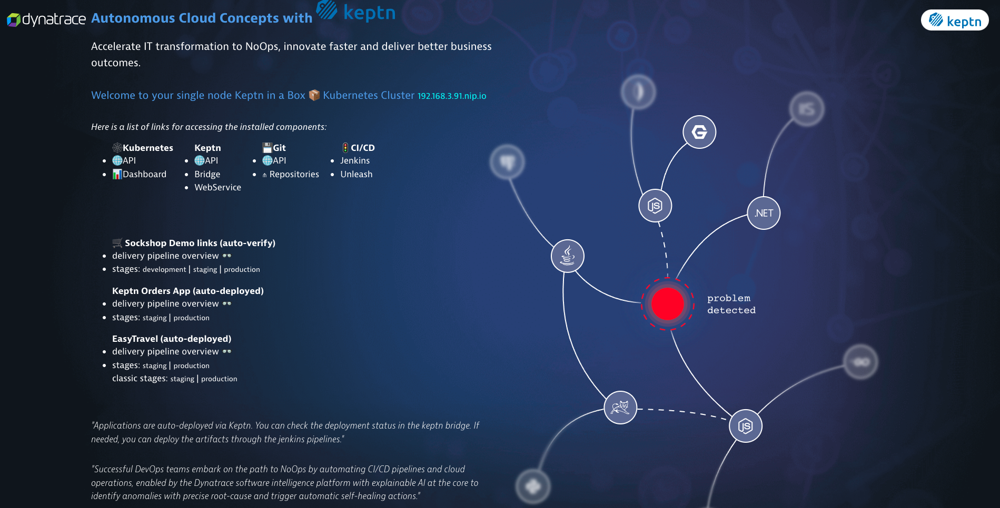
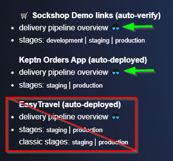
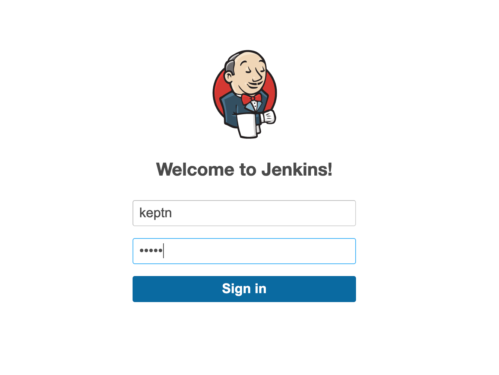
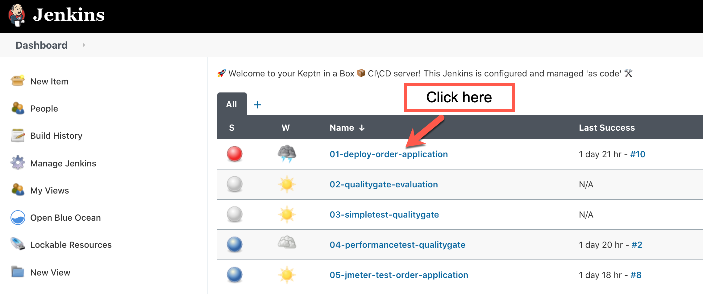
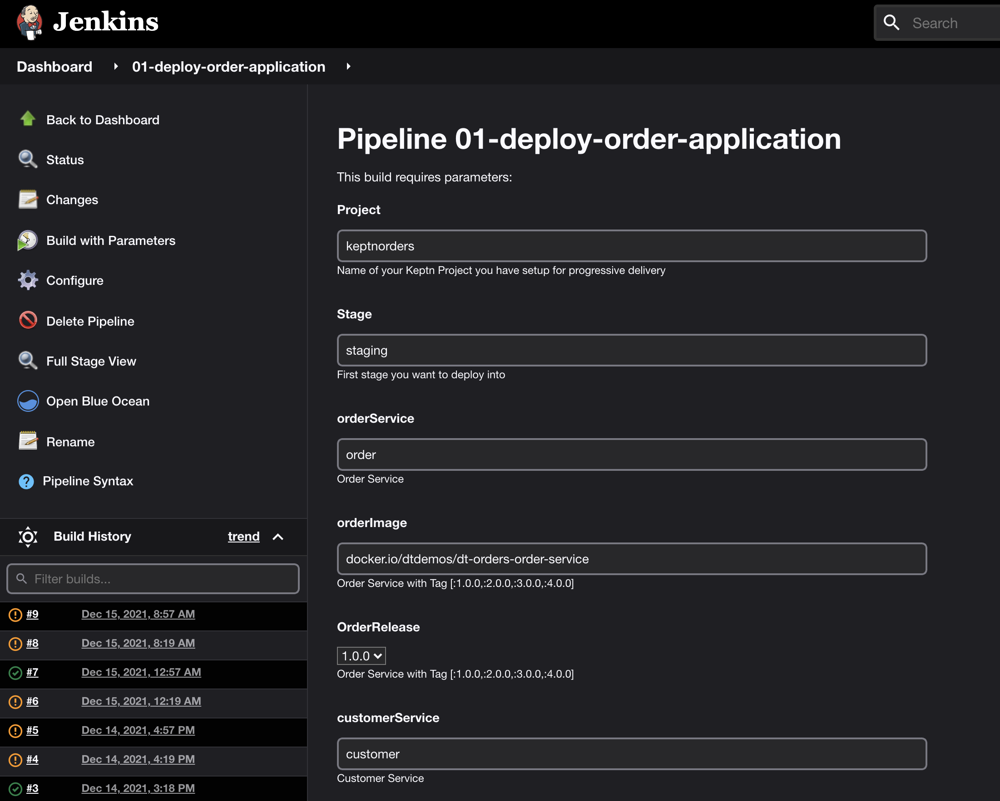
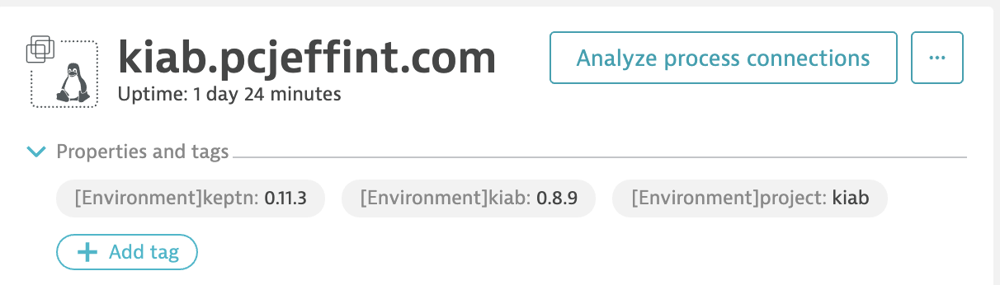
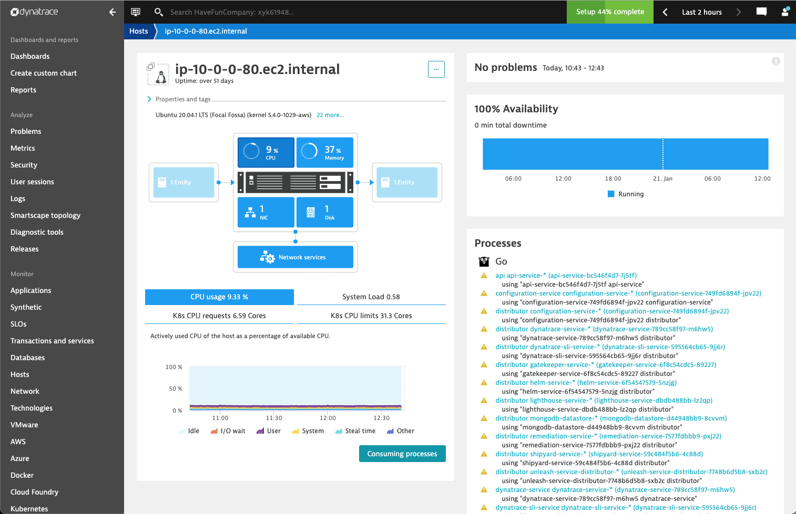
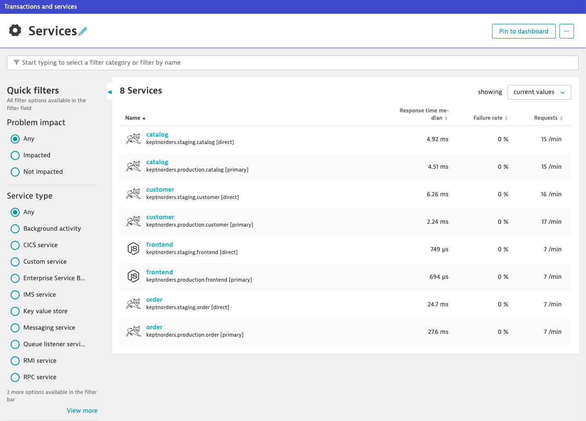
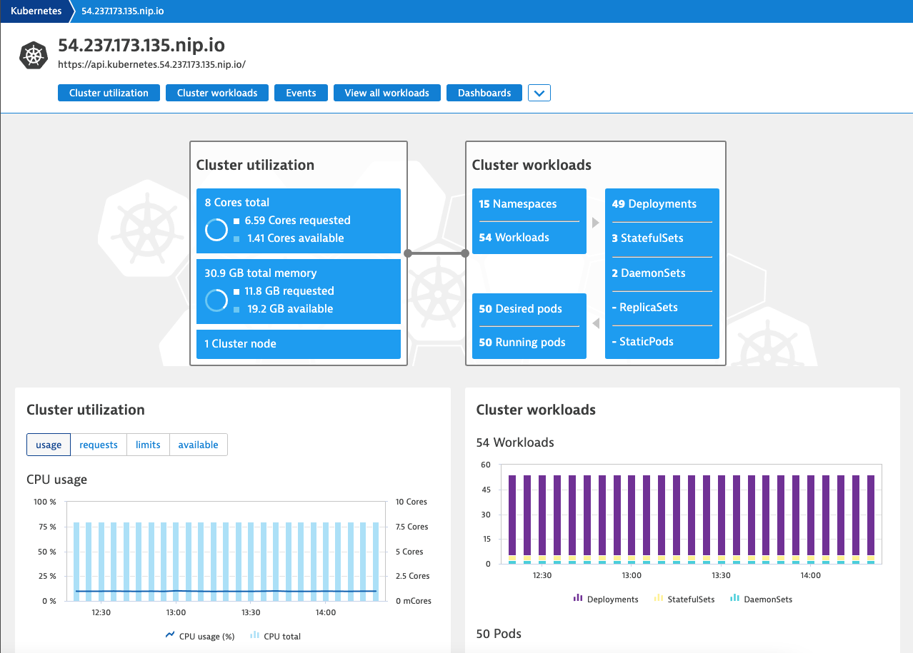

## Preperation

Keptn-in-a-Box is a 🚀 rocket launcher for enabling tutorials or workshops in an easy, fast and ressource efficient way.
Keptn-In-A-Box is a Bash script that will convert a plain Ubuntu machine in a Single Node Kubernetes Cluster with Keptn installed and configured 

In a matter of minutes you'll have a fully configured Single Node Kubernetes Cluster for learning Keptn tutorials, trying out new functionalities, building your own pipeline or even delivering Performance-as-a-Self-Service.

Keptn-in-a-Box runs on microk8s, which is a simple production-grade upstream certified Kubernetes made for developers and DevOps.

Projects used for this Session
- [Keptn](https://keptn.sh/)
- [Jenkins Service for Keptn](https://github.com/keptn-sandbox/jenkins-service/)
- [Order Overview](https://github.com/dthotday-performance/overview)
- [SockShop](https://github.com/keptn/examples)
- [EasyTravel](https://github.com/Dynatrace/easyTravel-Docker)
- [Jmeter Plugin](https://github.com/dynatrace-oss/jmeter-dynatrace-plugin)
- [KIAB](https://github.com/keptn-sandbox/keptn-in-a-box)
- [Jmeter Service](https://github.com/keptn/keptn/tree/master/jmeter-service#workloads)

## What have we prepared for you 

KIAB (Keptn in a Box)

| Componenet | Details |
| ---------- | ------ |
| Kubernetes | <ul><li>API</li><li>Cluster</li></ul> |
| [Keptn](https://keptn.sh/) | <ul><li>API</li><li>Bridge</li></ul> |
| Upstream Git | <ul><li>API</li><li>Repositories</li></ul> |
| CI/CD | <ul><li>Jenkins</li><li>Unleash</li></ul> |
| Order Application | <ul><li>Frontend Service</li><li>Customer Service</li><li>Catalog Service</li><li>Order Service</li></ul> |
| SockShop Application | <ul><li>Cart Service</li><li>CartMongoDB Service</li>|
| Easytravel Application | <ul><li>backend Service</li><li>frontend Service</li><li>angular service</li><li>www service</li>|

### How can you access your KIAB instance?

1. Access your Dynatrace Tenant
2. Go to Dashboards
3. open the "☁ Autonomous Cloud Concepts with Keptn" Dashboard.
4. Select link "🌐 KeptnInABox"


Optionally, you can also find the ip address, to the KIAB homepage, by loggining into your EC2 instance.
Then run the following from the command prompt.

```bash
less +F /tmp/install.log
```

Get the URL for KIAB from the log output.


Open a Browser window with the URL.

Welcome to KIAB.




## Validating the projects in the keptn bridge

Click on the "Bridge" link. This will open the keptn bridge.
You should see the preloaded projects.


You may need to run several pipelines to complete the deployments of the applications.
Don't worry, we will walk you through the process.

Validate each project stage has been deployed.

We will also validate each application is avaialble by navigating to the KIAB homepage.
Then select each application link.



## Run Pipelines

Click on **"Jenkins"**

Now we will kick off the Pipeline **01-deploy-order-application** to build out the application.

Login to Jenkins with the following credentials

* username = keptn
* password = keptn



After selecting the pipeline click **"build"**



The first build will fail, this is normal, becasue the pipeline files are pulled from a github repo.
Now, you should see "Build with parameters".



We now have different options for each pipeline build.
Instead of documenting each part here, we will walk through a few scenerios.

## Order App Overview

This application was built for demonstations of Dynatrace.  Here is the frontend.


The overall application is made up of four Docker components: a frontend web UI and 3 backend services.  Once monitored by Dynatrace, a multi-tier service flow will be available as shown below.


#### Pre-built Docker Images

The dt-orders application has pre-built problems programmed within different versions.  See source in the [dt-orders repo](https://github.com/dt-orders).  Each version for each service, has pre-built docker images that are published to [dockerhub](https://hub.docker.com/u/dtdemos).

This is a summary of the versions followed by a description of the problem scenarios.

| Service  | Branch/Docker Tag | Description |
|---|:---:|---|
| frontend | 1.0.0 | Normal behavior |
| catalog-service | 1.0.0 | Normal behavior |
| customer-service | 1.0.0 | Normal behavior |
| order-service | 1.0.0 | Normal behavior |
| customer-service | 2.0.0 | High Response time for /customer/list.html |
| order-service | 2.0.0 | 50% exception for /order/line URL and n+1 back-end calls for /order/form.html |
| customer-service | 3.0.0 | Normal behavior |
| order-service | 3.0.0 | Normal behavior |

### Problem Scenarios

#### Deploy dtdemos/customer-service:2.0.0


### Deploy dtdemos/order-service:2.0.0 

Both these scenearios are enabled


and...


## Examine Dynatrace 

Now lets take a look at what we have discovered in Dynatrace.

Open Dynatrace and navigate to **Hosts** in the menu and select the host.

### First, we must ensure the Host is tagged. 
You should see these tags,



If you do not see these tags, then we need to run a simple script to add the tags.
These tags will be added as Environment tags on the host.

Take these steps.
1. Login to your EC2 instance via ssh
2. Navigate to "keptn-in-a-box/resources/dynatrace/" directory

    ```bash
        cd keptn-in-a-box/resources/dynatrace/
    ```   
3. run this command.

    ```bash
        sudo ./hosttag.sh
    ```

After you have run this script, just wait a few minutes, then verify the tags have been added to the host.


### Next let's examine all the proceses automatically discovered by the Dynatrace oneAgent.



We can also see the processes for the order application.


Next we can examine the Transactions and Services.

Select **Transactions and Services** from the menu.



You can also change the focus by using the _management zone_ filter.

Finally, we can also see how the KIAB configured Kubernetes cluster monitoring.

Select **Kubernetes** from the menu.



### Pre-configured items also include:

1. Dashboards
1. Request Attributes
1. Calculated Service Metrics
1. Management Zones
1. Automatically Applied Tags
1. Applications
1. Problem notification
1. process and service naming rules

Due to to time constrainsts, we will visit each area as need during our working sessions.

Now that we are more familiar with what we have running, let's continue to the next activity.

