## Load Test Analysis Performance Issue

Learn how to use Dynatrace features that support Performance testing for each phase: scripting, analysis, and reporting

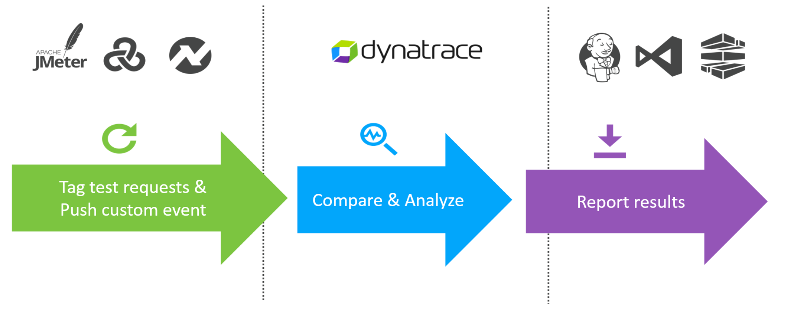

Now that we have our KIAB installed. 

Let's start by viewing a dashboard.

Click **"Dashboards"** from the Main Navigation menu.

Then Select the **"Autonomous Cloud Concepts with Keptn"** Dashboard.

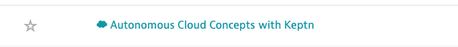

Now you should see your Dashboard.

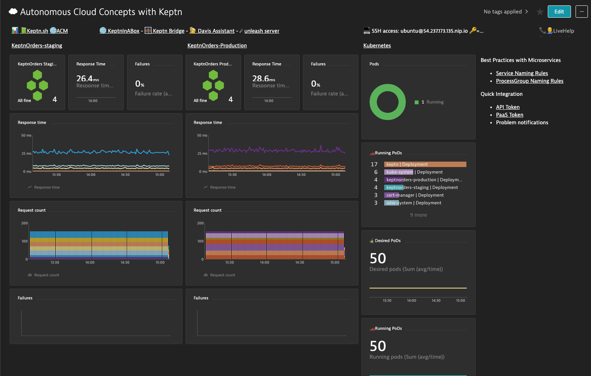

Next we will create a few configuration items and kick off a load test.

### Configuration

1.  Create a service tag
1.  Process Detection Naming rule
1.  Architecture Validation
1.  Run first Load Test
1.  Describe Dynatrace Load Test Request Attribute
1.  Describe Calculated Service Metrics for Load Test Steps
1.  Kick off Keptn Customer 2 Build
1.  Update Keptn: keptnorders staging Management Zone
1.  Run Load Test
1.  Examine Performance Test Dashboard with Transaction Steps
1.  Load Test Performance Analysis

### Create Service tag

To support tagging, Dynatrace provides both a manual approach (Settings > Tags > Manually applied tags) and an automated, rule-based approach (Settings > Tags > Automatically applied tags).

We are going to apply a manual tag for this exercise.

First we need to create a tag on the service.
Navigate to **Transactions and services>frontend** 

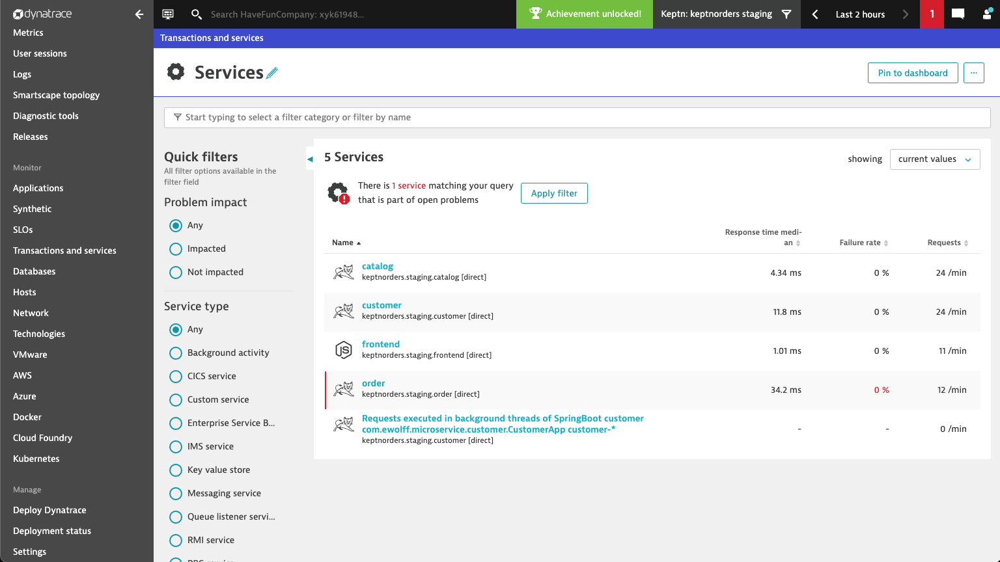

We are looking for **frontend** with **keptnorders.staging.frontend [direct]**

Now we can create the **"evalservice"** tag.

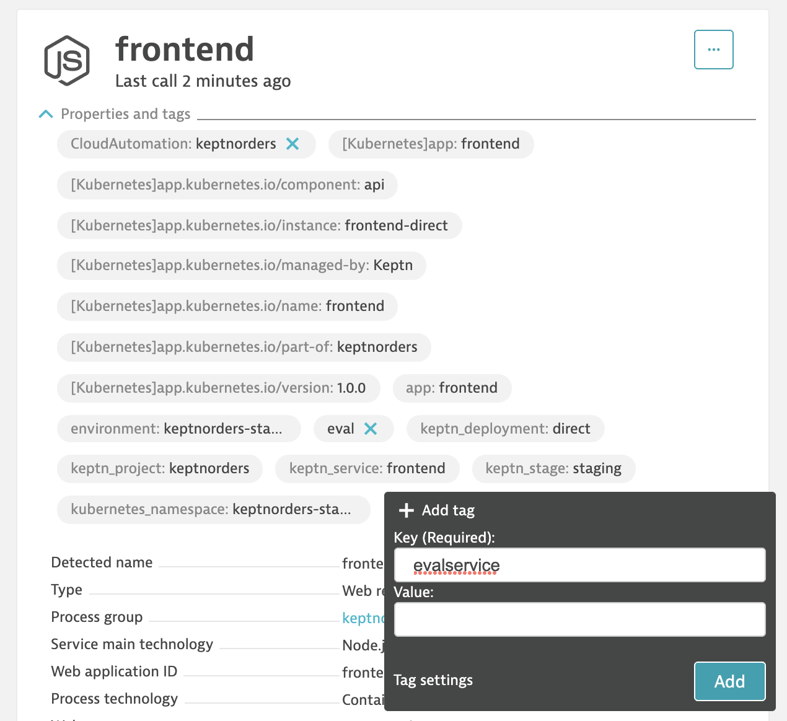

### Create Process Group Naming Rule (if not created)

Hopefully the naming rule has been created by the API call.  We need to validate that this has occurred.

If the rule is present, then we can skip to **Architecture Validation - Service Flow**

If the Rule has not been created, then we will need to follow these steps.

Go to **"Settings>Processes and Containers>Process group naming"**

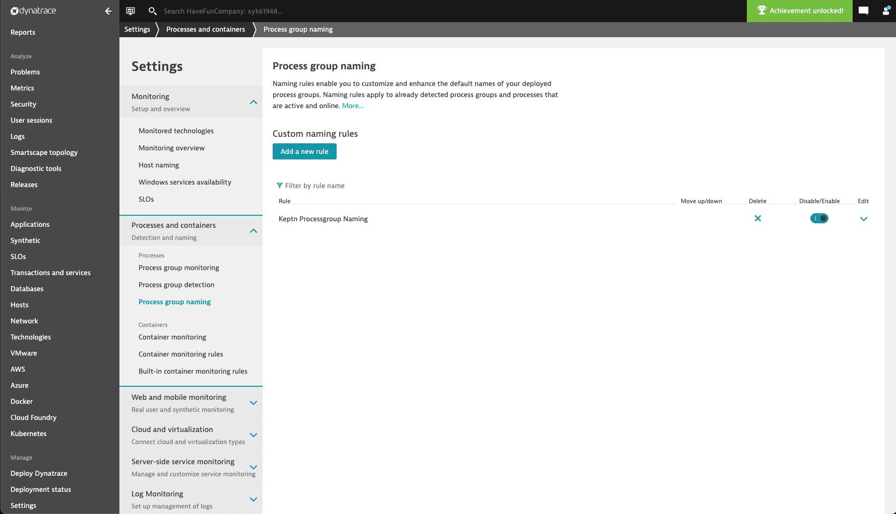

Then select "add new rule"

Now we will create the rule with the following parameters.

You can cut and paste these items.

* Rule name: **Keptn Processgroup Naming**
* Process group naming format: **{ProcessGroup:Environment:keptn_project}.{ProcessGroup:Environment:keptn_stage}.{ProcessGroup:Environment:keptn_service} [{ProcessGroup:Environment:keptn_deployment}]**
* Conditions: **keptn_deployment (Environment)**

Click **"Preview"** -> **"create rule"** -> **"save changes"**

### Architecture Validation - Service Flow

As testers, we typically only test against the service endpoint. As performance engineers we should however understand what happens end-to-end with that request. Which other services does it call? How many round trips to the database does it make? Does service load balancing and failover work correctly? Do the caching layers work well? And do we have any bad architectural patterns such as a data-driven N+1 query problem?

In Dynatrace, we analyze the Service Flow which shows us the full end-to-end flow of every request executed against our service endpoint. You can also apply filters to only focus on a particular test transaction, a specific time frame or compare the flow of failing vs non- failing transactions.

Click **"Applications"** from the Main Navigation menu. Then click **My web application**.

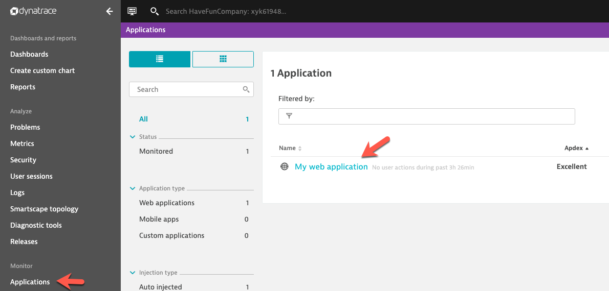

This will bring up the **My web application** Performance Overview.  In the Dynatrace infographic click on the **1 Service** box.   Then under the **Called services** table click on the aqua box called **View service flow**.

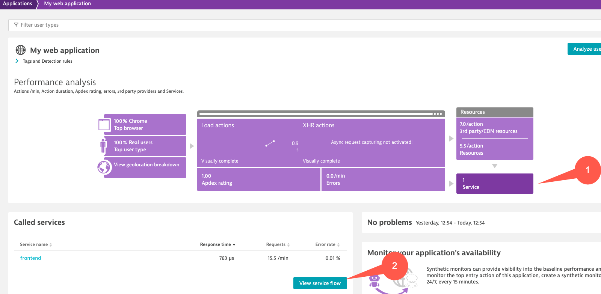

This will bring up the **Service flow** for the **My web application**.  View results.

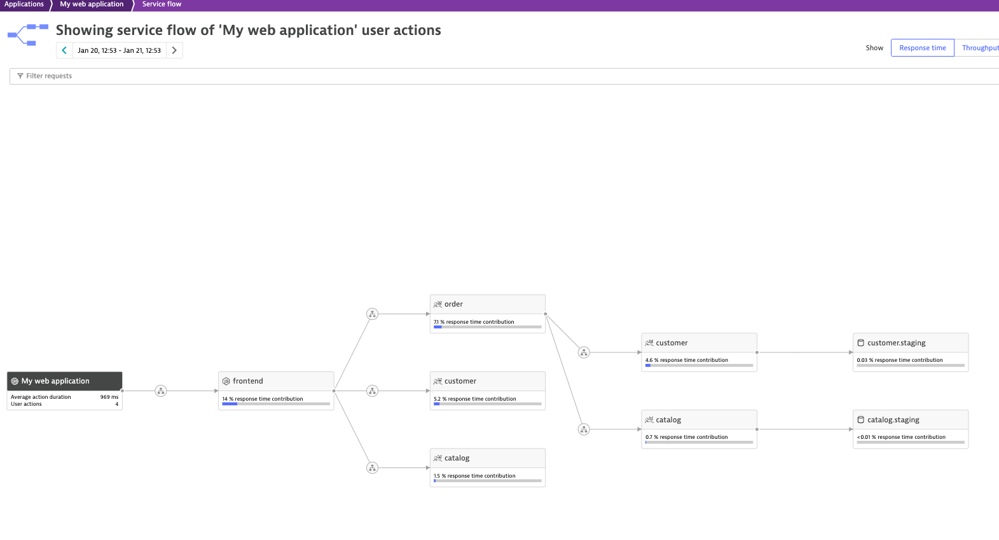

### Kick off our first load test

Login to Jenkins

* username = keptn
* password = keptn

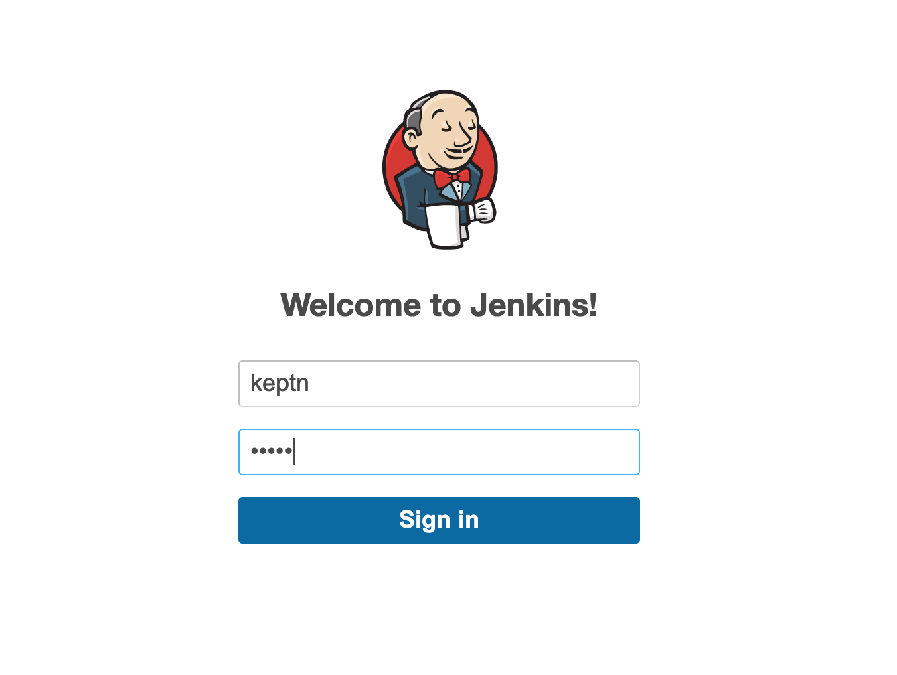

We are going to run the **03-simpletest-qualitygate pipeline**.
Click **"build"** this initial build will fail.
Refresh the page, now we can do a **"Build with Parameters"**

We need to change the Deployment URL

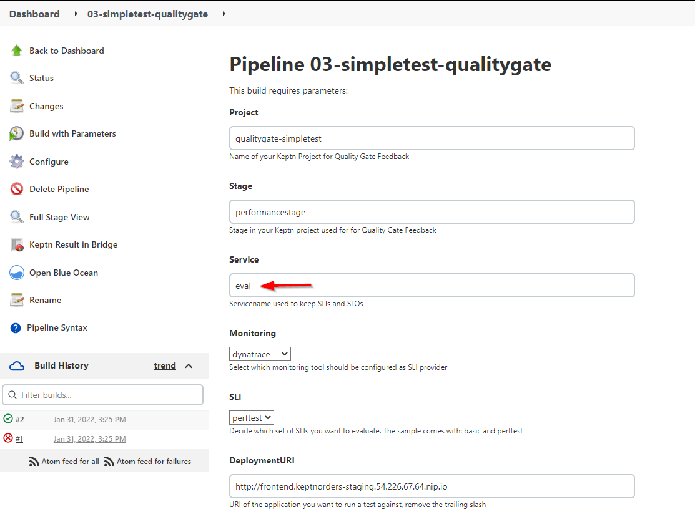

Click **Build**

### Describe Dynatrace Load Test Request Attribute

Dynatrace by default captures and traces every single incoming request on our instrumented applications and services. This allows us to analyze metrics (SLIs) for each individual endpoint URL. While this is great, the URL is not necessarily meaningful when we want to analyze details for a step from your load testing script, e.g: Login, Add to Cart, Checkout.

While executing a load test from your load testing tool of choice (JMeter, Neotys, LoadRunner, etc.) each simulated HTTP request can be tagged with additional HTTP headers that contain test-transaction information (for example, script name, test step name, and virtual user ID).

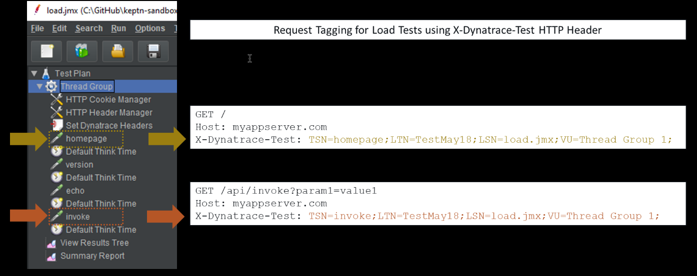

The header **x-dynatrace-test** is used one or more key/value pairs for the header. Here are some examples:

| **Key**   | **Description**   |
| --- | --- |
| VU  | Virtual User ID of the unique user who sent the request.  |
| SI  | Source ID identifies the product that triggered the request (JMeter, LoadRunner, Neotys, or other)  |
| TSN  | Test Step Name is a logical test step within your load testing script (for example, Login or Add to cart.  |
| LSN  | Load Script Name - name of the load testing script. This groups a set of test steps that make up a multi-step transaction (for example, an online purchase).  |
| LTN  | The Load Test Name uniquely identifies a test execution (for example, 6h Load Test – June 25)  |
| PC  | Page Context provides information about the document that is loaded in the currently processed page.  |

Dynatrace can analyze incoming HTTP headers and extract such contextual information from the header values and tag the captured requests with request attributes. Request attributes enable you to filter your monitoring data based on defined tags.

You can use any (or multiple) HTTP headers or HTTP parameters to pass context information. The extraction rules can be configured via **Settings --> Server-side service monitoring --> Request attributes**.

We have setup the Load Test **Request attributes** for you.   Below is an example setup but we will also show you in your environment where they are.

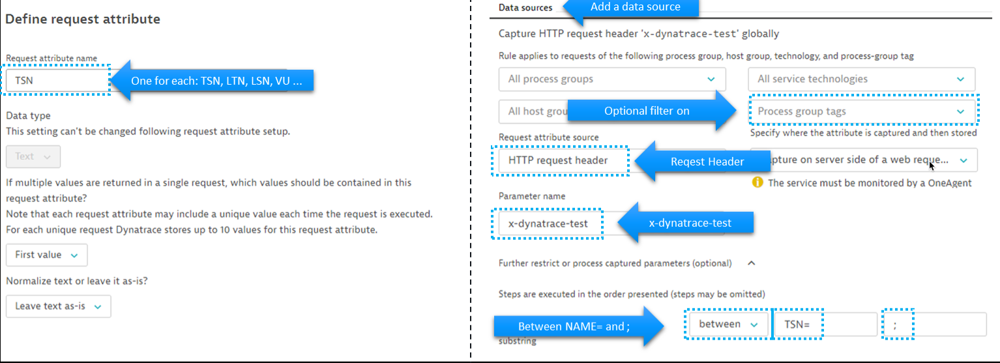

[Tag tests with HTTP headers](https://www.dynatrace.com/support/help/shortlink/load-testing-process#tag-test-requests-and-push-custom-events/)
  
### Describe Calculated Service Metrics for Load Test Steps

Dynatrace automatically captures important metrics for services with no configuration required. Additionally you might need additional business or technical metrics that are specific to your application. These metrics can be calculated and derived based on a wide variety of available data within the captured PurePath. This allows you to further customize key performance metrics for which alerts should be generated and helps you keeping an eye on them by pinning them to your dashboards.

For Performance Testing you can use Calculated service metrics to track your Performance transaction steps as an example.  Once created, these metrics can be used in Dashboards and alerting during the Performance Test but also can be used in analysis after the Performance test is complete. 

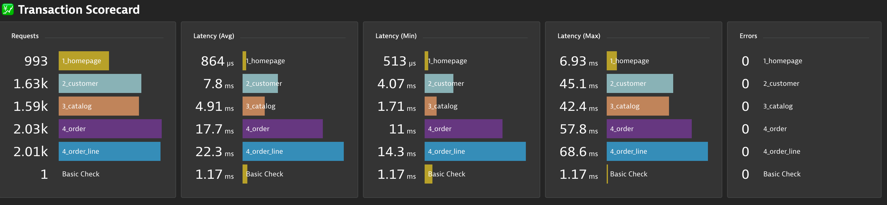

We have setup the Load Test **Calculated service metrics** for you.   Below is an example setup but we will also show you in your environment where they are.  The Calculated service metrics can be configured via **Settings --> Server-side service monitoring --> Calculated service metrics**.

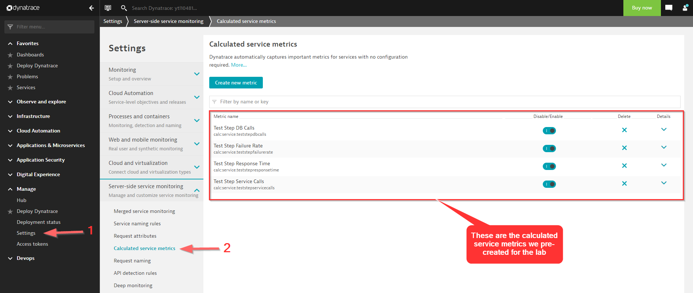

[Create Calculated Service Metrics (SLIs) - Step #8 of this Blog](https://www.dynatrace.com/news/blog/guide-to-automated-sre-driven-performance-engineering-analysis/)

### Kick off Keptn Customer 2 Build

Click on **01_deploy_order_application** pipeline

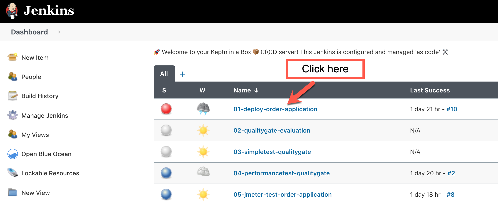

Now we are going to push the **customer** version **2**.

Select **"Build with parameters"**

- In the **customerimage** field we need to change the value at the end from 1 to **2**
- In the DEPLOY_TO field, change the dropdown box to **customer**

Next, click the **Build** button.

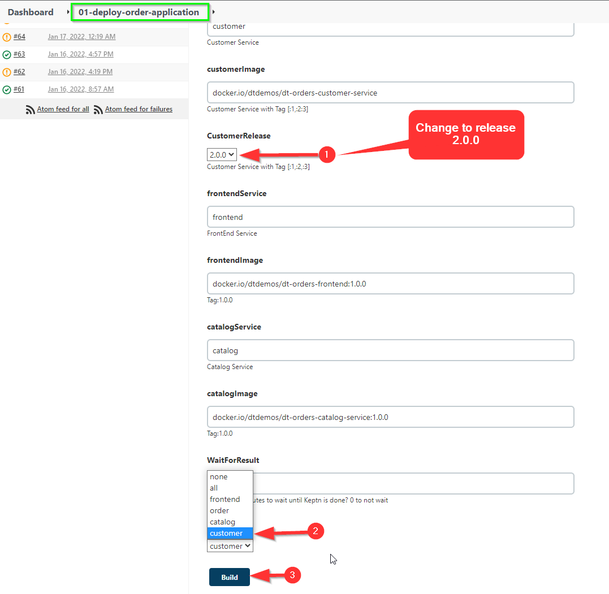

### Update Keptn: keptnorders staging Management Zone

Each customizable management zone comprises a set of monitored entities in your environment, be it hosts that share a common purpose, a specific application, a staging environment, or services of a certain technology. Management zones may overlap, just as team responsibilities often overlap. Users may be granted access to entire environments, a specific management zone, or a subset of related management zones.

This exercise shows how to update a management zone that will be used in dashboards to show process and host metrics for analysis.

In Dynatrace on the navigation menu, navigate to **settings --> preferences --> management zones**

Click **Keptn: keptnorders staging** management zone and add a new rule with configuration as show below.

- Rule applies to **Process groups**
- In the conditions section,  select **Process group** in the dropdown
- Keep **begins with** in the dropdown 
- In the text box use: **keptnorders.staging**
- Select **apply to underlying hosts of matching process groups** check box.
    
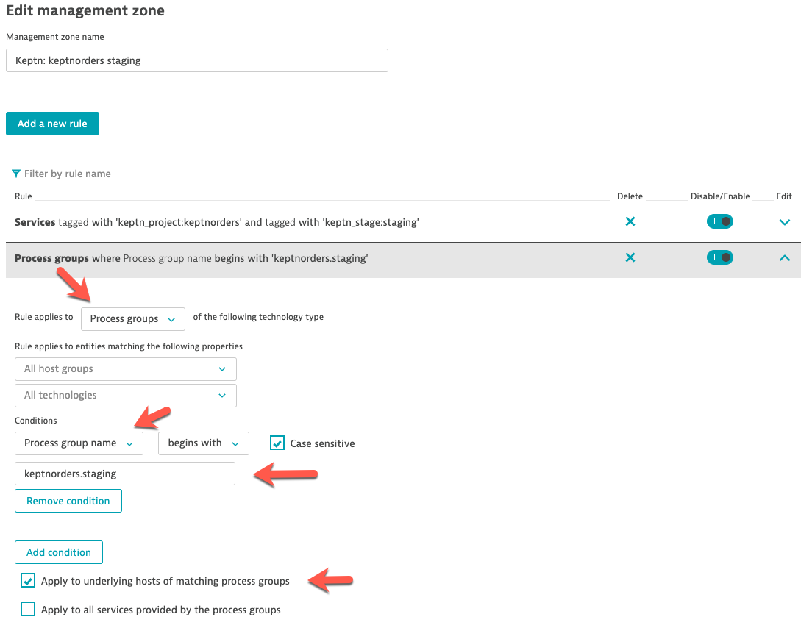

Click the **preview** button to verify.

Save the zone. Click **create rule** button. Then **Save changes** button.

## Run Load Test

Login to Jenkins

* username = keptn
* password = keptn

We are going to run the **03-simpletest-qualitygate pipeline**.
Click **"build"** this initial build will fail.
Refresh the page, now we can do a **"Build with Parameters"**

We need to change the Deployment URL

Click **Build**

### Examine Performance Test Dashboard with Transaction Steps

We have provided a **Performance Test Dashboard with Transaction Steps** in your environment.   This dashboard provides a complete overview for your Performance Test focusing on SLIs (Latency, Traffic, Errors & Saturation).  Included in this dashboard is the following: Health Status, Transaction Steps Scorecard, Services Overview,  Database Overview,  Process Overview and Hosts Overview.   This dashboard also provides quick analysis links.  

Click **"Dashboards"** from the Main Navigation menu.

Then Select the **Performance Test Dashboard with Transaction Steps** Dashboard.

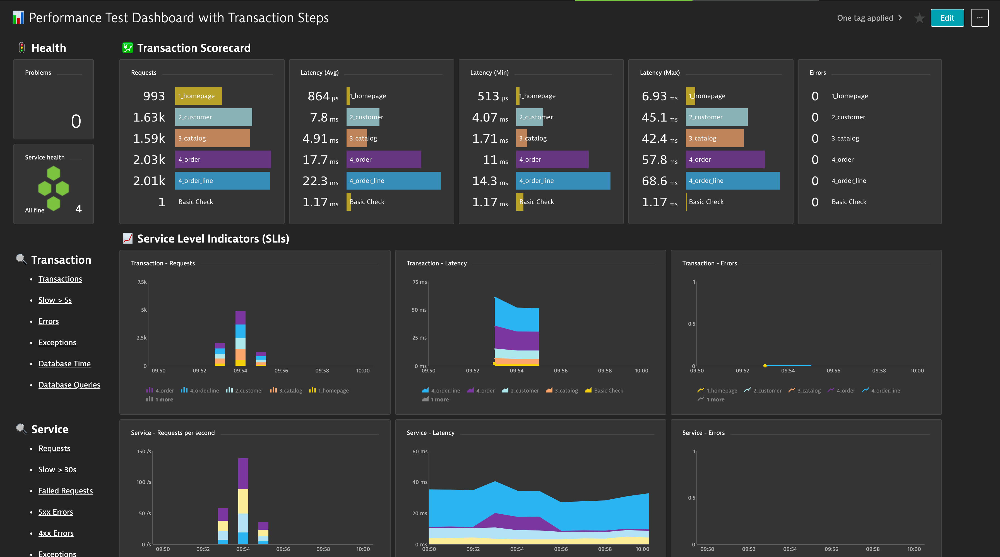

### Load Test Performance Analysis

Dynatrace uses a sophisticated AI causation engine, called Davis®, to automatically detect performance anomalies in your applications, services, and infrastructure. Dynatrace-detected problems are used to report and alert on abnormal situations, such as performance degradations, improper functionality, or lack of availability (i.e., problems represent anomalies in baseline system performance).

For Performance Testing the Dynatrace AI might not generate a Problems unless you are doing continuous performance testing. You can setup custom alerts with static thresholds.

If a Dynatrace Problem has generated a Problem during your Performance Test that is always a best place to start.

You can also analyze the data using custom Dashboards as well as out of the box workflows. Your approach should be based on the type of performance analysis you want to do (for example, crashes, resource and performance hotspots, or scalability issues). 

Following is an overview of using our **Performance Test Dashboard with Transaction Steps**.

Open the **Performance Test Dashboard with Transaction Steps** dashboard.  

Then click on the **Transactions** link under **Transaction** links section on the left side of the dashboard.

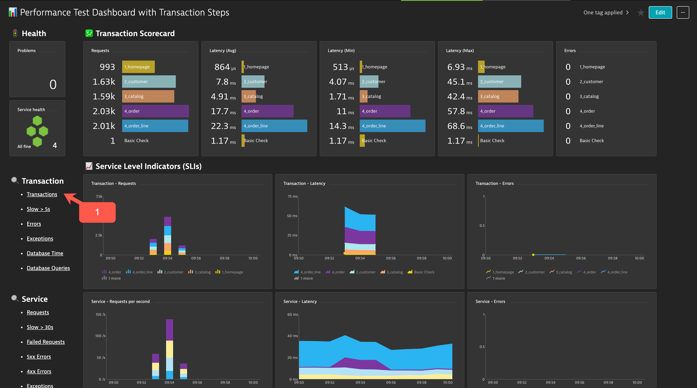

This will bring us to **Multidimensional analysis** that is showing response time split by the **TSN** request attribute.   Note,  you can also create your own **Multidimensional analysis** views and save them by going to the Diagnostic tools-->Top web requests configure desired settings.

For Developers to understand how to avoid future performance issues and proactively optimize performance, you must be able to analyze real-time data and understand code performance bottlenecks.

We are going to focus on the **customer** step name transaction.

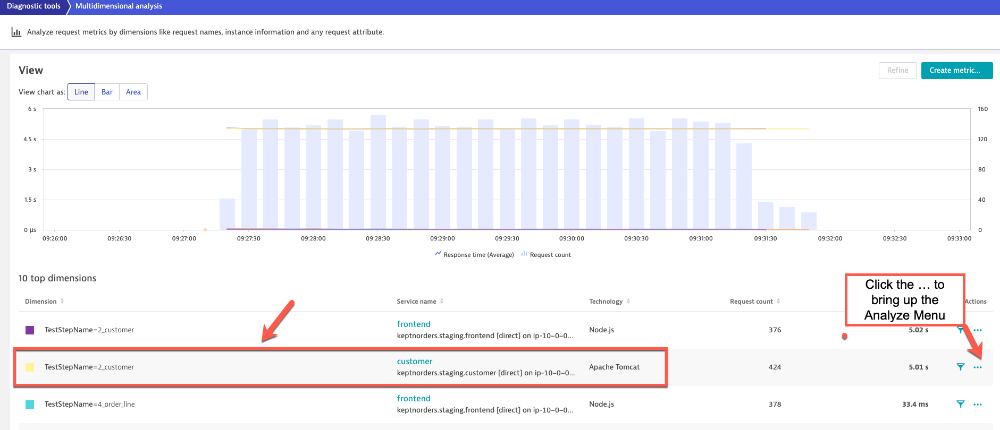

Click on the ... at the end of the table for **customer** step name transaction which will bring up the **Analyze** menu. 

Click  **Response time hotspots** from the Analyze menu.

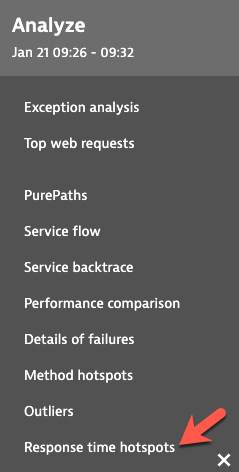

On the Response time analysis page it will display the average response time observed during the analyzed timeframe. On the left side of the infographic, under Distribution, you can see how much time is contributed by calls to other services, calls to databases, and code-level execution. On the right side, under Top findings, we list the biggest hotspots identified by Dynatrace. You can click any of these entries to view further details.

Within the current screen click on **View method hotspots** button which will drill to the **Method hotspots**.

In the **Method hotspots** screen click on **Hotspots** button.   This will change the view to the **Top hotspots**.  Click expand in the method call tree and you can see the method that is calling the top hotpot in the code. 

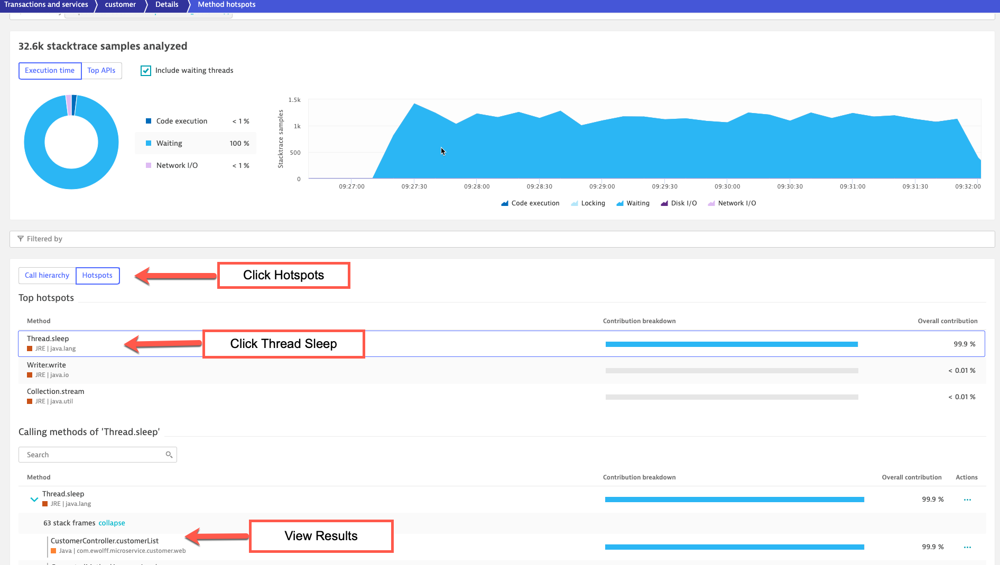

### Summary

-  We learned how to create a Process Detection Naming rule to change out of the box detected names
-  We learned how the use the Dynatrace Service Flow for Architecture Validation
-  We learned what a x-dynatrace-test request header is, how to use it in your Performance testing tool and the importance for improving of your Performance Test Analysis
-  We learned what a Dynatrace Load Test Request Attribute is,  how to use it,  and the importance for improving of your Performance Test Analysis
-  We learned what a Dynatrace Calculated Service Metric is,  how to use it,  and the importance for improving of your Performance Test Analysis
-  We covered the Performance Test Dashboard with Transaction Steps and how you can use it for improving of your Performance Test Analysis
-  We learned how to analyze Performance Test issue within Dynatrace and get to root cause in minutes

### Questions and Answers? 

