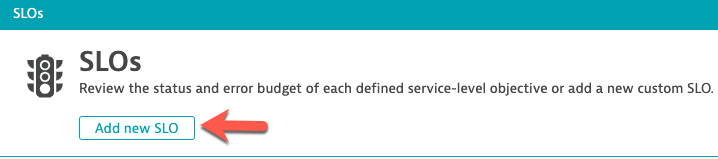
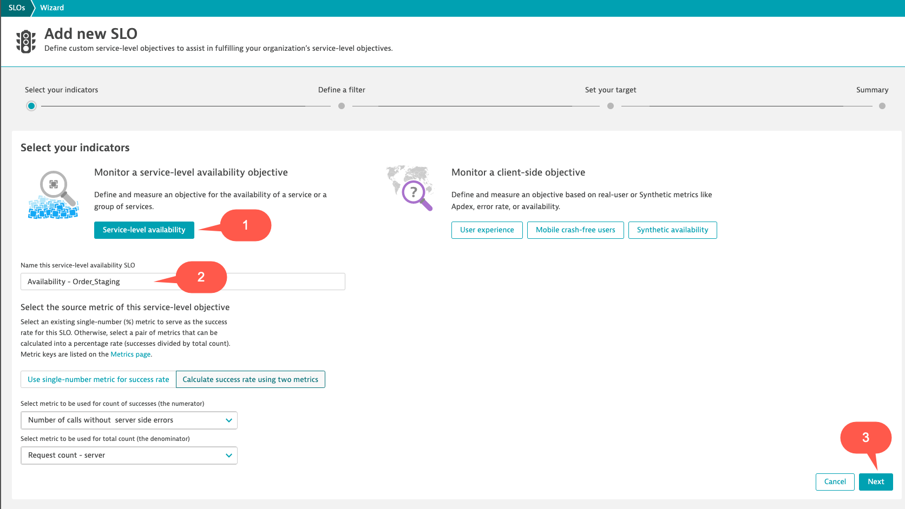
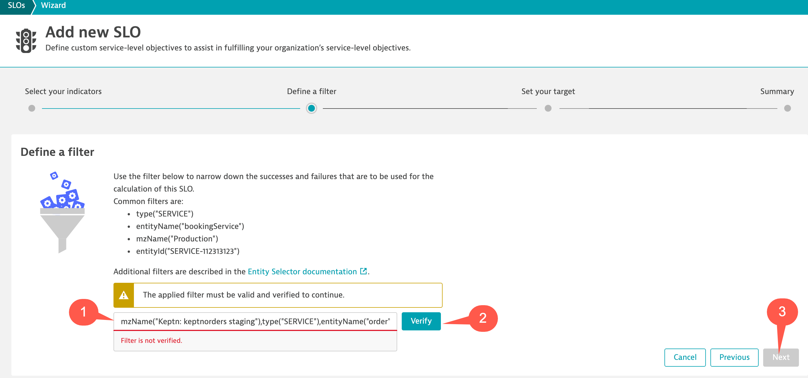
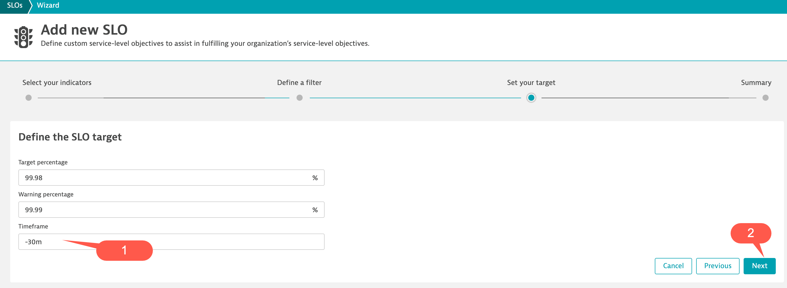
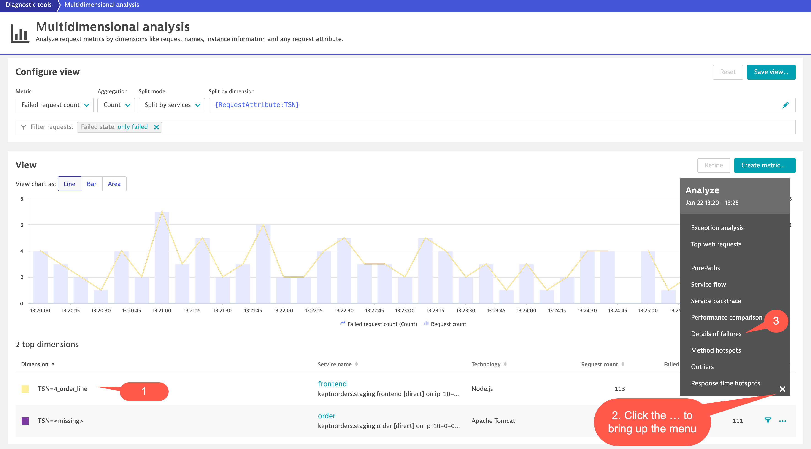

## SLOs and Load Test Analysis Error Issue

In this lab we walk through how to create SLOs in Dynatrace that can be used in your Performance Testing and we will also troubleshoot why a Availability/Error SLO failed.

The Google’s SRE Handbook mostly focuses on the production use case for SLIs/SLOs, Dynatrace is “Shifting-Left” this approach and using SLIs/SLOs

While an SLI is just a metric, an SLO just a threshold you expect your SLI to be in and SLA is just the business contract on top of an SLO. It’s great that this discipline and ideas have got a lot of attention lately.

“The earlier in the lifecycle we ensure SLIs meet their SLOs the better it will to ensure these service levels in production”.

### Configuration

1.  Kick off Keptn Orders 2 Build
1.  Create Availability/Error SLOs
1.  Run Load Test
1.  Examine Performance Test Dashboard with Transaction Steps & SLOs
1.  Load Test Availability/Error Analysis

### Kick off Keptn Orders 2 Build

Open Jenkins.

Click on **01_deploy_order_application** pipeline

Now we are going to push the **order** version **2**.

Select **"Build with parameters"**

- In the **orderimage** field we need to change the value at the end from 1 to **2**
- In the **DEPLOY_TO field**, change the dropdown box to **order**

Next, click the **Build** button.

### Create Availability/Error SLOs

The Dynatrace Software Intelligence Platform delivers all the necessary Service-Level Indicators (SLIs) for defining your Service-Level Objectives (SLOs) and monitors the status and error budgets of those objectives. Whether you want to define an SLO for real user experience or for measuring your service availability, your Dynatrace monitoring environment already comes with the right tools for your Site Reliability Teams. You can get all the facts about the health of you critical business services with respect to Business and Service-Level Objectives (SLO), Service-Level Agreements (SLAs), and end-user experience

Click "**SLOs**" from the Main Navigation menu.

Then Select the "**Add new SLO**" Button.

This will bring up the **Add new SLO** wizard screen.

Click on the **Service-level availability** button.

In the **Name this service-level availability SLO** section use this name:  **Availability - Order_Staging**

Click **Next** at the button right of the screen.

This brings us to the **Define a filter** screen.   

Copy and paste the below text into the **filter** section:

**mzName("Keptn: keptnorders staging"),type("SERVICE"),entityName("order")**

Then click the **Verify Button**, and after verified, click the **Next** button.

In the next screen change the Timeframe section to **-30m** and then click the **Next** button, and then the **Save** button.

After the **Availability - Order_Staging** has been created lets create two more SLOs for the **customer** and **catalog** services.

Use the follow settings for the **catalog** SLO: 

- SLO Name = **Availability - Catalog_Staging**
- Filter   = **mzName("Keptn: keptnorders staging"),type("SERVICE"),entityName("catalog")**

Use the follow settings for the **customer** SLO:

- SLO Name = **Availability - Customer_Staging**
- Filter   = **mzName("Keptn: keptnorders staging"),type("SERVICE"),entityName("customer")**

When complete,  review the results.

### Run Load Test

Open Jenkins.

Click on **04-performancetest-qualitygate** pipeline

Select **"Build with parameters"**

We only need to update the **DeployomentURI** section.   

Copy your Order Application URL and paste into the **DeployomentURI** section.   

**Make sure to remove the last / if present when you copied it**

When done click the **Build** button which will start the Performance Test.

### Examine Performance Test Dashboard with Transaction Steps & SLOs

We have provided a **Performance Test Dashboard with Transaction Steps & SLOs** in your environment.   This dashboard provides a complete overview for your Performance Test focusing on SLIs (Latency, Traffic, Errors & Saturation).  Included in this dashboard is the following: Health Status, SLOs, Transaction Steps Scorecard, Services Overview,  Database Overview,  Process Overview and Hosts Overview.   This dashboard also provides quick analysis links.  

Click **"Dashboards"** from the Main Navigation menu.

Then select the **Performance Test Dashboard with Transaction Steps & SLOs** dashboard.

We can see the SLO for the **Order** service is not being met.  In the next section we will show you why!

### Load Test Availability/Error Analysis

Dynatrace uses a sophisticated AI causation engine, called Davis®, to automatically detect performance anomalies in your applications, services, and infrastructure. Dynatrace-detected problems are used to report and alert on abnormal situations, such as performance degradations, improper functionality, or lack of availability (i.e., problems represent anomalies in baseline system performance).  

For Performance Testing the Dynatrace AI might not generate a Problems unless you are doing continuous performance testing.  You can setup custom alerts with static thresholds.  

If a Dynatrace Problem has generated a Problem during your Performance Test that is always a best place to start.  

From the Problem card we will focus on the Root cause Dynatrace has provided around the Failure rate increase.   Click on the **Analyze failure rate degradation** button. 

This will bring us to the **Failure analysis** screen.  We can see HTTP 500 Errors were generated and by each transaction.  To dig deeper you can drill-down to the Purepaths by clicking on the **Purepaths** icon at the top right of the screen.

This will bring us to the failed **Purepaths**.  Click on a **Purepath** to see the trace details Dynatrace has captured around the failure.

This will bring us to the Purepath trace details screen. Click on the **second node which is the order service** in the trace tree.  Then click on **Errors** in the table.  Then click on the down arrow under the **Details** of the Exception.

When looking at the Exception details we can see the in **Message** details the exact error message which caused the failure rate for the Performance test.   A good best practice is to copy the Dynatrace URL(s) for the screens you want to share in your analysis back to the Application team.

If a Dynatrace Problem wasn't detected you can use out of the box workflows and custom dashboards.    We will walk through using the **Performance Test Dashboard with Transaction Steps & SLOs** but also out of the box options as well.

Open the **Performance Test Dashboard with Transaction Steps & SLOs** dashboard.  

Then click on the **Errors** link under **Transaction** on the left side of the dashboard.

This will bring us to **Multidimensional analysis** that is showing failed request counts split by the **TSN** request attribute.   Note,  you can also create your own **Multidimensional analysis** views and save them by going to the Diagnostic tools-->Top web requests configure desired settings.

In the table provides the details for the failed Transaction Steps.  On the far left in the table details click you will see the **Actions**,  click the ... which will bring up the **Analyze** Menu.

Click on **Details of failures**.

This will bring us to the **Failure analysis** screen.  We can see HTTP 500 Errors were generated and also see exactly which transactions were impacted.  To dig deeper you can drill-down to the Purepaths by click on the **Purepaths** icon at the top right of the screen.

This will bring us to the failed **Purepaths**.  Click on a **Purepath** to see the trace details Dynatrace has captured around the failure.

This will bring us to the Purepath trace details screen.    Click on the **second node which is the order service** in the trace tree.   Then click on **Errors** in the table.   Then click on the down arrow under the **Details** of the Exception.

When looking at the Exception details we can see the in **Message** details that has the exact error message which caused the failure rate for the Performance test.   A good best practice is to copy the Dynatrace URL(s) of the screens you want to share with your analysis back to the Application team.

Last, we will cover troubleshooting via an out of the box workflow for a key service that has been impacted during the Performance Test.  

Click "**Transactions and services**" from the Main Navigation menu.

Then click on the **Order** service in the **Services** screen.

This will bring up the **Order** Service overview screen.   Under Dynamic web requests section (charts) click the **Failure rate** section.

This will bring up the **Order** Service **Failure rate** screen.   Click the **View details of failures** button.

This will bring us to the **Failure analysis** screen.   We can see all the failures, which transactions were impacted and Reason for failed requests including the Stack Trace Exception message.  To dig deeper you can drill-down to the Purepaths by click on the **Purepaths** icon at the top right of the screen.

### Summary

-  We learned how to create SLOs that can be used for your Performance Test Analysis
-  We learned how to Analyze a detected problem by Dynatraces Davis AI 
-  We covered the Performance Test Dashboard with Transaction Steps and SLOs and how you can use it for improving of your Performance Test Analysis
-  We learned how to analyze Performance Test issue within Dynatrace and get to root cause in minutes

### Questions and Answers? 

