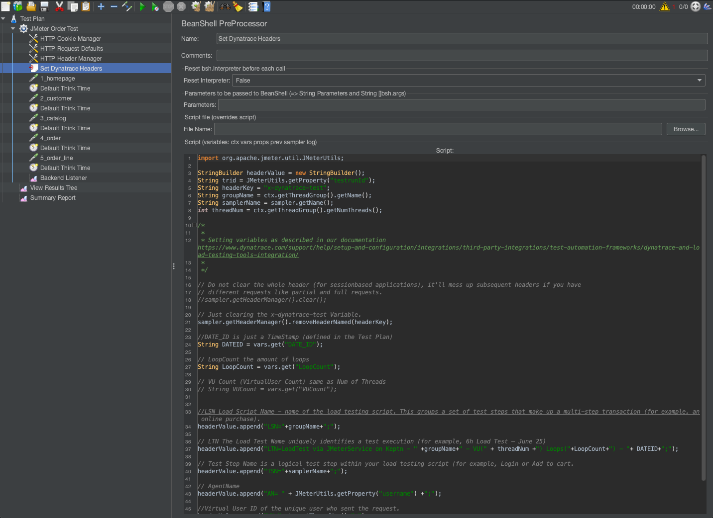

## Integrate Jmeter 


Previously we discussed the Load Test Request Attributes. Now we will expand on these concepts.

## Test automation frameworks 
Test automation involves the use of special software (separate from the software being tested) 
to control the execution of tests and the comparison of actual outcomes with predicted outcomes. 
Test automation can automate some repetitive tasks in a formalized testing process already in place, 
or perform additional testing that would otherwise be difficult to do manually. 
Test automation is important for continuous delivery and continuous testing.

## Test with Jmeter

While executing a load test in Apache JMeter, each simulated HTTP request 
can be tagged in JMeter with additional HTTP Headers that contain test-transaction 
information (for example, script name, test step name and virtual user ID). Dynatrace
can analyze incoming HTTP headers and extract such contextual information from the header 
values and "tag" the captured requests. Having a tag on a request allows you to analyze 
requests with specific tags.

### Tag tests with HTTP headers 

While executing a load test from your load testing tool of choice (JMeter, Neotys, 
LoadRunner, etc) each simulated HTTP request can be tagged with additional HTTP headers that 
contain test-transaction information (for example, script name, test step name, and virtual user ID). 
Dynatrace can analyze incoming HTTP headers and extract such contextual information from the header 
values and tag the captured requests with request attributes. 
Request attributes enable you to filter your monitoring data based on defined tags.


### Integrate Dynatrace with JMeter:

Within JMeter, use the HTTP Header Manager to add custom HTTP request headers. 
You can use any custom HTTP headers to pass context information. In this example, 
we use the header x-dynatrace-test and the set of key/value LSN=Scenario1;TSN=Put Item into Cart; for the header value. 
See Dynatrace and load testing tools integration for more details on the recommended key/value pairs. 

[Dynatrace Jmeter Integration](https://www.dynatrace.com/support/help/setup-and-configuration/integrations/third-party-integrations/test-automation-frameworks/dynatrace-and-jmeter-integration/)

Good News, we have already added this into the jmeter scripts.



Push custom events 
When running a load test, you can push additional context information to Dynatrace using the custom event API. A custom annotation then appears in 
the Events section on all overview pages of the entities that are defined in the API call (see example below).


Load test events are also displayed on associated services pages (see example below).


Further good news, these events are pushed via the keptn bridge.

### Dynatrace Backend listener plugin for JMeter
This library implements a JMeter Backend listener and sends the recorded loadtest metrics via the Dynatrace MINT 
metric ingest to the configured Dynatrace monitoring environment. 
See https://jmeter.apache.org/usermanual/component_reference.html#Backend_Listener for a description of the JMeter BackendListener concept.

We have also configured this in the Jmeter script.


### Change Jmeter Service

Before we can use the backend listener, we need to change the Jmeter service.

Go to your ssh client or use the built in command utility

```bash
cd ~/keptn-in-a-box/
```

Now we need to run the following command.

```bash
./04-set-jmeter.sh
```
We should see this output.


### Run Load Test

Now we need to run the **05-jmeter-test-order-application** pipeline in Jenkins.

Click **"build"** to initialize the pipeline. Refresh the page.

Now we can select **"Build with Parameters"**

Change the Deployment URL and click **"build"**


### Monitoring the metrics in Dynatrace
* Create a dashboard
* For every metric:
    * Add a custom chart
    * Select `Try it out` in the Banner line `Analyze multidimensional metrics from Prometheus, StatsD and others channels right on your dashboards`
    * Enter the name of the metric (from the list of the metrics above) in the field `Filter metrics by...`
    * Specify the chart settings (Visualization type, Chart type...)
    * Select `Pin to dashboard`
* Save the dashboard 

Further Reading:
[Load Testing Redefined](https://www.dynatrace.com/news/blog/load-testing-redefined-a-guide-from-kpi-reporting-to-ai-supported-performance-engineering/)

## Summary
We learned how to integrate load testing with Dynatrace.

## Questions and Answers?


