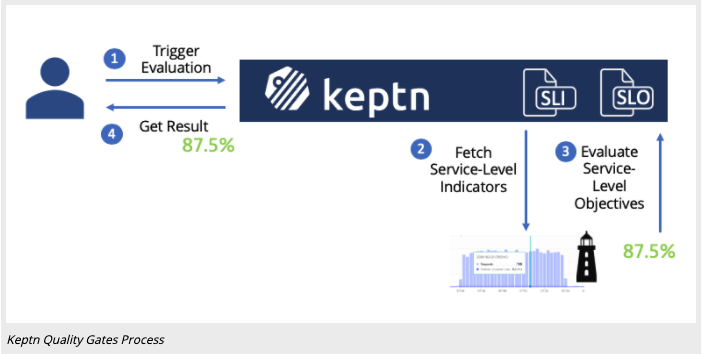

## Automated Performance Test

We previously discussed SLO's in Dynatrace. Now we will examine, in detail, more about SLO's and 
how we can use both SLI's and SLO's with our deployment strategies.

### Deployment automation 
Deployment automation is about the automated implementation of your application’s build, deploy, test 
and release process. In general, the automated deployment process is initiated whenever a developer 
commits code to a software repository inside the version control system (VCS) such as Subversion or Git. 
When the build automation server, which acts as the pipeline’s control center, such as Jenkins, 
observes a change in the repository, it triggers a sequence of stages which examine a build from 
different angles via automated tests, but terminates immediately in case of failure. Only when a build 
passes all stages it is regarded to be of sufficient quality to be released into production.


- [keptn](https://keptn.sh/)

### What is keptn

**Keptn** is an event-based control plane for continuous delivery and automated operations for 
cloud-native applications.

#### Get full observability for your Keptn workflows
Keptn traces every event and all resulting actions and provides real-time tracing information 
and a powerful API enabling full visibility of every deployment and operations triggered via Keptn.

## keptn bridge

You can access the keptn bridge by opening the "Autonomous Cloud Concepts with Keptn" Dashboard in Dynatrace.
Then simply select the "Keptn Bridge" link.


You can also access the bridge from the KIAB page.


Now let's take a quick tour of the keptn bridge. 


## What do we see?

### Declarative Multi-Stage Delivery
Keptn allows to declaratively define multi-stage delivery workflows by defining what needs to be done. 
How to achieve this delivery workflow is then left to other components and also here Keptn provides 
deployment services, which allow you to setup a multi-stage delivery workflow without a single line of pipeline code.


### Keptn Quality Gate Process
Keptn quality gates provide you a declarative way to define quality criteria of your service. 
Therefore, Keptn will collect, evaluate, and score those quality criteria to decide if a new 
version is allowed to be promoted to the next stage or if it has to be held back.



### What is a Service-Level Indicator (SLI)?
A service-level indicator is a “carefully defined quantitative measure of some aspect of the level of 
service that is provided” (as defined in the Site-Reliability Engineering Book).

An example of an SLI is the response time (also named request latency), which is the indicator of how long
 it takes for a request to respond with an answer. Other prominent SLIs are error rate (or failure rate), 
 and throughput. Keptn defines all SLIs in a dedicated sli.yaml file to make SLIs reusable within several 
 quality gates. To learn more about the SLI configuration.
 
 We have prepared SLIs which include service response time metrics (p50, p90, p95), througput and failure rate.
 In our use cases, we use the Dynatrace Metrics API v2 Query String. In order for Dynatrace to know from which 
 service I want to pull these metrics I assume the service is tagged with the name of the service we are testing.
 
 This makes the SLI much more flexible and I can reuse it for other projects as well. Other placeholders are $PROJECT, $STAGE & $DEPLOYMENT.
 
 Lets have a quick look at two of these SLIs - one showing a regular built-in Dynatrace service metric the other one is a custom calculated 
 service metric that gives me response time for a particular test name:
 
```yaml
 rt_svc_p95:       "metricSelector=builtin:service.response.time:merge(0):percentile(95)?entitySelector=tag($SERVICE),type(SERVICE)"

 rt_test_homepage: "metricSelector=calc:service.teststepresponsetime:filter(eq(Test Step,homepage)):merge(0):avg?entitySelector=tag($SERVICE),type(SERVICE)"
```

Now let's examine the complete SLI setup.

```yaml
---
spec_version: '1.0'
indicators:
  throughput_svc:  "metricSelector=builtin:service.requestCount.total:merge(0):sum&entitySelector=tag($SERVICE),type(SERVICE)"
  error_count:  "metricSelector=builtin:service.errors.total.rate:merge(0):avg&entitySelector=tag($SERVICE),type(SERVICE)"
  rt_svc_p50:      "metricSelector=builtin:service.response.time:merge(0):percentile(50)&entitySelector=tag($SERVICE),type(SERVICE)"
  rt_svc_p90:      "metricSelector=builtin:service.response.time:merge(0):percentile(90)&entitySelector=tag($SERVICE),type(SERVICE)"
  rt_svc_p95:      "metricSelector=builtin:service.response.time:merge(0):percentile(95)&entitySelector=tag($SERVICE),type(SERVICE)"
  db_calls:       "metricSelector=builtin:service.dbChildCallCount:merge(0):sum&entitySelector=tag($SERVICE),type(SERVICE)"
  non_db_calls:   "metricSelector=builtin:service.nonDbChildCallCount:merge(0):sum&entitySelector=tag($SERVICE),type(SERVICE)"
  lock_time:    "metricSelector=builtin:service.lockTime:merge(0):sum&entitySelector=tag($SERVICE),type(SERVICE)"
  io_time:      "metricSelector=builtin:service.ioTime:merge(0):sum&entitySelector=tag($SERVICE),type(SERVICE)"
  cpu_time:     "metricSelector=builtin:service.cpu.time:merge(0):sum&entitySelector=tag($SERVICE),type(SERVICE)"
```  

### What is a Service-Level Objective (SLO)?
A service-level objective is “a target value or range of values for a service level that is measured by an SLI.” 
(as defined in the Site-Reliability Engineering Book).

An example of an SLO can define that a specific request must return results within 100 milliseconds. 
Keptn quality gates can comprise several SLOs that are all evaluated and scored, based even on different 
weights for each SLO to consider different importance of each SLO. Keptn defines SLOs in a dedicated slo.yaml.

The SLI file we provided contains a good list of individual indicators. What we need to do now is to define an SLO 
(Service Level Objective) that indicate what Keptn should do with these SLIs. We have these options after Keptn pulled 
the value through the SLI Provider a) Just give me the value b) Compare the value with a static threshold c) Compare 
it with a baseline from previous runs, this is an example.  To see the full SLO, view this in the Keptn Bridge.

```yaml
---
    spec_version: '0.1.0'
    comparison:
      compare_with: "single_result"
      include_result_with_score: "pass" # pass_or_warn
      aggregate_function: avg
    objectives:
      - sli: rt_svc_p95
        pass:        # pass if (relative change <= 10% AND absolute value is < 500)
          - criteria:
              - "<=+10%" # relative values require a prefixed sign (plus or minus)
              - "<600"   # absolute values only require a logical operator
        warning:     # if the response time is below 800ms, the result should be a warning
          - criteria:
              - "<=800"
      - sli: throughput_svc
        pass:
          - criteria:
            - "> 2000" # at least 1000 Calls for a basic test to pass.
      - sli: error_count
        weight: 2
        pass:
          - criteria:
              - "<=1" # less than 1% failurerate
        warning:
          - criteria:
              - "<=2" # more than 2 failed transactions is failed
      - sli: rt_svc_p50
      - sli: rt_svc_p90
        pass:
          - criteria:
              - "<=+10%"
        warning:
          - criteria:
              - "<=+50%"   
```

### Continuous Performance Verification

Keptn helps automating your tests by having Keptn triggering the test execution and evaluating the result of 
these performance tests. The result can then be automatically processed or presented in the Keptn Bridge to 
take further decisions. You can even expand this use case by letting Keptn deploying new versions of your 
applications to a test environment, succeeded by triggering and evaluating the tests.


## Putting it all together.

Let's discuss how we put these concepts into practice.

- [Keptn Jenkins Shared Library](https://github.com/keptn-sandbox/keptn-jenkins-library)
, Jenkins shared library for integrating Keptn Use Cases with your Jenkins Pipelines


In order to use this Jenkins Shared Library simply configure it in your Global Jenkins Configuration.

You can obtain Keptn API Token and Endpoint as explained in the Keptn doc:

```
KEPTN_ENDPOINT=https://api.keptn.$(kubectl get cm keptn-domain -n keptn -ojsonpath={.data.app_domain})
KEPTN_API_TOKEN=$(kubectl get secret keptn-api-token -n keptn -ojsonpath={.data.keptn-api-token} | base64 --decode)
```

The KEPTN_BRIDGE is the link to your keptn bridge so that the Library can generate some deep links to the bridge to give you easy access to quality gate results!

Once you have everything configured use it in your Jenkins Pipeline like this

```groovy
@Library('keptn-library')_
def keptn = new sh.keptn.Keptn()

node {
    properties([
        parameters([
         string(defaultValue: 'performance', description: 'Name of your Keptn Project for Performance as a Self-Service', name: 'Project', trim: false), 
         string(defaultValue: 'performancestage', description: 'Stage in your Keptn project used for Performance Feedback', name: 'Stage', trim: false), 
         string(defaultValue: 'evalservice', description: 'Servicename used to keep SLIs, SLOs, test files ...', name: 'Service', trim: false),
         choice(choices: ['dynatrace', 'prometheus',''], description: 'Select which monitoring tool should be configured as SLI provider', name: 'Monitoring', trim: false),
         choice(choices: ['performance', 'performance_10', 'performance_50', 'performance_100', 'performance_long'], description: 'Test Strategy aka Workload, e.g: performance, performance_10, performance_50, performance_100, performance_long', name: 'TestStrategy', trim: false),
         choice(choices: ['perftest','basic'], description: 'Decide which set of SLIs you want to evaluate. The sample comes with: basic and perftest', name: 'SLI'),
         string(defaultValue: 'http://frontend.keptnorders-staging.54.237.173.135.nip.io', description: 'URI of the application you want to run a test against', name: 'DeploymentURI', trim: false),
         string(defaultValue: '60', description: 'How many minutes to wait until Keptn is done? 0 to not wait', name: 'WaitForResult'),
        ])
    ])

    stage('Initialize Keptn') {
        // keptn.downloadFile('https://raw.githubusercontent.com/keptn-sandbox/performance-testing-as-selfservice-tutorial/release-0.7.3/shipyard.yaml', 'keptn/shipyard.yaml')
        keptn.downloadFile("https://raw.githubusercontent.com/dthotday-performance/keptn-in-a-box/release-0.7.3.1/resources/jenkins/pipelines/keptnorders/dynatrace/dynatrace.conf.yaml", 'dynatrace/dynatrace.conf.yaml')
        keptn.downloadFile("https://raw.githubusercontent.com/dthotday-performance/keptn-in-a-box/release-0.7.3.1/resources/jenkins/pipelines/keptnorders/slo_${params.SLI}.yaml", 'keptnorders/slo.yaml')
        keptn.downloadFile("https://raw.githubusercontent.com/dthotday-performance/keptn-in-a-box/release-0.7.3.1/resources/jenkins/pipelines/keptnorders/dynatrace/sli_${params.SLI}.yaml", 'keptnorders/sli.yaml')
        keptn.downloadFile('https://raw.githubusercontent.com/dthotday-performance/keptn-in-a-box/release-0.7.3.1/resources/jenkins/pipelines/keptnorders/jmeter/load.jmx', 'keptnorders/jmeter/load.jmx')
        keptn.downloadFile('https://raw.githubusercontent.com/dthotday-performance/keptn-in-a-box/release-0.7.3.1/resources/jenkins/pipelines/keptnorders/jmeter/basiccheck.jmx', 'keptnorders/jmeter/basiccheck.jmx')
        keptn.downloadFile('https://raw.githubusercontent.com/dthotday-performance/keptn-in-a-box/release-0.7.3.1/resources/jenkins/pipelines/keptnorders/jmeter/jmeter.conf.yaml', 'keptnorders/jmeter/jmeter.conf.yaml')
        archiveArtifacts artifacts:'keptnorders/**/*.*'

        // Initialize the Keptn Project
        keptn.keptnInit project:"${params.Project}", service:"${params.Service}", stage:"${params.Stage}", monitoring:"${monitoring}" // , shipyard:'shipyard.yaml'

        // Upload all the files
        keptn.keptnAddResources('dynatrace/dynatrace.conf.yaml','dynatrace/dynatrace.conf.yaml')
        keptn.keptnAddResources('keptnorders/sli.yaml','dynatrace/sli.yaml')
        keptn.keptnAddResources('keptnorders/slo.yaml','slo.yaml')
        keptn.keptnAddResources('keptnorders/jmeter/load.jmx','jmeter/load.jmx')
        keptn.keptnAddResources('keptnorders/jmeter/basiccheck.jmx','jmeter/basiccheck.jmx')
        keptn.keptnAddResources('keptnorders/jmeter/jmeter.conf.yaml','jmeter/jmeter.conf.yaml')
    }
    stage('Trigger Performance Test') {
        echo "Performance as a Self-Service: Triggering Keptn to execute Tests against ${params.DeploymentURI}"

        // send deployment finished to trigger tests
        def keptnContext = keptn.sendDeploymentFinishedEvent testStrategy:"${params.TestStrategy}", deploymentURI:"${params.DeploymentURI}"
        String keptn_bridge = env.KEPTN_BRIDGE
        echo "Open Keptns Bridge: ${keptn_bridge}/trace/${keptnContext}"
    }
    stage('Wait for Result') {
        waitTime = 0
        if(params.WaitForResult?.isInteger()) {
            waitTime = params.WaitForResult.toInteger()
        }

        if(waitTime > 0) {
            echo "Waiting until Keptn is done and returns the results"
            def result = keptn.waitForEvaluationDoneEvent setBuildResult:true, waitTime:waitTime
            echo "${result}"
        } else {
            echo "Not waiting for results. Please check the Keptns bridge for the details!"
        }

        // Generating the Report so you can access the results directly in Keptns Bridge
        publishHTML(
            target: [
                allowMissing         : false,
                alwaysLinkToLastBuild: false,
                keepAll              : true,
                reportDir            : ".",
                reportFiles          : 'keptn.html',
                reportName           : "Keptn Result in Bridge"
            ]
        )
    }
}
```

### Walk through the Kept Bridge.

Open the Keptn Bridge, Then we can walk through the Keptn Bridge.

### Validating Deployment version

After every deployment we can start in the Keptn's bridge to validate the progress. We can answer questions like

Did the deployment already happen?

What is the URL of the deployed service in each stage?

Did anything bad happen?

Go to Keptn's Bridge and see how Keptn has deployed the service into staging and then production:

The bridge also gives you access to the links of the deployed service.


## Questions and Answers?


