### Bonus Round

If time permits during our session we have created a few more exercises/topics to cover. 

See below:

- Request Naming Rule
- Custom Alert
- Performance Analysis
- Compare Results of Two Test Runs

### Request Naming Rule

Within Dynatrace, you can use request naming rules to adjust how your requests are tracked and to define business transactions in your customer-facing workflow that are critical to the success of your digital business. With such end-to-end tracing, Dynatrace enables you to view and monitor important business transactions from end to end.

For the **order** service, we want to change the discovered transaction names to use the **LSN** request attribute that has the Test Step Name you use in your load test product when running Performance Tests.

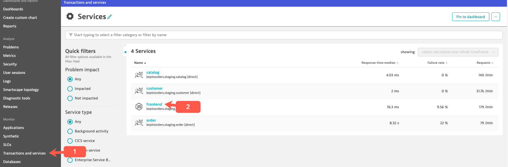

At the top of the **order** services page and choosing the edit option as shown below.

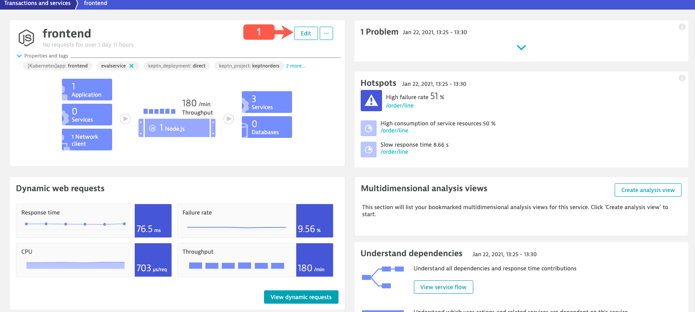

Within in the service settings, navigate to Web request naming and click the **Add rule** button

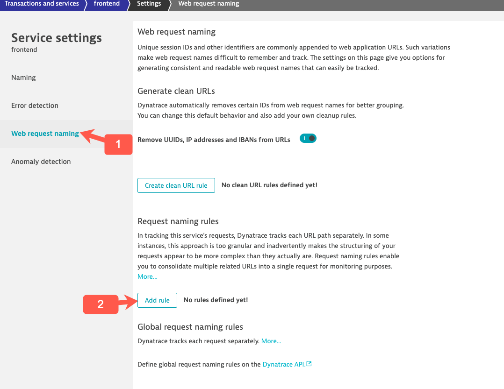

Below are the settings we want to use:

- naming pattern = **{RequestAttribute:LSN}**
- conditions =  **{RequestAttribute:LSN}** exists
- click the **Preview Rule** button to verify.

It should look like this:

---Placeholder screenshot---

### Custom Alert

A custom alert provides a simple way of defining a threshold on a given metric. Dynatrace sends out alerts when a metric breaches a user-defined threshold. You can define alerts for when actual metric values are above or below the user-defined threshold. Because a metric can be recorded by multiple components within your environment, Dynatrace always alerts with a reference to the component that shows the violating metric.

We are going to cover how to create a Customer alert based on response time for your Test Step transactions.

Go to **"Settings>Anomaly detection>Custom events for alerting"** and then select **Create custom event for alerting**.

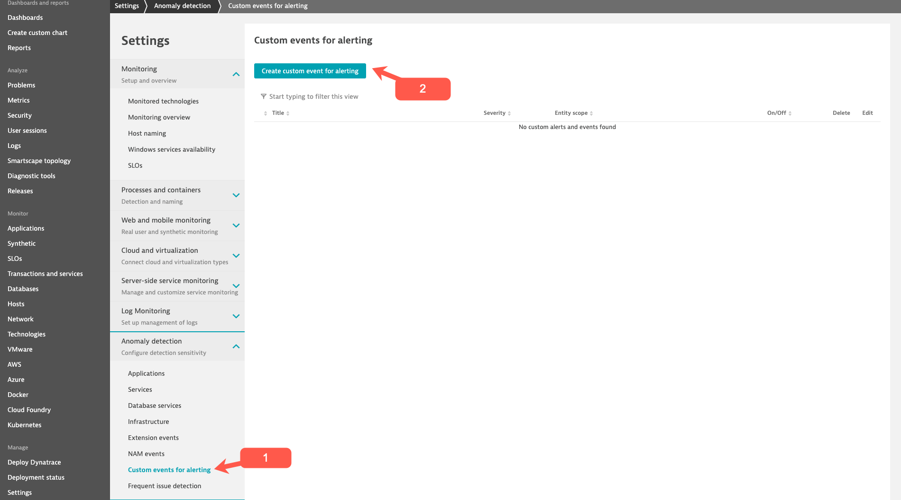

The will bring you to the **Create custom event for alerting** screen.

In the **Metric** section use the following settings:
 
- Category dropdown pick: **Services**
- Metric dropdown pick: **Test Step Response Time**
- Aggregation keep the default which is **Average**

In the **Entities** section click **Add a rule base filer**

We will use the following settings:

- Property dropdown pick: **Management zone**
- Operator dropdown pick: **Exists**
- Value dropdown pick: **Keptn: keptnorders staging**

When finished, select the **Create rule based filer**

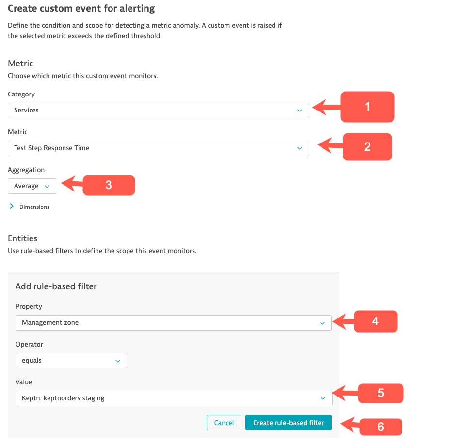

In the **Monitoring strategy** section we will use the following settings:

- Keep the default which is **Static threshold**.

In the Static threshold settings section use:

- **4 seconds**

In the **Event description** section we will use the following settings:

- Title use:  **Test Step Name Response Time High**
- Severity dropdown pick:  **Slowdown**

When finished, select the **Create custom event for alerting** button.   This will create your custom alert.

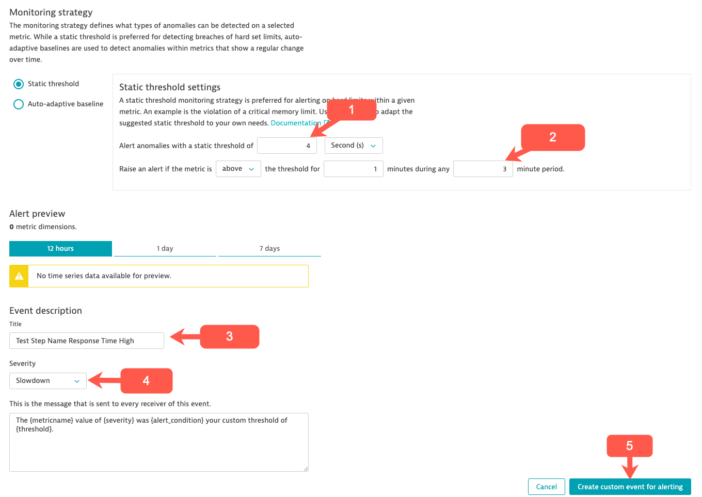

We need to run a Load Test so we can review the Problem that gets generated from the custom alert you setup.

### Performance Analysis

We will cover another troubleshooting example via an out of the box workflow for a key service that has been impacted during the Performance Test.  

Click "**Transactions and services**" from the Main Navigation menu.

Then click on the **Order** service in the **Services** screen.

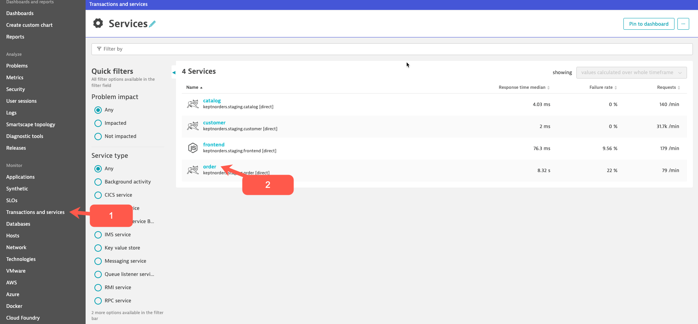

This will bring up the **Order** Service overview screen.   Under Dynamic web requests section (charts) click the **Response time** section.

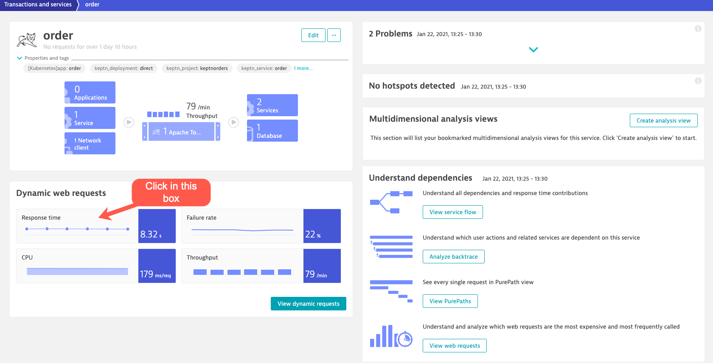

This will bring up the **Order** Service **Response time** screen.   Click the **View details response time hotspots** button.

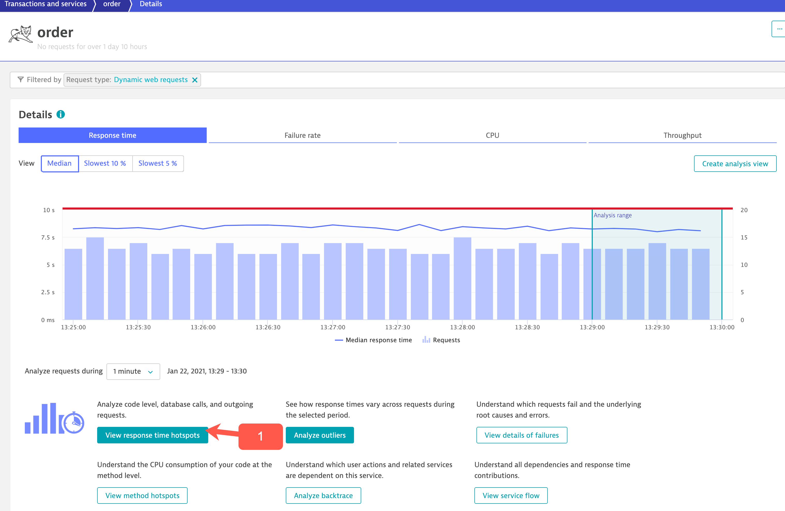

This will bring us to the **Response time analysis** screen.   We can see Average response time,  Distributions and Top findings.

In the *Distributions* section click the **Interactions witt services and queues**.   

To dig deeper you can drill-down to the Purepaths by click on the **Purepaths** button at the bottom of the screen under the **Analyze 'order' requests** section*.

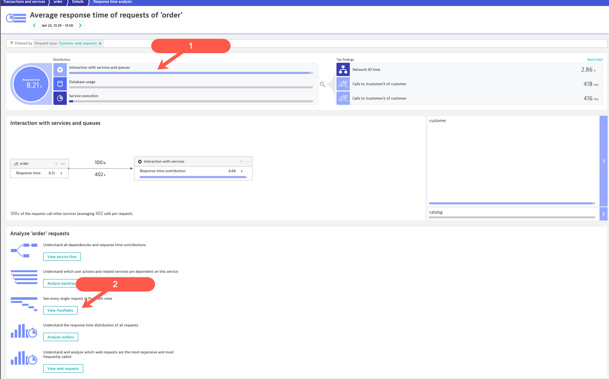

This will bring us to the slow **Purepaths**.  Click on a **Purepath** to see the trace details Dynatrace has captured around the slow transaction.

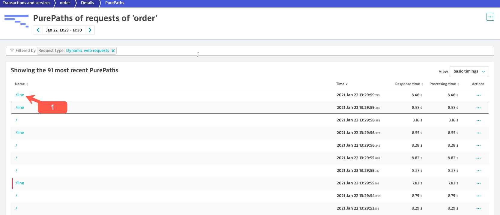

This will bring us to the Purepath trace details screen. Reviewing the puepath details we quickly see an high number of queries are being executed by the **customer** service over and over.   

This is a **N+1** issue!!  This is inefficient at that transaction level but can also kill your database and impact other transactions.

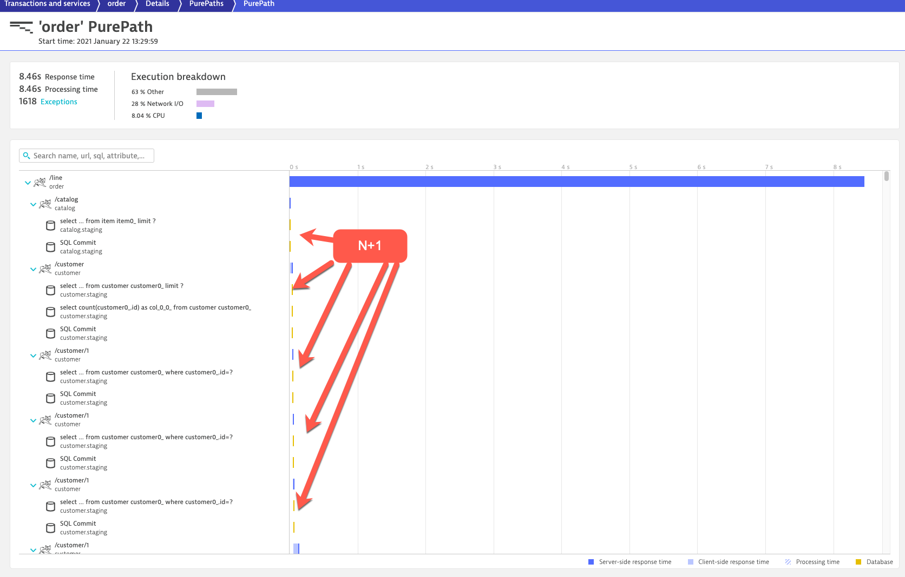

### Compare Results of Two Test Runs

Analyzing one test run is great, but comparing two is better as we want to know what the difference between two test runs really is.

In this example a new deploy for version 2.0.0 of a node.js sample application that had some issues where requests to one of the api endpoints has a high failure rate.

Focusing on “Average Failure Rate split by Test Names” and comparison with the previous test.

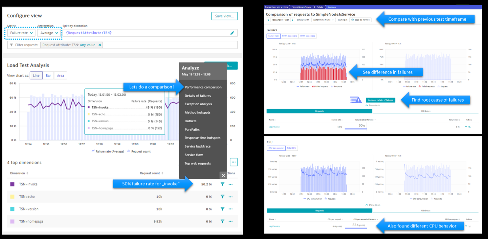

## Summary

- We learned how to rename transactions using web request naming rules
- We learned how to how to create a custom alert
- We showed another example how to analyze a Performance Test
- We learned how to compare results from two different Performance tests

## Questions and Answers?