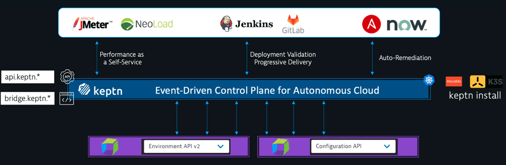
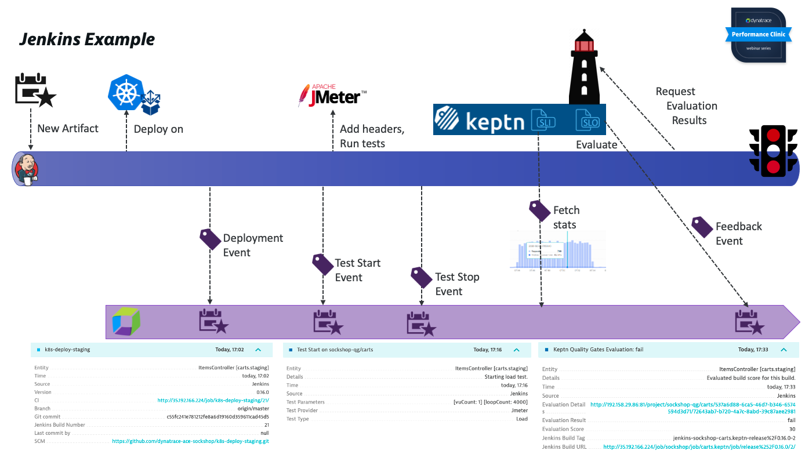

# Dynatrace Cloud Automation

## Dynatrace Cloud Automation currently offers

Service-Level Objectives (SLO)

Service-level objectives (SLOs) enable DevOps teams to accelerate and scale their site reliability engineering (SRE) efforts.

Dynatrace comes with native support for service-level objective (SLO) monitoring according to Site Reliability Engineering (SRE) fundamentals published by Google.

#### SLO overview
You can review the current health status, error budgets, target and warning, along with the timeframe of all your SLOs on the SLOs overview page.

Automated release Inventory and version comparison

Automated release inventory and version comparison enable an easy evaluation of the performance of individual release versions.

The software product lifecycle of a release requires careful management of release risks. Also, as more and more components and versions are deployed, the frequency of releases in your organization increases, and manually collecting release-relevant data can easily become a bottleneck in your release automation pipeline and automated software lifecycle.
Dynatrace offers a built-in release-analysis solution that helps you determine the following:

- Which versions are deployed across your deployment stages and production environments based on multiple version-detection strategies
- The release stages of the deployed versions
- The changelog for a new version
- Known bugs and whether they're release-blockers
- Risks related to specific versions
- Which version is taking too much load (for example, if you are temporarily redirecting load with a canary deployment)
- How the new version is behaving compared to previous versions
- Issue statistics related to the monitored entities

Automated validation with quality gates

Automated release validation and quality gates ensure that high-quality code moves smoothly through the delivery pipeline and doesn't violate error budgets in production.

#### What are quality gates?
Quality gates are benchmarks in the software delivery lifecycle that define specific, measurable, and achievable success criteria that a service must meet before it is advanced to the next phase of the software delivery pipeline. Quality gates can validate any service-level objective (SLO), giving you the ability to ensure automated and consistent evaluation of software quality.

Establishing clear, consistent, and effective quality gates that are automatically validated at each phase of the delivery pipeline is essential for improving software quality and speeding up delivery.

Lifecycle orchestration

Lifecycle orchestration provides a declarative way to define your delivery or operational processes with event-based triggers for integration.

Dynatrace Cloud Automation can orchestrate different delivery or operational processes that are part of an application's lifecycle. Cloud Automation also provides an easy, event-based integration point for external tools (such as testing services, notification services, and incident management services) via webhooks. With external tool integration, you can set external tools to send events to Dynatrace, or set Dynatrace Cloud Automation to send events to external tools, which can then execute certain tasks in response.

 
 
We have already discussed Service Level Objective (SLO's).

Now we will delve into Cloud Automation Quality Gates.

 
 

### SRE Best practices

 
 

### SLIs drive SLOs which inform SLAs

- Service Level Indicators (SLIs)
  - Percentage of an imporant metric against a criteria
  - Example: Service Response Time p95 < 400ms
- Service Level Objectives (SLOs)
  - Success-% SLI over a timeframe
  - Example: p95 < 400ms in 90% of the time over 30 days
- Service Level Agreements (SLAs)
  - What happens IF SLO is breached
  - Example: Paying penalities, loosing customers ...
- Error Budget
  - How much more impact can we afford before violating SLO?

### Our mission is to help everyone with their cloud automation journey

### Quality Gate (simple example)

### Quality Gate Jenkins Example

 

## Exercises

### No we will walk through the steps to synchronize a Monitored Service with Quality Gates using tags

First Let's take a look at the Dynatrace project in the Keptn Bridge.
This project should be empty.

Lucky for us, we don't have to worry about connecting Cloud Automation to the Dynatrace Environment.
This has already been done, as part of the environment automation.

### Enable a quality gate for a Dynatrace monitored service

In order the synchronize the monitored service, we need to create tags on the service.

These are the tags we will need to create:
- keptn_managed
- keptn_service: <service_name>
- keptn_project: dynatrace
- keptn_stage: quality_gate

