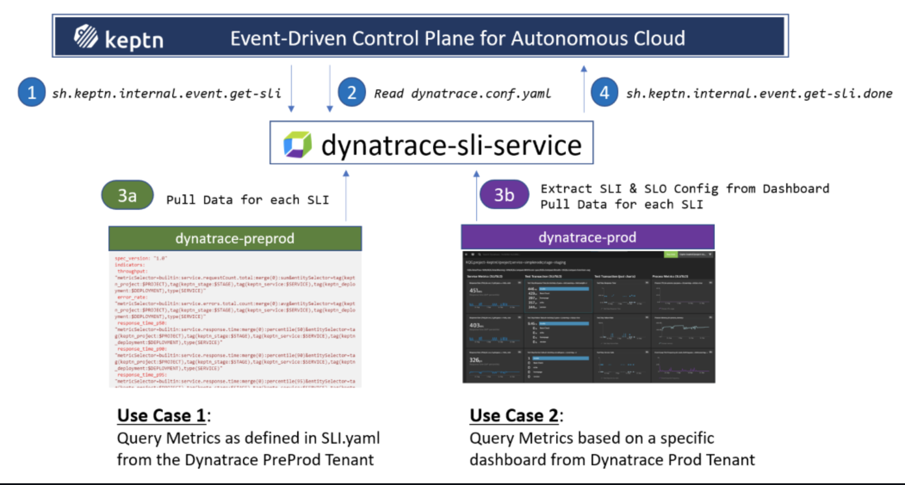
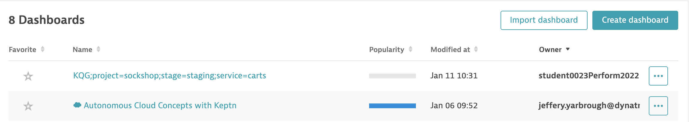
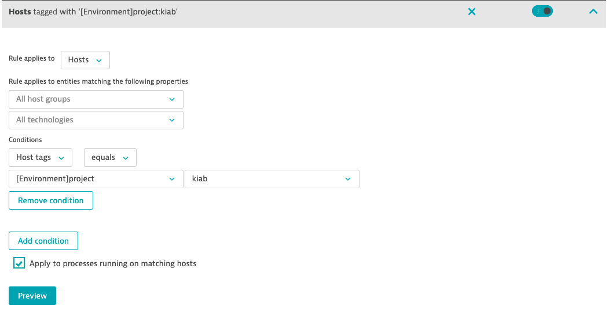
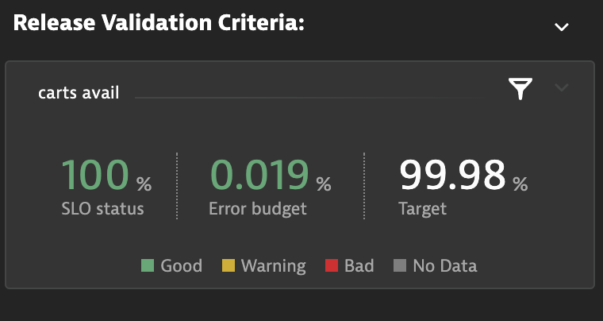
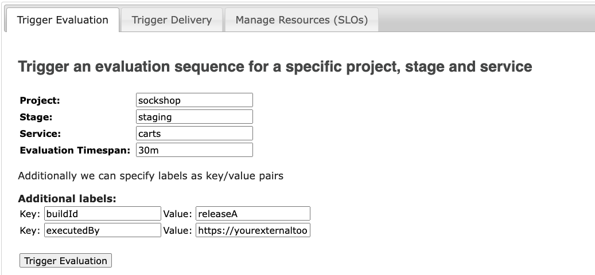
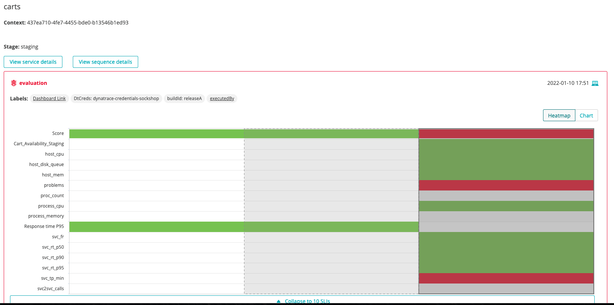

## SLIs & SLOs via Dynatrace Dashboard

Based on user feedback we learned that defining custom SLIs via the sli.yaml and then defining SLOs via slo.yaml can be challenging as one has to be familiar with the Dynatrace Metrics v2 API to craft the necessary SLI queries. As dashboards are a prominent feature in Dynatrace to visualize metrics, it was a logical step to leverage dashboards as the basis for Keptn's SLI/SLO configuration.

<hr>

## Use Cases



## SLI/SLO Dashboard Layout and how it generates SLI & SLO definitions

Here is a sample dashboard for our simplenode sample application:


And here is how the individual pieces matter:

### 1. Name of the dashboard

```
project=<project>,service=<service>,stage=<stage>
```

### 2. Management zone Filter

If you are building a dashboard specific to an application or part of your environment, it is a good practice to set a default management zone filter for your dashboard.

### 3. Markdown with SLO Definitions

The dashboard is not only used to define which metrics should be evaluated (list of SLIs), it is also used to define the individual SLOs and global settings for the SLO, e.g., Total Score goals or Comparison Rules. These are settings you normally have in your slo.yaml. To specify those settings simply create a markdown that contains name-value pairs like in the example dashboard.

```
KQG.Total.Pass=90%;KQG.Total.Warning=75%;KQG.Compare.WithScore=pass;KQG.Compare.Results=1;KQG.Compare.Function=avg
```

### 4. Tiles with SLI definition

Similar to the markdown, each tile can define several configuration elements. The only mandatory is sli=sliprefix. Here a couple of examples of possible values. It actually starts with a human readable value that is not included in the analysis but makes the dashboard easier readable:

```
Test Step Response Time;sli=teststep_rt;pass=<500;warning=<1000;weight=2
Process Memory;sli=process_memory
Response time (P50);sli=svc_rt_p95;pass=<+10%,<500
```

### 5. SLI Dashboard also supports SLO tiles and Problem Tiles.
### 6. USQL Tiles

<hr>

## This all seems a little complex.

Good news, for the lab exercise, we have created a SLI dashboard template.

We have also created the secret in keptn to allow the dashbaord integration.

<details><summary>Environment setup steps</summary>

1. open ssh
1. change to the root user
    1. execute
        ```bash
            #: sudo su - 
        ```
        Use the password from your lab environments page.    
1. validate the environment variables
    1. execute   
        ```bash
            #: env
        ```
    we are looking for these environment variables: 

        1. DT_TENANT
        2. DT_API_TOKEN
        3. KEPTN_DOMAIN

    If These are not set, then we will need to set them, A instructor will help you find these values.
    1. execute
        ```bash
            #: export DYNATRACE_TENANT=<DYNATRACE_TENANT>
            #: export DT_API_TOKEN=<DT_API_TOKEN>
            #: export KEPTN_DOMAIN=<KEPTN_DOMAIN>
        ```    

1. Next, navigate to this directory, ~/keptn-in-a-box/resources/dynatrace/scripts
    1. execute
        ```bash
            #: cd /home/dtu_training/keptn-in-a-box/resources/dynatrace/scripts
        ```
1. Run the script setdbenv.sh
    1. execute
        ```bash
            #: ./setdbenv.sh <domain>
        ```
        You can find your domain by navigating to the lab home page.
</details>

<hr>

## Next

Go to your Dynatrace tenant and click on "Dashboards".

The Dashbaord we are looking for is labeled "KQG;project=sockshop;stage=staging;service=carts"

1. Toggle on **"Show all tenant dashboards"**
1. Clone the dashbaord
1. Select the cloned dashboard
1. rename the dashboard
    1. click edit
    1. click the "pencil" icon for the dashbaord header
    1. remove "-clone" from the header then click the "check-mark"

Now if you navigate back to dashbaords, you should see this dashbaord with the student id as the owner.



select the dashbaord.


<details><summary>Dynatrace Configuration</summary>

If not done previously, We need to create a rule on the management zone that keptn created.

In the Dynatrace UI, navigate to "Settings>Preferences>Management zones"
Now, locate the "Keptn: sockshop staging" management zone.

Create this rule on the management zone.



</details>

<hr>

### Next, create the SLO

We need to configure the SLO tiles on the Dashboard.

1. make sure you have selected the "keptn: sockshop staging" management zone.
1. Go to **"Service-level objectives"**
1. Create the SLO type **"Service-level availability"**
1. set timeframe to **"Last 30 minutes"**
1. use **"mzName("Keptn: sockshop staging"),type("SERVICE")"** as the entity selector
1. Now navigate back to the dashboard
1. Click edit
1. Select the SLO tile
1. pick the SLO you just created from the drop down
1. click **"Done"**

Now you should data in the SLO tile.



### Next, Execute the evaluation

Go to Jenkins and run the "06-qualitygate-sli-dashboard".

Or

We can trigger the evaluation by using the **keptn web service**



Give it a few minutes to see the evaluation performed in the Keptn bridge.

We can see the evaluation for the **SockShop** project.


Drilling into the project, we can navigate to the Cart Service Heatmap. 

This will show all the SLI's from the dashbaord and the overall SLO scores.



<hr>

### Summary

- How one can setup a dashbaord for SLI/SLO evaluations