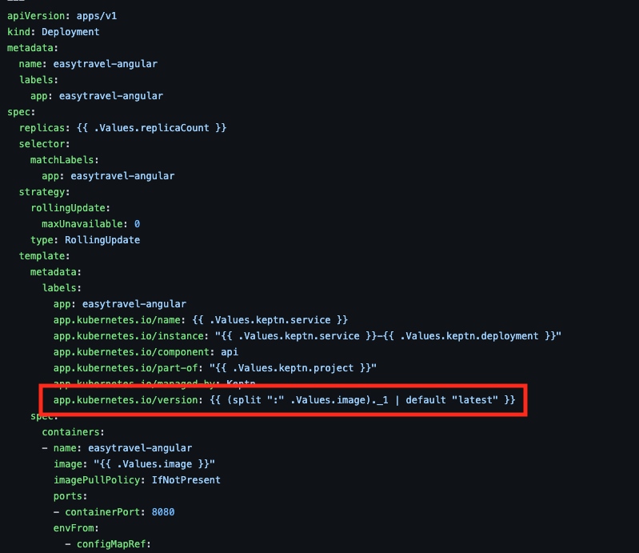
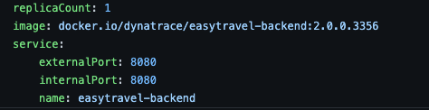

## Release monitoring

The software product lifecycle of a release requires careful management of release risks. Also, as more and more components and versions are deployed, the frequency of releases in your organization increases, and manually collecting release-relevant data can easily become a bottleneck in your release automation pipeline and automated software lifecycle.
Dynatrace offers a built-in release-analysis solution that helps you determine the following:

- Which versions are deployed across your deployment stages and production environments based on multiple version-detection strategies
- The release stages of the deployed versions
- The changelog for a new version
- Known bugs and whether they're release-blockers
- Risks related to specific versions
- Which version is taking too much load (for example, if you are temporarily redirecting load with a canary deployment)
- How the new version is behaving compared to previous versions
- Issue statistics related to the monitored entities

First we need to examine built in version detection strategies.

## Environment variables
A easy way to get version information also available on every PurePath is to provide metadata via environment variables.

- DT_RELEASE_VERSION for Version
- DT_RELEASE_STAGE for Stage
- DT_RELEASE_PRODUCT for Product
- DT_RELEASE_BUILD_VERSION for Build version

## Kubernetes labels

We recommend that you propagate Kubernetes labels to environment variables in the deployment configuration.

In this example we are using a helmchart type of deployment.

Pulls value from the values.yaml

We can examine this release information in Dynatrace. 

## Event Ingestion

You can send custom deployment events to Dynatrace APIs that explicitly provide version information.

For this exercise, we will execute a jenkins pipeline that contains the event ingestion for several processes.

First we need to check the tags on the process_groups.