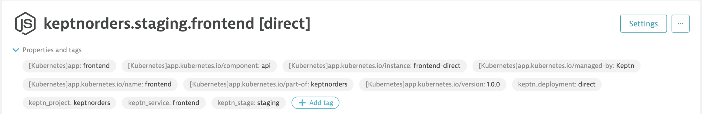

## Release monitoring

The software product lifecycle of a release requires careful management of release risks. Also, as more and more components and versions are deployed, the frequency of releases in your organization increases, and manually collecting release-relevant data can easily become a bottleneck in your release automation pipeline and automated software lifecycle.
Dynatrace offers a built-in release-analysis solution that helps you determine the following:

- Which versions are deployed across your deployment stages and production environments based on multiple version-detection strategies
- The release stages of the deployed versions
- The changelog for a new version
- Known bugs and whether they're release-blockers
- Risks related to specific versions
- Which version is taking too much load (for example, if you are temporarily redirecting load with a canary deployment)
- How the new version is behaving compared to previous versions
- Issue statistics related to the monitored entities

First we need to examine built in version detection strategies.

## Environment variables
A easy way to get version information also available on every PurePath is to provide metadata via environment variables.

- DT_RELEASE_VERSION for Version
- DT_RELEASE_STAGE for Stage
- DT_RELEASE_PRODUCT for Product
- DT_RELEASE_BUILD_VERSION for Build version

## Kubernetes labels

We recommend that you propagate Kubernetes labels to environment variables in the deployment configuration.

In this example we are using a helmchart type of deployment.


Pulls value from the values.yaml


Now, we can examine this release information in Dynatrace. 

<hr>

## Event Ingestion

You can send custom deployment events to Dynatrace APIs that explicitly provide version information.

For this exercise, we will execute a jenkins pipeline that contains the event ingestion for several processes.

First we need to check the tags on the process_groups.  These tags should have been added by utilizing the kubernetes labels.

Go to **"Services"** and select the **"frontend (keptnorders.staging.frontend)"** 

Expand the **"Properties and tags"**, then select the process group.

We will just validate the process group tags are present.



Now, we can kickoff the **"07-release-for-version"** pipeline in jenkins.

Go to Jenkins and build the **"07-release-for-version"** pipeline. The intial build will fail.
we need refresh the page and do a "build with parameters"

This pipeline use the Events API to injest the release information. we do this on each process group for the application.

Here is a sample json payload, Note that the processes are matched via tags.  This specific example uses parameters and variables from Jenkins.

<details>
  <summary>example json:</summary>

```json
{"eventType": "${eventType}",
  				"attachRules": {
    				"tagRule" : [ 
				    {
        			   "meTypes" : [ 
				        "${meType}"
				      ],
				      "tags" : [
				         {
				          "context": "${context}",
					      "key" : "${key}",
                          "value" : "${value}"
					     },
				         {
				          "context": "CONTEXTLESS",
					      "key" : "keptn_stage",
                          "value" : "staging"
					     }					     
					   ]
				     }
				     ] 
    				},
  					"deploymentName":"${JOB_NAME} - ${BUILD_NUMBER} ${params.buildenv} (${value})",
  					"deploymentVersion":"${params.buildVersion}-${BUILD_NUMBER}",
  					"deploymentProject":"${params.project}",
  					"remediationAction":"${params.remediationAction}",
  					"ciBackLink":"${BUILD_URL}",
  					"source":"${source}",
  					"customProperties":{
    					"Jenkins Build Number": "${BUILD_ID}",
    					"Environment": "${params.buildenv}",
    					"Job URL": "${JOB_URL}",
    					"Commits": "${GIT_COMMIT}",
    					"Git URL": "${GIT_URL}"
  						}
					}
```

</details>

<hr>

## Releases in Dynatrace

Go to Dynatrace and select **"Releases"**

Now, we can see the release version for our keptnorders.staging containers.


We also have the ability to examine the deployment events. 


Finally, we can click on the deployed component and examine details about the component and deployments all in one place.


We will skip the Issue-tracking integration at this time.  Just note, that you can integrate your issue-tracking system with Dynatrace.

Dynatrace currently supports integration with

- Jira on-premises
- Jira cloud
- GitHub
- GitLab
- ServiceNow

Execute the **"07-release-for-version"** pipeline again to see how the release versions are again updated.


