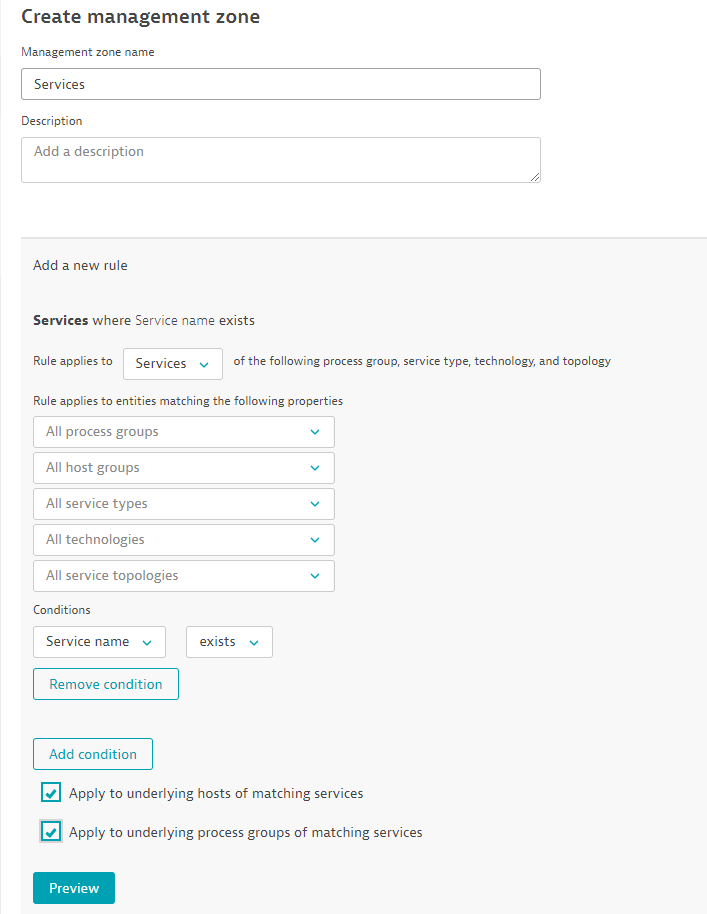

## Preparation

SLOs in Dynatrace provide you with a powerful way to tie business or technical KPIs with the deep-dive capabilties of Dynatrace monitoring and the automation of the DAVIS AI.

During this hands on session, you will learn how to:
1. Create SLOs in Dynatrace
2. Identify useful metrics and criteria for actionable SLOs
3. Create synthetic tests and evaluate their perform within the scope of an SLO (availability and performance)
4. Create advanced SLOs using custom metrics
5. Build a dashboard to monitor the state of defined SLOs

Projects used for this session
- [EasyTravel](https://github.com/Dynatrace/easyTravel-Docker)
- [JMeter Service](https://github.com/keptn/keptn/tree/master/jmeter-service#workloads)
- [Keptn](https://keptn.sh/)

Access your Dynatrace environment at www.dynatrace.com and click 'SaaS login'.

Use your HOT session credentials to login to your tenant.

### Setup
#### Management Zone
- We need to create a management zone that we can use later as an SLO filter criteria.
- For this scenario, we will use a very simple management zone that simply checks if a service name exists. 
1. In your tenant, navigate to Settings > Preferences > Management Zones
2. Click the button 'Add new management zone'
3. Name this management zone 'Services' and leave the optional description field blank. 
4. Click the 'Add a new rule' button.
5. Under conditions, click the drop-down and select 'Service name'. Next, select the drop-down menu to the right of Service Name and select 'exists'.
6. Apply to both underlying hosts and process groups of the matching services.
7. Finally, preview your changes and make sure services and hosts show up in the preview section. Your final rule should look like the example image below.
  

