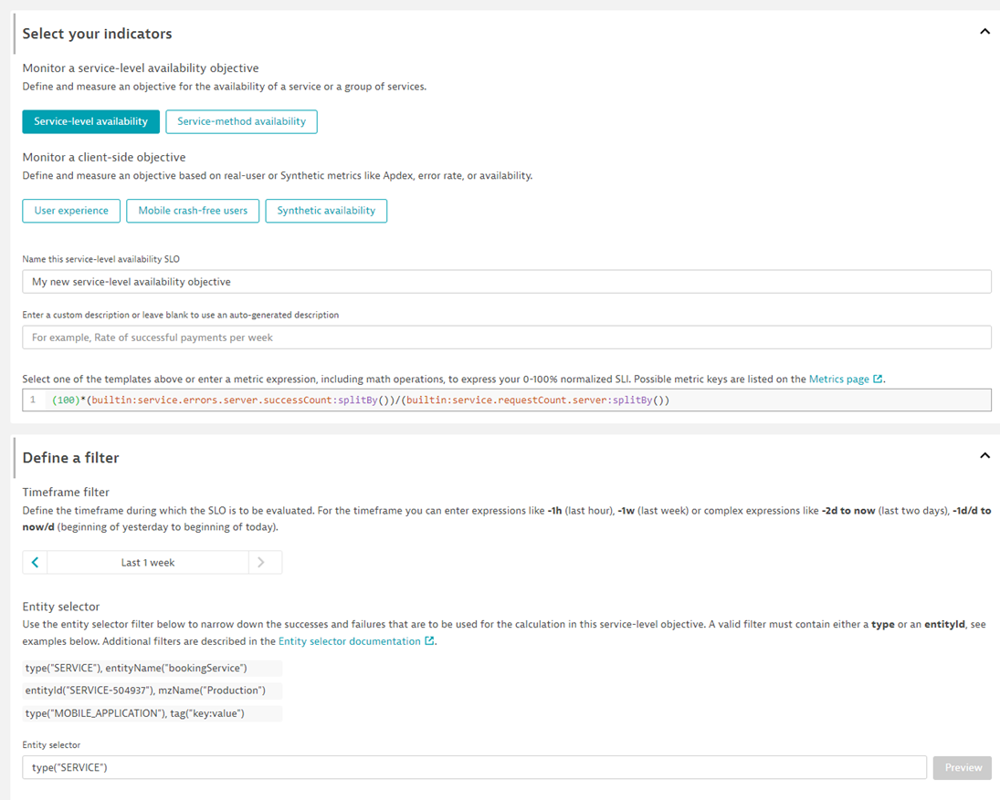
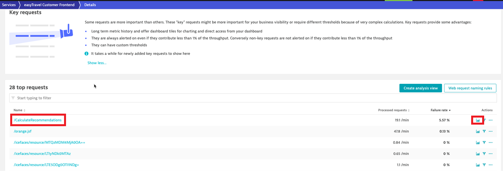
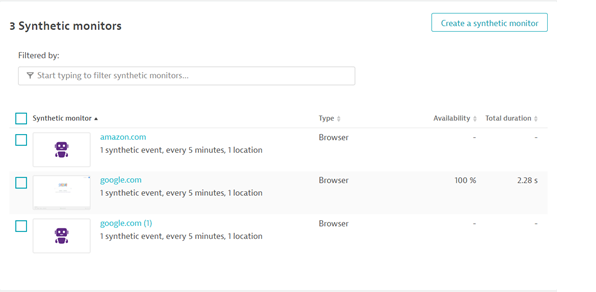
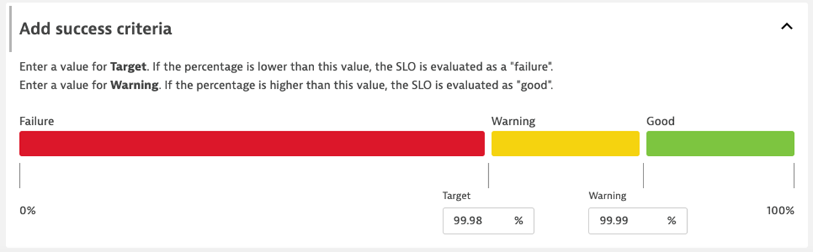
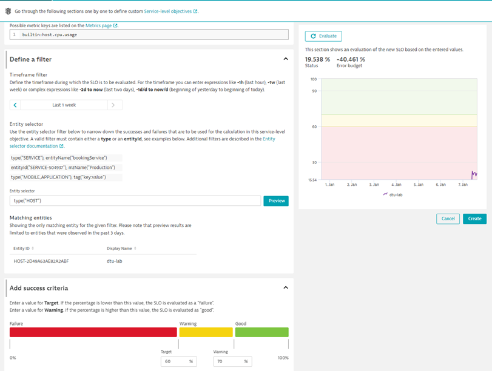

# Hands on #1 – Let’s create an SLO in our Dynatrace environments
### Situation: You are a SRE tasked with defining and tracking a SLO for a new frontend service that has recently been introduced into the application you’re responsible for. After consulting with business partners and app owners, the team has agreed on SLIs and error budgets. 
<br/><br/>

1. First, navigate and log in to your Dynatrace environment provided to you ahead of class. If you’re having issues, please raise your hand or ask an instructor for help. 
2. Navigate to the SLO page found on your side menu inside Dynatrace.
3. Click on add new SLO


4. We’ve now entered the Dynatrace configuration wizard. Because we’re making a simple availability SLO, we can just click this button and Dynatrace will autofill the appropriate metrics to look for.
5. Dynatrace will fill the metric expression with a templated example. You should see a string similar to this:</br></br>
```
(100)*(builtin:service.errors.server.successCount:splitBy())/(builtin:service.requestCount.server:splitBy())
```
</br></br>


6. We’ve now entered the Dynatrace configuration wizard. Because we’re making a simple availability SLO, we can just click this button and Dynatrace will autofill the appropriate metrics to look for.</br>


</br>

7. Name the SLO or leave it as default for this example. Ensure metrics are filled in under the metric expresion section. We can also remove the management zone component in the 'Entity Selector' section.</br>
8. Because we want a specific service, we can use the filter string and use an entityName operator along with the service type to zero in on a single service to evaluation. ```type("SERVICE"),entityName("easyTravel Customer Frontend")```. </br></br>
9. Verify that only a single entity made it into the preview. 
10. Finally, preview the SLO and hit 'Create'


# Hands on #2 – Create a SLO for a specific service request
### Situation: The business and dev teams have recently introduced a new function in the application that calculates travel recommendations for customers visiting the website. The business has determined that they want a separate, and granular SLO to track this single function, instead of the service overall (which is what we just did in the previous hands on). They want to track an SLO with a 15% error budget.

In order to do this, we’ll need to: 
* Create 2 custom metrics for our new request: Total count, and success count
* Define an SLO with success as the numerator and total count as denominator. 

# Hands on #2 - Create an SLO for a specific service request

### The business and dev teams have recently introduced a new function in the application that calculates travel recrecommendations for customers visiting the website. The business has determined that they want a separate, and granular SLO to track this single function, instead of the service overall (which is what we just did in the previous hands on). They want to track an SLO with a 15% error budget.In order to do this, we’ll need to: 
### Create 2 custom metrics for our new request: Total count, and success count
### Define an SLO with success as the numerator and total count as denominator. 

1. Navigate to Services in the left-hand menu. The request we need to build an SLO for is inside our easyTravel Customer Frontend service.
2. Find and click on easyTravel Customer Frontend. (Tip: You can search for the service in the filter bar)
3. CLick on View dynamic requests so we can find the function we're looking for.
4. Scroll down on this new page and identify the /CalculateRecommendations transaction.
5. Click the analysis button to the right of the transaction, shown in the image below.
</br></br>



</br></br>
6. This will navigate you to the multidimensional analysis view. Under 'Configure View', change the Metric dropdown to 'Request count". This counts the <b>total</b> number of requests for this transaction. 
7. Click on Create metric. Name your metric 'CalculateRecommendationsCount' and click create metric at the bottom of the create metric box.
</br></br>


</br></br>
8. For the second metric, change the dropdown to 'Successful request count". Name this metric 'Calculate Recommendations Success Count". Create the metric.
9. Return to the SLO page by either navigating to a previous tab, or selecting 'Service-Level Objectives' from the left-hand menu. Click 'Add new SLO'.
10. Name the new SLO. 
11. To calculate this SLO, we will divide our success metric count by the total metric count. Your metric definition will look something like this (using your own metric IDs in place of the example):

```
(100)*(builtin:service.errors.server.successCount:splitBy())/(builtin:service.requestCount.server:splitBy())
```

12. Because we specific scope by selecting a specific service, we do not need to define it under the Entity Selector section. We can keep this field blank.
13. For our success criteria, we can use a target of 99.75 and a warning of 99.95. 
14. Evaluate the newly minted SLO and click create.

# Hands-on #3 - Synthetic Monitoring SLO

### You are a SRE tasked with tracking the uptime of your teams' applications and most important workflows from an outside-in view. You should provide an overall perspective as well as availability SLOs for specific applications and application groups.

1. Navigate to the <b>Synthetic</b> page found on your side menu and click 'Create synthetic monitor button'. 
2. Click 'Create a browser monitor' button.
3. Type in www.google.com or any generic, easy to access address. Hit 'next'.
4. Select <b>5min</b> as a frequency and <b>one location</b> (for example, Johannesburg), then click 'Next'.
5. Review the synthetic test summary, then click 'Create Monitor'.
6. Navigate back to the synthetic monitors list using the breadcrumb navigation or the side menu. Click the checkbox next to your monitor and select 'Duplicate' in the prompt box below. Enable the duplicated monitor.


7. Create one more monitor, this time against a different URL (example: amazon.com). Once complete, you should have 3 monitors.



8. Select the two browser monitors running against google and click <b>Edit</b>.
9. Click the 'Add tags to these monitors' checkbox. Add key: Sitetype and value: Search


10. Navigate to the Service-level Objectives page and add a new SLO. Click the 'Synthetic Availability' button to populate the fields below. 
11. Remove the "mzName" filter, verify and create the SLO. Pin this to a dashboard to see results in real time. 
Note: You should see type("SYNTHETIC_TEST") in the entity selector once you remove the management zone filter.
12. Create a new SLO, following the steps outlined above in #10-11. This time, after removing the management zone filter, add the tag filter for the sitetype:search field we added earlier. Your entity selector should look like the following:

```
type("SYNTHETIC_TEST"),tag("Sitetype:Search")
```
13. Evaluate, create, and pin this new SLO to your dashboard.

# Hands on #4 - Advanced SLO - Application Performance with template
1. Under <b>'Digital Experience'</b> on the left-hand menu, find <b>'Web'</b> and navigate to the Applications screen.
2. You will note thje <b>'My web application'</b> application that came out-of-the-box with Dynatrace. Remember this name, we will be using it later.
3. Navigate to the <b>'Service-level Objective'</b> screen and create a new SLO.
4. Select User Experience and provide a name for the SLO (in our example: EasyTravel UX)


5. Enter a filter under <b>Entity Selector</b>, using the below example. Note: We used the application name from step #2.

```
type(“APPLICATION”)entityName(“My web application”)
```
6. Preview the selection, verifying we see at least one application.
7. Add a success criteria with a target of 99.98 and a warning of 99.99. 



8. Review the configuration and verify the values shown make sense. Our status will likely be under the target. That is okay. Create the SLO.

# Hands on #5 - Creating Infrastructure SLOs

### Large Insurance Company utilizes Dynatrace SLOs to monitor their Infrastructure.  
### Objective:
### Monitor Infrastructure components focusing on utilization and error rates as opposed to response time to ensure infrastructure is meeting predefined performance.

1. There is no template for infrastructure SLOs, so we’ll need to use what we learned in previous exercises to define the metrics we want to use as part of our SLO definition.
2. For this example, we’ll use host CPU usage.


3. We will use the metric for cpu utilization that comes out of the box with Dynatrace. 

```
builtin:host.cpu.usage
```

4. For the entity selector, remove everything and replace it with type("HOST"). Note: You could specify a specific entity via the entityName or entityId fields, but since our environment only has a specific host, this is fine.
5. Because we want to ensure utilization is at a certain level, we will set the target and warning at 60%-70%, respectively. This ensures that we will be notified anytime our utilization drops by a significant amount from our expected threshold.
6. Evaluate the SLO, make sure the data matches your expecations and then hit create.



7. We can pin this newly created SLO to a dashboard along with any other metrics that would make sense to monitor. PaaS utilization, process CPU, host memory, etc., are all built-in (to Dynatrace) examples that would fit.


8. Example below of a finalized infrastructure SLO dashboard.


